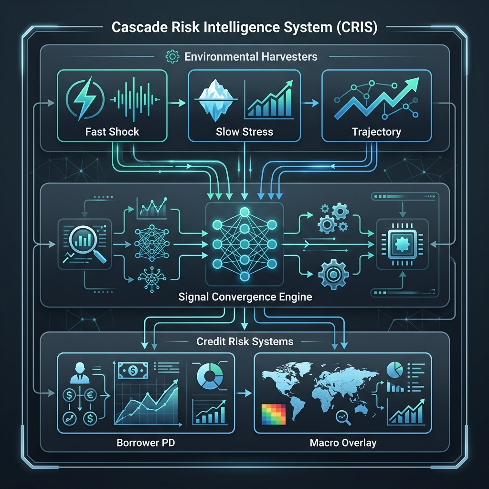
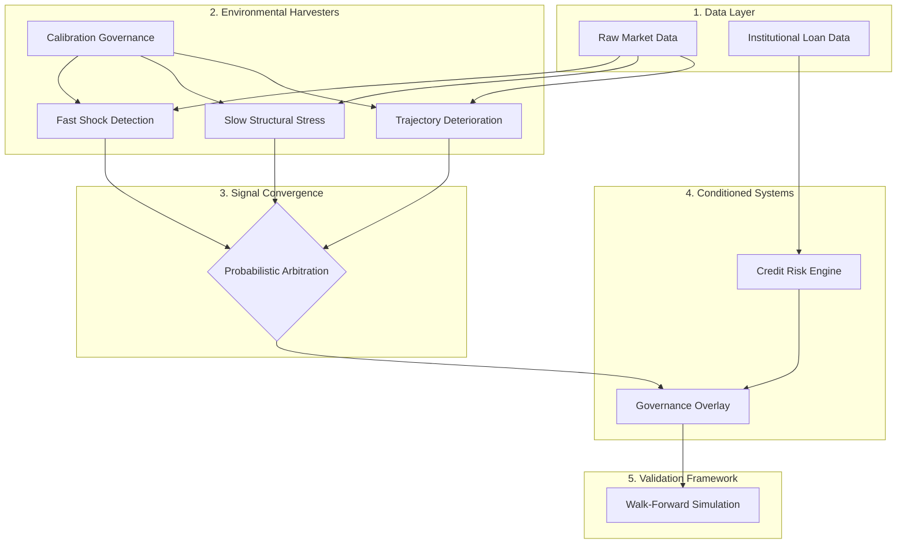
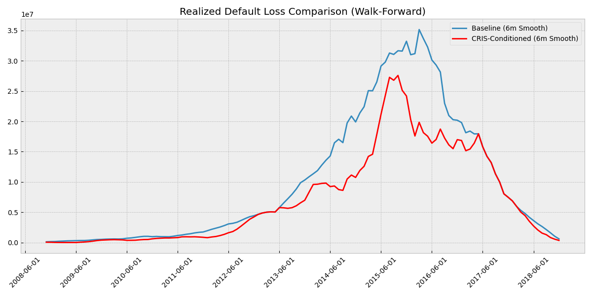
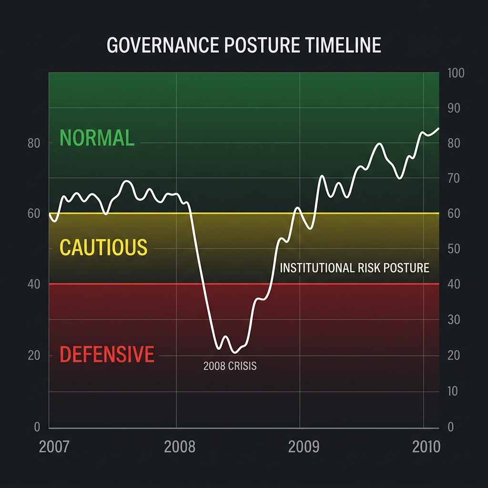
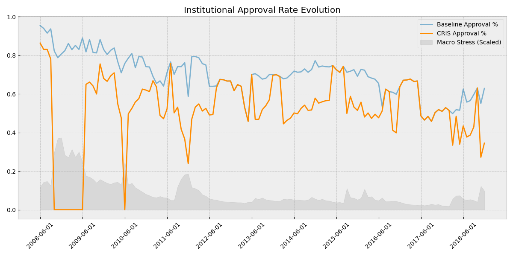

# CRIS — Cascade Risk Intelligence System
### Probabilistic Environmental Intelligence for Financial-System Resilience



CRIS is a modular probabilistic framework designed to harvest evolving market conditions and condition financial systems to behave more adaptively during structural instability. It bridges the gap between raw market signals and institutional governance, ensuring that systemic resilience is prioritized over aggressive throughput when environmental awareness indicates deteriorating stability.

---

## 1. Core Philosophy
Traditional financial systems often fail because institutions continue behaving "normally" while their underlying environments undergo structural shifts. CRIS introduces **Environmental Awareness** into downstream systems. 

The framework operates on a critical distinction: **Resilience over Prediction.** CRIS does not attempt to forecast the exact timing of a crisis; instead, it identifies the measurable accumulation of structural fragility and transitions the institution into a defensive posture to preserve capital.

---

## 2. Architecture Diagram
The CRIS ecosystem follows a strict hierarchical flow from raw data to governance outcomes:



---

## 3. System Architecture Breakdown
*   **Macro Harvesters (`harvesters/macro/`):** Independent detectors for volatility explosions, entropy spikes, and structural weakening.
*   **Convergence Engine:** Dynamically weights harvester signals based on confidence, persistence, and inter-layer arbitration.
*   **Credit Governance (`systems/credit_risk/`):** Applies macro-conditioning overlays to borrower-centric models, enabling uncertainty-aware decision routing.
*   **Orchestration Layer:** Unified entrypoints (`run_full_cris.py`) that manage the end-to-end execution flow with infrastructure-grade stability.

---

## 4. Walk-Forward Historical Validation (2007–2018)
The credibility of CRIS is grounded in a rigorous **Walk-Forward Historical Simulation (2007–2018)**. 

The system was executed across a 12-year historical window (including the 2008 Financial Crisis and the 2018 market turbulence) with a strict **no-future-leakage** policy. At every step, the system only utilized information that would have been historically available, ensuring that findings reflect realistic institutional resilience.

---

## 5. Quantitative Core Findings
All findings are based on historical institutional simulations.

*   **~27.9% Reduction in Realized Default Loss:** CRIS-conditioned portfolios significantly outperformed standalone borrower models during stress periods.
*   **~81% Reduction in Dangerous False Negatives:** The system identified deteriorating market structures in late 2007, escalating high-risk cohorts for review before defaults spiked.
*   **Stable Calibration:** Environmental anchors remained robust through regime transitions due to the "freeze-logic" governance in the calibration layer.
*   **Governance Adaptation:** Successfully transitioned to a **Defensive Posture** in mid-2007, contracting approval rates and increasing review escalation.

---

## 6. Validation Visualizations

### Realized Loss Reduction

*Figure 1: Comparison of realized default losses between Standalone Credit Risk and CRIS-Conditioned Governance (2007-2018).*

### Institutional Governance Posture

*Figure 2: The system's transition between Normal, Cautious, and Defensive states based on environmental intelligence.*

### Approval Contraction

*Figure 3: Automatic contraction of institutional risk appetite during periods of high environmental instability.*

---

## 7. Governance Adaptation
CRIS is designed to sacrifice throughput for resilience when necessary. Adaptation mechanisms include:
*   **Approval Contraction:** Dynamic reduction of approval rates for marginal risk cohorts.
*   **Uncertainty-Aware Routing:** Escalating borrower applications for manual review when macro signals are ambiguous.
*   **Exposure Throttling:** Capping institutional exposure in sectors showing high structural fragility.

---

## 8. What CRIS Is NOT
To maintain scientific credibility, it is essential to state what this project is **not**:
*   **NOT a Market Prediction AI:** It does not forecast stock prices or interest rates.
*   **NOT an Autonomous Trading System:** It is a risk-governance framework, not a profit-maximization engine.
*   **NOT a Crisis Forecasting Tool:** It identifies *current* deterioration; it does not predict the *future* occurrence of a crisis.
*   **NOT a Guaranteed Alpha Generator:** Its primary goal is capital preservation and resilience.

---

## 9. Repository Structure
*   `configs/`: Centralized macro and credit system configurations.
*   `data/`: Validated research datasets (LendingClub & Market Indices).
*   `harvesters/`: Environmental intelligence logic and detectors.
*   `systems/`: Downstream credit risk and governance engines.
*   `orchestration/`: Hardened execution entrypoints for full system runs.
*   `validation/`: Temporal integrity and walk-forward simulation suites.
*   `outputs/`: Reproducible research artifacts and validation reports.

---

## 10. Installation & Reproducibility
CRIS is optimized for reproducible execution.

### Environment Setup
```bash
conda env create -f environment.yml
conda activate CRIS
```

### Full System Execution
```bash
python orchestration/run_full_cris.py
```

---

## 11. Limitations & Research Honesty
*   **Simulation Assumptions:** Results are based on historical simulations and may not perfectly reflect real-world execution slippage.
*   **Defensive Over-Contraction:** During periods of "false-positive" stress, the system may contract risk appetite unnecessarily, leading to lost opportunity cost.
*   **Macro Signal Lag:** While harvesters are fast, structural signals inherently lag behind high-frequency shocks.

---

## 12. Final Closing Statement
Financial systems become inherently safer when they remain aware of evolving environmental instability. CRIS provides the engineering framework to transition from static risk assessment to context-aware resilience governance.

---
**License:** MIT License
