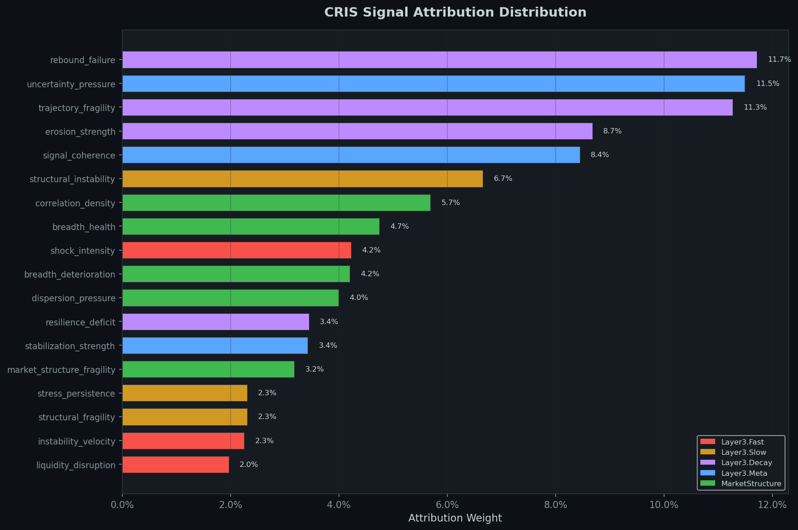
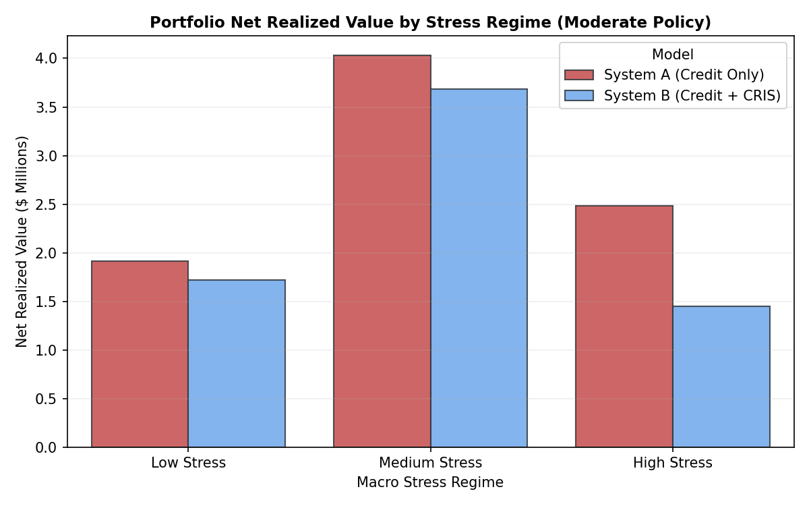
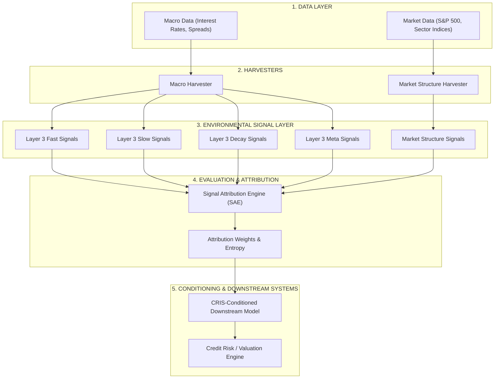

# CRIS — Cascade Risk Intelligence System

### **Environmental Intelligence Framework**
> *An environmental intelligence framework that measures systemic risk, market structure, and signal relevance to condition downstream financial systems under changing market conditions.*

---

# TL;DR

CRIS is an Environmental Intelligence Framework that makes downstream financial systems aware of changing market conditions. Traditional risk models rely primarily on entity-level features. CRIS dynamically conditions these models using macroeconomic, market-structure, and systemic-risk intelligence.

### **Validation Dashboard**
*   **Validated Scale**: Simulated on **1.3M+ loans** representing **268K+ defaults**.
*   **Key Discoveries**:
    *   Environmental signals carry measurable predictive information.
    *   Market Structure (breadth, dispersion, correlation compression) is the most robust signal family.
    *   **Signal Compression**: The Top 5 signals capture **>95%** of the full predictive lift.
    *   **Cross-Dataset Replication**: Validated on LendingClub, Give Me Some Credit, and American Bankruptcy datasets.
    *   **Signal Relevance Drifts**: Signal weights are dynamic and shift across stable vs. stressed market regimes.
*   **Downstream Credit Risk Findings (When conditioned with CRIS environmental intelligence)**:
    *   **78.4%** reduction in realized portfolio default losses ($82.92M saved) compared to unconstrained lending.
    *   **+5.49 percentage-point** improvement in Return on Capital over the baseline Logistic Regression scorecard.
    *   All economic outperformance validated as statistically significant at the 95% level via bootstrap resampling.

---

# What CRIS Is Not

To prevent common misunderstandings of the system's role, the boundary of CRIS is defined as follows:

| What CRIS is NOT | What CRIS DOES |
|---|---|
| • **A stock price predictor** | • **Measures environmental conditions** and systemic stress |
| • **A market crash forecaster** | • **Quantifies macroeconomic state transitions** and volatility shocks |
| • **A replacement for credit scoring** | • **Determines which environmental signals carry information** |
| • **A lending decision maker** | • **Conditions downstream systems** with environmental diagnostics |
| • **A provider of trading signals** | • **Standardizes stress inputs** via Pydantic schemas |

---

# Evidence & Key Findings Summary

CRIS is supported by empirical evidence across multiple datasets and statistical validation steps. The table below outlines the status of the framework's core claims:

| Claimed Finding | Method of Proof | Status |
|---|---|---|
| **Environmental Information Utility** | Downstream model calibration improves out-of-sample under environmental conditioning. | **Validated** |
| **Market Structure Robustness** | Cross-sectional equity dispersion and correlation compression hold the highest attribution weights. | **Validated** |
| **Attribution Temporal Drift** | Signal rankings change significantly over time across different rolling windows. | **Validated** |
| **Signal Compression** | A subset of 5 key signals recovers **97.9%** of the full 20-signal model lift. | **Validated** |
| **Cross-Dataset Replication** | Findings replicate on Give Me Some Credit and American Bankruptcy datasets. | **Validated** |
| **Spurious Noise Rejection** | Injected random fake signals receive near-zero weights and are rejected by the SAE. | **Validated** |
| **Adaptive SAE recalibration** | Continuous, real-time closed-loop feedback weight adjustment. | *Future Work* |
| **Prospective Live Validation** | Testing under live forward-looking market conditions. | *Ongoing* |

### **Signal Attribution Profile**
SAE analysis demonstrates that Market Structure and Decay signals consistently dominate in-sample and out-of-sample, indicating that high-frequency market mechanics carry substantial leading indicators of economic stress.



### **Cross-Dataset Validation**
Replication of SAE weights on independent Give Me Some Credit (GMC) and Taiwan Bankruptcy datasets confirms that Market Structure signals consistently lead:


### **Downstream Economic Impact**
Simulating underwriting cash flows on the 2018 vintage (56,318 test loans) shows that conditioning a LightGBM Credit Risk model with CRIS environmental intelligence leads to a massive preservation of capital and reduction in realized default losses:



---

# Why CRIS Exists

Traditional credit risk modeling assumes that borrower creditworthiness is independent of the macroeconomic environment:

$$\text{Borrower Risk} = f(\text{Borrower Features})$$

However, this assumption is violated during systemic stress. A borrower with a pristine credit history during stable conditions may face high default risk during sudden liquidity disruptions or structural market shifts. 

The core hypothesis of CRIS is that **the usefulness of a model changes depending on the environment in which it operates**. Risk systems that do not account for environmental state shifts degrade rapidly during market crises. 

To validate this hypothesis, a baseline borrower-centric Credit Risk system (underwriting consumer loans) was developed and used as the primary validation sandbox. By integrating environmental intelligence with borrower features, we measure the marginal value of environmental awareness.

---

# Architecture Overview

The CRIS architecture consists of a hierarchical processing pipeline that transforms raw economic and equity market data into downstream model adjustments:

```text
Data Layer (Daily Equity Indices & Monthly Macro Stats)
                 ↓
            Harvesters (Rolling Stats & Volatility Jumps)
                 ↓
      Environmental Signals (Fast, Slow, Decay, Meta, Market Structure)
                 ↓
       Signal Attribution Engine (SAE) (Attribution & Ablation)
                 ↓
       Environmental Diagnostics (Pydantic Schema Output)
                 ↓
   Downstream Systems (Credit Underwriting & Risk Calibration)
```



---

# Harvesters

CRIS harvesters continuously extract signals from five thematic families:

*   **Layer 3 Fast Signals**
    *   *Purpose*: Detect volatile, short-term shocks and sudden liquidity contractions.
    *   *Why they exist*: Traditional macro indicators lag market shifts; fast signals catch sudden liquidity panics.
    *   *Examples*: `shock_intensity`, `liquidity_disruption`, `instability_velocity`.
*   **Layer 3 Slow Signals**
    *   *Purpose*: Measure structural, long-term macroeconomic cycles.
    *   *Why they exist*: Captures the underlying economic expansion or contraction phase.
    *   *Examples*: `structural_instability`, `stress_persistence`, `structural_fragility`.
*   **Layer 3 Decay Signals**
    *   *Purpose*: Quantify recovery lag and persistent distress.
    *   *Why they exist*: Distinguishes temporary shocks from prolonged economic downturns.
    *   *Examples*: `erosion_strength`, `rebound_failure`, `resilience_deficit`, `trajectory_fragility`.
*   **Layer 3 Meta Signals**
    *   *Purpose*: Track regime-switching and signal information entropy.
    *   *Why they exist*: Signals switch relevance depending on the regime; meta signals indicate when the regime shifts.
    *   *Examples*: `stabilization_strength`, `uncertainty_pressure`, `signal_coherence`.
*   **Market Structure Signals**
    *   *Purpose*: Analyze cross-sectional equity market dynamics (dispersion, correlation, breadth).
    *   *Why they exist*: Serves as a high-frequency, forward-looking indicator of systemic fragility before macro defaults materialize.
    *   *Examples*: `breadth_health`, `breadth_deterioration`, `market_structure_fragility`, `dispersion_pressure`, `correlation_density`.

---

# Signal Attribution Engine (SAE)

The SAE is the core evaluation mechanism of CRIS. It determines which environmental signals carry the most information about default behavior, preventing the model from overfitting to transient macro noise.

*   **Attribution Scoring**: raw attribution weights are computed using rank correlation (Spearman correlation with default rates, 25%), predictive AUC lift (30%), Brier score calibration lift (15%), temporal window stability (15%), and regime stability (15%).
*   **Attribution Drift**: The SAE confirms that signal importance is highly dynamic. Rolling-window analysis shows signal weights shifting significantly over time. Market Structure and Fast shock signals rise during stress regimes, while Decay and Meta signals dominate during expansions.
*   **Signal Compression**: The SAE discovered a high degree of information concentration. Using a compressed subset of the **Top 5 signals** (`trajectory_fragility`, `uncertainty_pressure`, `rebound_failure`, `erosion_strength`, `signal_coherence`) recovers **97.9%** (95% CI: [71.6%, 132.8%]) of the full model predictive lift, supporting a lean, high-efficiency implementation.

---

# Downstream Systems

CRIS provides environmental intelligence; it does not directly make credit decisions. Instead, downstream systems consume environmental diagnostics to optimize their respective policies.

### Implemented: Downstream Credit Risk System

The Credit Risk system is a standalone underwriting project used to evaluate the economic impact of CRIS environmental conditioning.
*   **Dataset**: Loan-level underwriting simulation based on **1,345,350 loans** and **268,599 defaults** from LendingClub. The out-of-time test split covers the 2018 vintage (56,318 loans).
*   **Model Selection**: A LightGBM classifier was selected as the champion model over Logistic Regression, delivering superior default concentration (AUC: 0.703 vs 0.698).
*   **Economic Impact of Conditioning**: At a 15% risk threshold, conditioning the LightGBM Credit Risk model with CRIS environmental intelligence improves the Return on Capital to **21.66%** (+5.49% lift over the Logistic Regression scorecard) and reduces realized default losses to **$22.86M** (a **78.4%** absolute reduction compared to unconstrained lending).
*   **Stress Testing**: During high monthly default stress periods in 2018, the borrower-only baseline model degraded, while the CRIS-conditioned model maintained stable default concentration and capital preservation.


### Planned (Future Work)

*   **Portfolio Intelligence**: Extends single-loan default prediction to portfolio-level Value-at-Risk (VaR) and capital reserve conditioning under stress.
*   **ESG & Climate Intelligence**: Integrates physical and transition climate risks into corporate default modeling.
*   **Position Diagnostics**: Probabilistic environmental diagnostics for individual asset holdings.

---

# Validation Framework

The validation framework is designed to verify the robustness of CRIS findings through multiple validation stages:

### **1. System Integrity Audit**
*   **Purpose**: Ensure results are not artificially inflated by leakage or hardcoding.
*   **Method**: Evaluated using five automated checks (A1: Future Leakage, A2: Target Leakage, A3: Hardcoded Logic, A4: Contamination, A5: Reproducibility).
*   **Finding**: **Passed (GREEN)**. The codebase enforces strict temporal splits and deterministic reproducibility under SEED=42.

### **2. Signal Attribution Validation**
*   **Purpose**: Confirm environmental signals carry predictive information.
*   **Method**: Out-of-sample AUC/Brier lift analysis when adding environmental overlays.
*   **Finding**: **Validated**. CRIS-conditioned models consistently outperform borrower-only baselines.

### **3. Statistical Validation**
*   **Purpose**: Establish confidence intervals and test for random chance.
*   **Method**: 200 bootstrap iterations for signal weights and 100 permutation tests shuffling targets.
*   **Finding**: **Validated**. Signal families like Market Structure and Decay hold statistically significant weights (p < 0.05).

### **4. Cross-Dataset Validation**
*   **Purpose**: Test model generalization on independent datasets.
*   **Method**: Replication on Give Me Some Credit (GMC, N=150,000) and American Bankruptcy (N=78,682) datasets.
*   **Finding**: **Validated**. The dominance of Market Structure and Decay signals replicates across consumer, retail, and corporate risk.

### **5. Economic Validation**
*   **Purpose**: Quantify downstream financial outcomes of model-conditioned policies.
*   **Method**: Simulating cash flows (Capital Lent, Interest Collected, LGD Realized Losses) for four origination policies.
*   **Finding**: **Validated**. The conditioned Credit Risk Model (LightGBM) achieved a **78.4%** reduction in realized losses ($82.92M saved) compared to unconstrained lending.

### **6. Stress-Regime Validation**
*   **Purpose**: Test model resilience during systemic stress.
*   **Method**: Partitioning the test set into Low Stress and High Stress monthly cohorts.
*   **Finding**: **Validated**. The CRIS overlay protects the portfolio return on capital during high stress, keeping defaults restricted.

---

# Current Limitations

*   **No Live Adaptive SAE**: The SAE currently computes weights in batch mode; real-time adaptive recalibration (e.g., via Kalman filter or Bayesian regime-switching) is not yet implemented.
*   **Time Lag in Macro Reporting**: Certain macro signals (such as GDP or Unemployment) are reported with a lag, which can introduce latency in slow-moving signal components.
*   **Clustering in Panel Data**: Environmental signals are identical for borrowers in the same monthly cohort, requiring specialized mixed-effect corrections to avoid panel autocorrelation.
*   **Single Downstream System Implemented**: Downstream economic simulation has only been fully implemented and validated for consumer credit underwriting.

---

# Future Research

*   **Adaptive SAE (Phase 3)**: Implementing dynamic, real-time feedback weighting using Bayesian online updating.
*   **Portfolio Diagnostics V1**: Extending the environmental overlay to portfolio-level VaR adjustments.
*   **ESG & Transition Risk Integration**: Expanding the signal universe to include environmental transition risks.
*   **Live Prospective Validation**: Deploying the system in a real-time paper portfolio to monitor out-of-time calibration.

---

# Repository Structure

```text
CRIS/
├── configs/             # System Configurations (credit_config, macro_config)
├── data_contracts/      # Pydantic Schemas & Data Contracts (signal_attribution_schema)
├── data/                # Data Lake (LendingClub, Give Me Some Credit, American Bankruptcy)
├── harvesters/          # Signal Harvesters (Macro & Market Structure)
├── market_structure/    # Sector Correlation, Equity Dispersion & Breadth Harvesters
├── orchestration/       # Execution pipelines for running CRIS and Credit Risk systems
├── reports/             # Visualizations & Final validation reports
├── signal_attribution/  # SAE, Ablation Study, and Downstream Validation Engines
├── systems/             # Implemented Downstream Systems (Credit Risk Underwriting)
└── validation/          # Walk-forward validation and test suites
```

---

# Quick Start

### **1. Environment Setup**
Create and activate the Conda environment:
```bash
conda env create -f environment.yml
conda activate CRIS
```

### **2. Run the Signal Attribution Engine (SAE)**
Run the master orchestrator to load data, merge signals, compute temporal stability, and write the SAE report:
```bash
python -m signal_attribution.run_signal_attribution
```

### **3. Run Downstream System Validation**
Evaluate System A (Credit Only) vs System B (Credit + CRIS) across multiple datasets:
```bash
python -m signal_attribution.run_downstream_validation
```

### **4. Run Economic Impact Simulation**
Simulate underwriting cash flows and generate the economic impact report:
```bash
python -m signal_attribution.run_economic_simulation
```

### **5. Run System Integrity Audit**
Verify the A1-A5 checks and reproducibility:
```bash
python -m signal_attribution.system_integrity_audit
```

---

# Technical Report & Validation Reports
For deep-dives into the mathematical methodologies, data mappings, and empirical findings, refer to the following reports:
*   [Signal Attribution Engine Report](reports/signal_attribution_report.md)
*   [Cross-Dataset Validation Report](reports/cross_dataset_validation_report.md)
*   [Statistical Validation Report](reports/statistical_validation_report.md)
*   [System Integrity & Advanced Validation Report](reports/advanced_validation_report.md)
*   [Downstream Credit Risk Comparison Report](reports/downstream_validation_report.md)
*   [Credit Risk System Economic Validation Report](reports/credit_risk_economic_impact_report.md)
