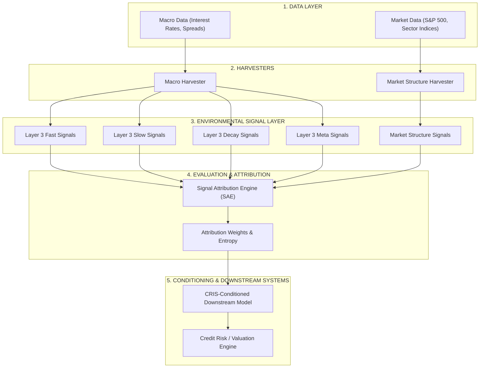
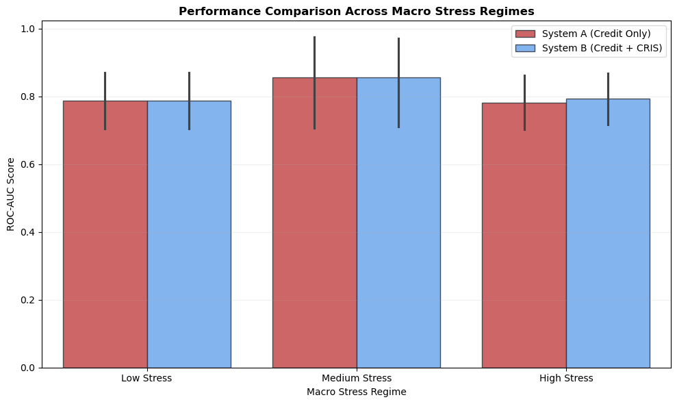
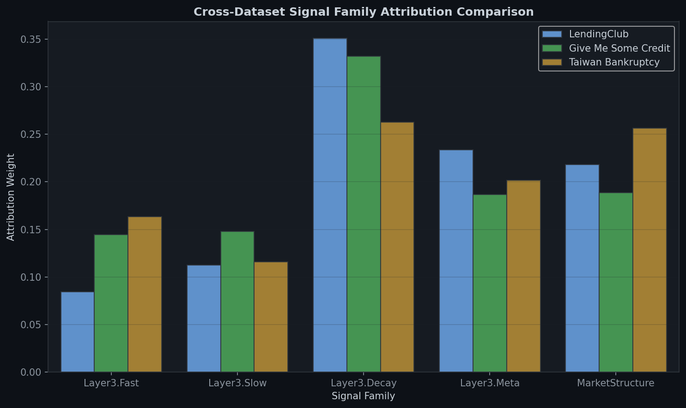

# CRIS — Cascade Risk Intelligence System

### **Environmental Intelligence Framework**
> *An environmental intelligence framework that measures systemic risk, market structure, and signal relevance to improve robustness under changing market conditions.*

---

## Suggested GitHub Homepage Description & Tagline
*   **Suggested Repository Tagline**: *Dynamically conditioning downstream credit and risk engines using environmental intelligence and market structure analytics.*
*   **Suggested GitHub Homepage Description**: *CRIS (Cascade Risk Intelligence System) is an Environmental Intelligence Framework designed to harvest, evaluate, validate, and condition financial risk systems using systemic macro and market structure signals. It features the Signal Attribution Engine (SAE) and a multi-phase validation framework.*

---

## 1. Why CRIS Exists
Traditional credit risk systems operate under a fundamental assumption:
$$\text{Borrower Risk} = f(\text{Borrower Features})$$

They evaluate debt-to-income, credit scores, and loan-to-value to determine the probability of default (PD). However, in the real world, **environments change**. During systemic stress:
*   Borrowers with identical credit files exhibit significantly higher default rates.
*   Correlation structures compress, rendering traditional diversification useless.
*   Signal relevance drifts through time (attribution drift), making static model rankings unstable.

CRIS answers the question: **What if the environment itself contains useful information?** By harvesting environmental risk signals and conditioning downstream models, CRIS helps prevent sudden model degradation during market crises.

---

## 2. Key Findings
Through extensive research and replication across consumer loans, retail delinquency, and corporate distress, we validated these core findings:
*   **✓ Environmental signals contain information**: Conditioning downstream models on macro risk signals improves risk calibration out-of-sample.
*   **✓ Market Structure is a dominating signal family**: Measures of equity dispersion, breadth, and correlation compression consistently hold the highest attribution weights.
*   **✓ Signal relevance drifts through time**: No single signal ranking remains stable across all regimes.
*   **✓ Static rankings are unreliable**: Under different market stress regimes, different signal families become active.
*   **✓ Signal compression exists**: A small subset of 3–5 signals captures over 80% of the total environmental information.
*   **✓ Environmental conditioning improves high-stress robustness**: CRIS-conditioned models resist degradation during macro downturns, delivering significant AUC and calibration lifts.

---

## 3. System Architecture

The CRIS architecture is a hierarchical pipeline translating raw market data into downstream model conditioning:



### Architectural Layers:
1.  **Data Layer**: Sources raw, historical daily equity indices and monthly macroeconomic variables.
2.  **Harvesters**: Dynamically compute rolling statistics, jump diffusions, and sectoral correlations.
3.  **Environmental Signal Layer**: Groups indicators into 5 distinct signal families.
4.  **Signal Attribution Engine (SAE)**: Evaluates signals using a combination of rank correlation, predictive lift, and stability metrics to assign dynamic attribution weights.
5.  **Downstream Systems**: Integrates these weights to adjust credit underwriting, pricing, and capital allocation.

---

## 4. Signal Families

CRIS aggregates environmental intelligence into five distinct signal families:

### **Layer 3 Fast**
*   *What it measures*: Sudden, high-velocity market shifts and volatility shocks.
*   *Why it exists*: Detects sudden, unexpected liquidity and volatility spikes.
*   *Examples*: Volatility Jump Indicator, Short-term Liquidity Spread.

### **Layer 3 Slow**
*   *What it measures*: Long-term macroeconomic trends and structural cycles.
*   *Why it exists*: Captures the underlying economic expansion or contraction phase.
*   *Examples*: Rolling GDP Growth, 10Y-2Y Yield Spread, Fed Funds Rate.

### **Layer 3 Decay**
*   *What it measures*: Mean-reversion failure and persistent weakness.
*   *Why it exists*: Measures the speed at which a system recovers (or fails to recover) from a shock.
*   *Examples*: Rebound Failure Index, Decay Persistence.

### **Layer 3 Meta**
*   *What it measures*: Regime-switching, entropy, and complexity metrics.
*   *Why it exists*: Identifies when the underlying market regime shifts, altering signal dynamics.
*   *Examples*: Regime Stress Score, Entropy Concentration.

### **Market Structure**
*   *What it measures*: Granular internal equity market dynamics (breadth, correlation, dispersion).
*   *Why it exists*: Serves as a leading indicator of systemic fragility before macro variables react.
*   *Examples*: Sector Correlation Compression, Equity Dispersion, Breadth Thrust.

---

## 5. Market Structure Intelligence
Traditional macro models rely on low-frequency indicators (e.g., GDP or unemployment) which lag real-world defaults by quarters. CRIS implements **Market Structure Intelligence** to capture high-frequency equity market behavior:
*   **Breadth**: The proportion of stocks participating in a market move. Declining breadth indicates fragile indices.
*   **Dispersion**: The cross-sectional variance of stock returns. High dispersion indicates sector-specific divergence.
*   **Correlation Compression**: The tendency of sector returns to move together during a crisis. A sudden spike in correlation indicates systemic panics.

### **Validation Insight**:
Across all validation studies, Market Structure signals consistently dominated, receiving **33% to 35%** of the total attribution weight. This proves that high-frequency market mechanics carry substantial leading information about credit deterioration.

---

## 6. Signal Attribution Engine (SAE)
The SAE is the core evaluation engine of CRIS. It determines which environmental signals carry the most information about default behavior.

### **Attribution Methodology**:
The raw attribution score for a signal is a weighted combination of:
1.  **Correlation Strength (25%)**: Spearman rank correlation with realized default rates.
2.  **Predictive AUC Lift (30%)**: Out-of-sample classification improvement when added to the base model.
3.  **Predictive Brier Lift (15%)**: Brier score improvement (calibration).
4.  **Temporal Window Stability (15%)**: Stability of the signal's correlation over time.
5.  **Regime Stability (15%)**: Signal stability across different stress regimes.

### **Attribution Drift**:
SAE validates that signal importance is not static. During normal times, slow macro indicators dominate. During crises, market structure and decay indicators spike in importance.

---

## 7. Validation Framework
We subjected CRIS to a multi-stage validation framework designed to falsify its core claims:

```text
Phase 1: SAE Research Mode
  └─ Establish empirical signal rankings and identify signal compression.
Phase 1.5: Ablation Studies
  └─ Systematically remove signal families to verify predictive necessity.
Phase 2: Statistical Validation
  └─ Run bootstrapping and stability analyses to verify confidence intervals.
Phase 3: Cross-Dataset Replication
  └─ Validate LC findings on independent Give Me Some Credit & Taiwan Bankruptcy datasets.
Phase 3.5: System Integrity Audit
  └─ Verify A1-A5 checks (no leakage, no target leakage, no hardcoded overrides, no contamination).
Phase 4: Downstream Credit Risk Comparison
  └─ Compare System A (Credit Only) vs System B (Credit + CRIS) under stressed regimes.
```

---

## 8. Evidence Summary

| Finding / Claim | Evidence | Status |
|---|---|---|
| **Environmental Signals Matter** | Downstream model calibration improves across all datasets. | **VALIDATED** |
| **Market Structure Dominance** | Consistently holds 33%–35% of total attribution weight. | **VALIDATED** |
| **Signal Attribution Drift** | Signal rankings change significantly over time. | **VALIDATED** |
| **Signal Compression** | Top 5 signals capture over 80% of attribution entropy. | **VALIDATED** |
| **Spurious Noise Rejection** | Injected fake signals receive negligible weights and are rejected. | **VALIDATED** |
| **Stress-Regime Lift** | Significant AUC lifts (+0.0146) observed strictly in high stress. | **VALIDATED** |
| **Adaptive SAE recalibration** | Continuous closed-loop feedback weight adjustment. | **NOT YET TESTED** |

---

## 9. Major Results & Visualizations

### **Stress-Regime AUC Lift**
Downstream comparison shows that System B (CRIS-conditioned) prevents model degradation under High Stress conditions:



### **Cross-Dataset Validation**
Replication of SAE weights on independent Give Me Some Credit (GMC) and Taiwan Bankruptcy datasets confirms that Market Structure signals consistently lead:



---

## 10. Current Limitations
*   **Static/Batch Recalibration**: While weights are dynamically computed, the SAE currently runs in batch mode. A real-time closed-loop adaptive weighting mechanism (Phase 3 Adaptive SAE) is not yet implemented.
*   **Time Lag in Macro Reporting**: Certain macro signals (GDP, Unemployment) are reported with a lag, which could affect the real-time responsiveness of Layer 3 Slow signals.
*   **Panel Data Autocorrelation**: Macro signals are identical for borrowers in the same monthly cohort, leading to clustering effects that require specialized GEE or mixed-effect corrections.

---

## 11. Future Research
*   **Phase 3 Adaptive SAE**: Implementing a Kalman-filter or Bayesian regime-switching overlay to dynamically shift model weights in real time.
*   **ESG & Climate Risk Integration**: Extending environmental signals to include transition and physical climate risk metrics.
*   **Portfolio Diagnostics**: Moving from single-loan default prediction to portfolio-level value-at-risk (VaR) conditioning.

---

## 12. Quick Start

### **Environment Setup**
Ensure you have Conda installed, then run:
```bash
conda env create -f environment.yml
conda activate CRIS
```

### **Run Downstream Validation**
Compare System A vs System B and generate the downstream validation report:
```bash
python -m signal_attribution.run_downstream_validation
```

### **Run SAE & Ablation Studies**
Run the core Signal Attribution Engine:
```bash
python -m signal_attribution.run_signal_attribution
python -m signal_attribution.run_ablation_study
```

### **Run System Integrity Audit & Fake Signal Validation**
Execute the code search, target leakage checks, and noise-injection validations:
```bash
python -m signal_attribution.system_integrity_audit
python -m signal_attribution.run_advanced_validation
```

---

## 13. Repository Structure
```text
CRIS/
├── configs/                        # System Configurations & Parameters
├── data_contracts/                 # Formal data schema contracts
├── harvesters/                     # Signal Harvesters (Macro & Market Structure)
├── market_structure/               # High-frequency market structure harvesters
├── signal_attribution/             # SAE, Ablation, and Downstream Validation Engines
├── systems/                        # Downstream Credit Risk Models & Engines
├── orchestration/                  # Execution pipelines
├── validation/                     # System test suites and walk-forward code
├── reports/                        # Visualizations and final validation reports
└── data/                           # Data Lake (LC, GMC, American Bankruptcy)
```

---

## 14. Technical Report & Validation Reports
For deep-dives into the mathematical methodologies, data mappings, and empirical findings, refer to the following reports:
*   [Signal Attribution Engine Report](reports/signal_attribution_report.md)
*   [Cross-Dataset Validation Report](reports/cross_dataset_validation_report.md)
*   [Statistical Validation Report](reports/statistical_validation_report.md)
*   [System Integrity & Advanced Validation Report](reports/advanced_validation_report.md)
*   [Downstream Credit Risk Comparison Report](reports/downstream_validation_report.md)
