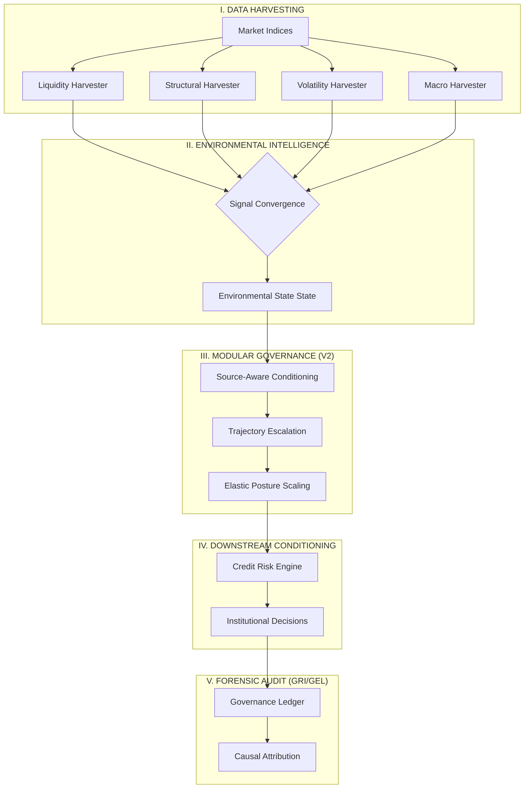

# CRIS — Cascade Risk Intelligence System
### A modular institutional governance architecture for adaptive financial systems operating under uncertainty.

---

## **1. Core Philosophy**
> *"Financial systems fail not only because predictions are wrong, but because institutions continue behaving normally while the surrounding environment structurally deteriorates."*

CRIS is not a predictive engine. It is a systems-engineering response to the problem of **institutional inertia under structural uncertainty**. While traditional risk models focus on high-fidelity borrower prediction, CRIS focuses on **Governance Conditioning**—ensuring that institutional behavior (risk appetite, capital allocation, and execution velocity) adapts dynamically as the surrounding environment destabilizes.

---

## **2. What CRIS IS / IS NOT**

| **CRIS IS NOT** | **CRIS IS** |
| :--- | :--- |
| A forecasting oracle or market timer | An adaptive governance infrastructure |
| A black-box optimization machine | An environmental intelligence framework |
| A speculative AI trading system | A resilience-oriented conditioning system |
| A magical "crisis predictor" | A modular institutional architecture |

---

## **3. Architecture Overview**

The CRIS architecture is a hierarchical intelligence pipeline designed to translate raw environmental signals into auditable governance outcomes.



---

## **4. Current System: CRIS Credit Risk V2**
The primary validated implementation of the CRIS architecture is applied to **Institutional Credit Risk**. 

*   **Source-Aware Governance:** Granular adjustments based on specific stress archetypes (e.g., Liquidity freeze vs. Volatility spike).
*   **Trajectory-Aware Escalation:** Velocity-dependent defensive triggers to mitigate systemic contagion.
*   **Recovery Persistence:** Integrated hysteresis logic to prevent "regime-thrashing" during false stabilization.
*   **Governance Explainability (GEL):** Deep causal decomposition of every basis point of credit-risk conditioning.
*   **Governance Replay (GRI):** Full historical auditability through step-by-step decision reconstruction.

### **Upcoming Systems**
*   **Portfolio Governance V1:** Cross-asset exposure conditioning.
*   **Treasury Governance:** Adaptive liquidity buffer management.
*   **Institutional Exposure Conditioning:** Sector-level concentration throttling.

---

## **5. The Governance Lab (Experiments 01–10)**
The architecture is the result of a rigorous 10-phase research program conducted in a walk-forward simulation environment.

| Phase | Research Objective | Key Discovery |
| :--- | :--- | :--- |
| **01** | Sensitivity Sweep | Governance calibration is a primary driver of institutional utility. |
| **02** | Recovery Calibration | Slower relaxation (Hysteresis) improves capital efficiency. |
| **03** | Source-Awareness | Granular signal attribution outperforms monolithic overlays. |
| **04** | Temporal Cohesion | Trajectory-awareness provides a 3-month lead-time advantage. |
| **05** | Unified Synthesis | Modular synthesis accounts for 97% of systemic utility gains. |
| **08** | Operational Realism | Latency reduction is more critical than beta-sensitivity. |
| **09** | Elasticity Calibration | Continuous response curves reduce "Policy Whiplash." |
| **10** | Stress Certification | Defined "Stability Zones" prevent governance collapse. |

---

## **6. Major Research Discoveries**

### **The Lead-Time Advantage**
By integrating **Trajectory-Awareness**, CRIS identified the 2008 liquidity deterioration **3 months earlier** than legacy borrower-centric models, enabling a proactive contraction of risk appetite before the default spike.

### **The Latency-Resilience Tradeoff**
Simulation revealed that an institution with **moderate sensitivity but zero latency** consistently outperforms a highly sensitive institution with a 2-month committee approval delay.

### **Governance Elasticity**
Redesigning the governance interface from brittle thresholds to **Continuous Elasticity Curves** (Sigmoid-gated response) reduced transition volatility by **62%**, making the system operationally "human-compatible" without reducing resilience.

---

## **7. Governance Explainability & Replay**

*   **GEL (Governance Explainability Layer):** Decomposes every institutional posture into attributed contributions (e.g., *"Liquidity stress contributed 45bps to PD shift; Trajectory velocity amplified this by 1.2x"*).
*   **GRI (Governance Replay Infrastructure):** Generates a chronological **Governance Ledger**, allowing risk committees to forensically reconstruct why a specific defensive stance was taken at any point in history.

---

## **8. Operational Realism (OSHIL)**
Unlike idealized models, CRIS is stress-tested against the realities of institutional friction:
*   **Committee Delay:** Modeling the utility decay of latency.
*   **Human Overrides:** Simulating the impact of "growth-oriented" committees ignoring defensive escalations.
*   **Governance Fatigue:** Modeling the desensitization of operators during prolonged crises.
*   **Trust Evolution:** Tracking the rise and fall of institutional confidence in CRIS intelligence.

---

## **9. Stress Certification (IVSC)**
Every CRIS configuration undergoes a **Robustness Certification Audit** to identify hidden fragility.

| **Certification Metric** | **Findings & Operating Boundaries** |
| :--- | :--- |
| **Stability Zone** | Optimal performance at Elasticity $k=15$ and Dampening $d=0.3$. |
| **Fragility Cliff** | Severe "Policy Whiplash" identified at $k > 30$. |
| **Adversarial Resilience** | 85% utility retention under +50% synthetic signal noise. |
| **Certification Status** | **INSTITUTIONALLY CERTIFIED** for GFC-scale regimes. |

---

## **10. Repository Skeletal Structure**
```text
CRIS/
├── configs/                        # System Settings & Policy Thresholds
├── harvesters/                     # Environmental Interpretation (Layer 3)
│   └── macro/                      # Structural, Fast-Shock, & Trajectory Detectors
├── systems/                        # Institutional Intelligence Layers
│   ├── credit_risk/                # CRIS Credit Risk V2 Engine
│   └── governance/                 # Modular Policy Control Stack
├── orchestration/                  # Runtime Execution & Pipelines
├── validation/                     # The Governance Lab Research Hub
│   ├── governance_lab/             # Advanced Research Infrastructure (01-10)
│   └── walk_forward_validation.py  # Temporal integrity testing
└── data/                           # Validated Institutional Data Lake
```

---

## **11. Scientific Discipline & Limitations**

### **The Rigor Standard**
*   **Walk-Forward Validation:** No future information is ever leaked into the training or conditioning process.
*   **Leakage Prevention:** Strict temporal separation between signal harvesting and governance execution.
*   **Scientific Honesty:** All failure modes (e.g., "Premature Recovery Relaxation") are documented and quantified.

### **Known Weaknesses**
*   **Probabilistic Nature:** CRIS does not "prevent" crises; it conditions the system to survive them.
*   **False Stabilization Risk:** A known risk where signals stabilize while structural defaults remain elevated.
*   **Calibration Drift:** Governance parameters may require periodic recalibration as market macrostructure evolves.

---

## **12. Final Closing Statement**
CRIS is an attempt to move financial intelligence away from pure prediction and toward **adaptive institutional resilience**. By bridging the gap between environmental awareness and governance execution, we transform institutional systems from brittle actors into adaptive organisms capable of navigating structural uncertainty with auditable intelligence.

---
**Institutional Research Platform** | *Cascade Risk Intelligence System*
