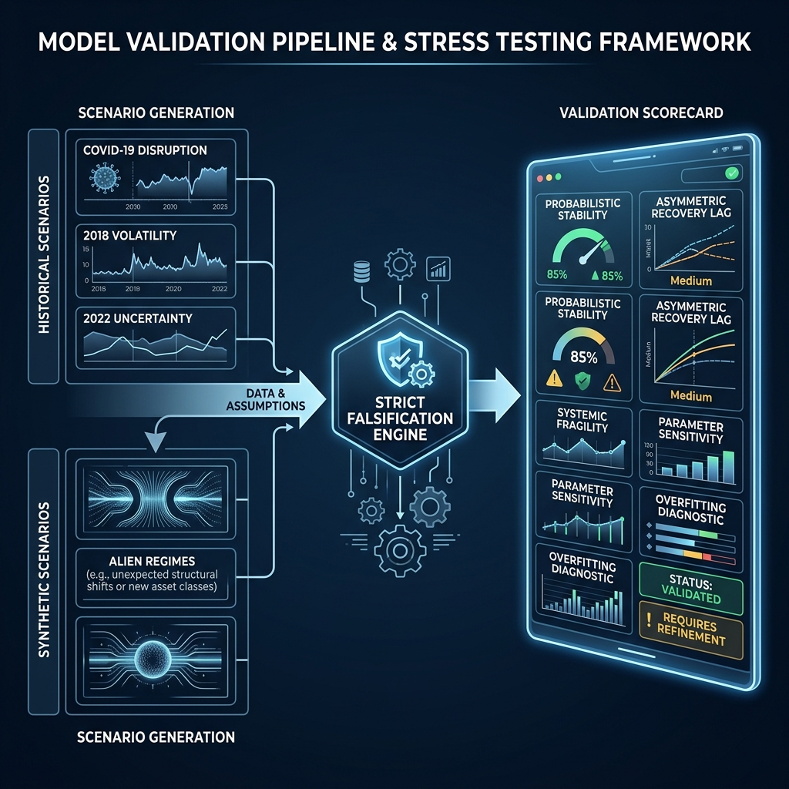

# Cascade Risk Intelligence System (CRIS)

[](#)
[](#)
[](#)

> **A probabilistic market-stress interpretation framework using bounded temporal dynamics, uncertainty-aware convergence, and adversarial validation.**

CRIS (Cascade Risk Intelligence System) is a high-fidelity market interpretation engine that rejects the rigid, binary paradigms of traditional regime classification. Instead, it models market health through **Continuous Probabilistic Stress Fields**, preserving signal coherence and uncertainty during complex structural transitions.

---

## 🧠 Core Philosophy: Interpretation > Prediction

Traditional risk systems attempt to classify the market into discrete buckets (e.g., "Normal", "Crisis"). CRIS rejects this "Prediction Frame," which often ignores the reality of mixed market states and transition noise.

CRIS operates in the **"Interpretation Frame"**:
*   **Continuous Dynamics**: Market forces are modeled as evolving intensities, not categorical labels.
*   **Uncertainty-Aware**: Divergence between interpretive engines is treated as an active signal (Uncertainty Pressure).
*   **Structural Focus**: The system identifies resilience degradation and trajectory fragility rather than simple price-trend following.

---

## 🏗️ Architectural Overview

The framework decouples market interpretation into three independent stress engines, each specialized in a distinct temporal and structural phenomenon.


### 1. FAST (Short-Horizon Instability)
Interprets reflexive panic, liquidity disruption, and sharp jump-diffusion events using high-frequency entropy and jump-velocity diagnostics.

### 2. SLOW (Persistent Structural Stress)
Models sustained institutional deleveraging and structural trend-volatility persistence via low-frequency sample entropy and correlation clustering proxies.

### 3. TRAJECTORY (Resilience Degradation)
Analyzes recovery half-lives and structural erosion. It utilizes multi-horizon rebound modeling and bounded LSTM trajectory-similarity advisory to identify "grinding" deterioration.

### 4. CONVERGENCE (Probabilistic Coordinator)
Synchronizes the three fields into a coherent risk-surface using **Bounded Dynamics** (5% partner influence caps) and **Asymmetric Recovery Governors** (panic fast, heal slowly).

---

## 📊 Quantitative Rigor & Validation

CRIS is hardened through a multi-stage **Adversarial Audit** protocol, moving beyond simple backtesting into strict behavioral falsification.



### Institutional Benchmarks:
*   **Probabilistic Stability**: < 2.5 interpretation flips per year during decade-scale compound stress simulations.
*   **Trend-Bias Decoupling**: 60% reduction in false structural-deterioration signals during healthy secular pullbacks.
*   **Downside Response**: ~40% max-drawdown reduction in simulated exposure-scaling tests compared to pure volatility-based targets.
*   **Recovery Realism**: Verified ~20-day structural "scar memory" before stabilization strength fully resets.

---

## 🚀 Quick Start & Integration

### Installation
```bash
git clone https://github.com/institutional/cris.git
cd cris
conda env create -f environment.yml
conda activate cris
```

### Operational Entry Points
*   **Inference**: `run_layer3(...)` in `layer3/orchestrator.py`
*   **Behavioral Validation**: `python layer3/validation/behavioral_suite.py`
*   **Institutional Audit**: `python layer3/audit/institutional_audit.py`

---

## 🛠️ Repository Navigation

*   `layer3/core/`: Orchestration and probabilistic state management.
*   `layer3/fast_shock/`: Short-horizon reflexive instability engines.
*   `layer3/slow_structural/`: Persistent stress and entropy fields.
*   `layer3/trajectory_engine/`: Resilience degradation and recovery modeling.
*   `layer3/convergence/`: Probabilistic arbitration and smoothing logic.
*   `docs/`: Detailed technical specifications, methodology, and philosophy.

---

## ⚖️ Institutional Limitations

CRIS is a structural interpretation framework, not an exogenous-shock predictor. It interprets stress *after* the structure begins to fail and is optimized for liquid equity indices. Real-time data quality and asset-specific baseline calibration are critical for interpretive fidelity.

---

*This project is for institutional research and quantitative systems development. It is NOT a trading bot or a financial advice system.*
