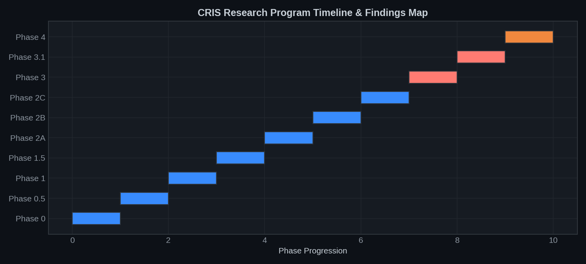
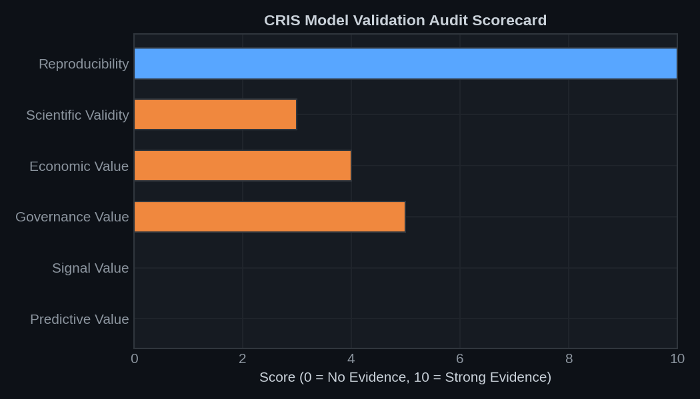
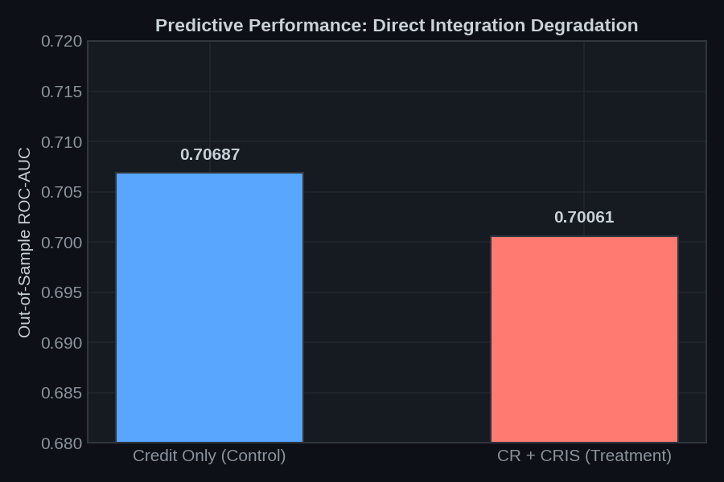
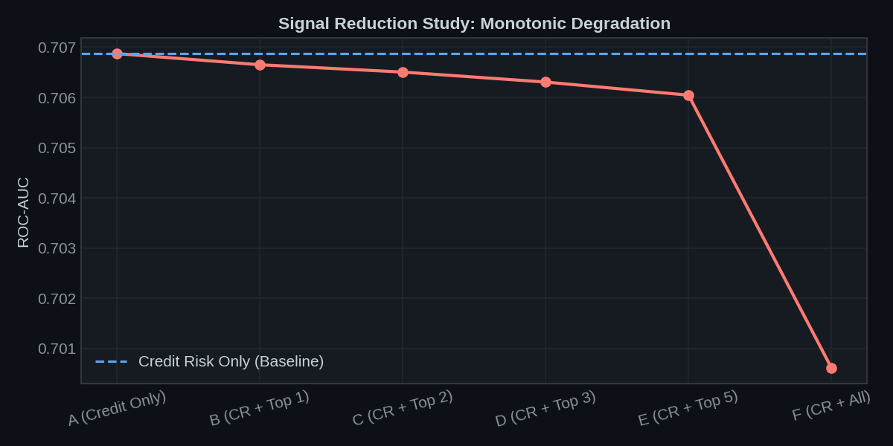
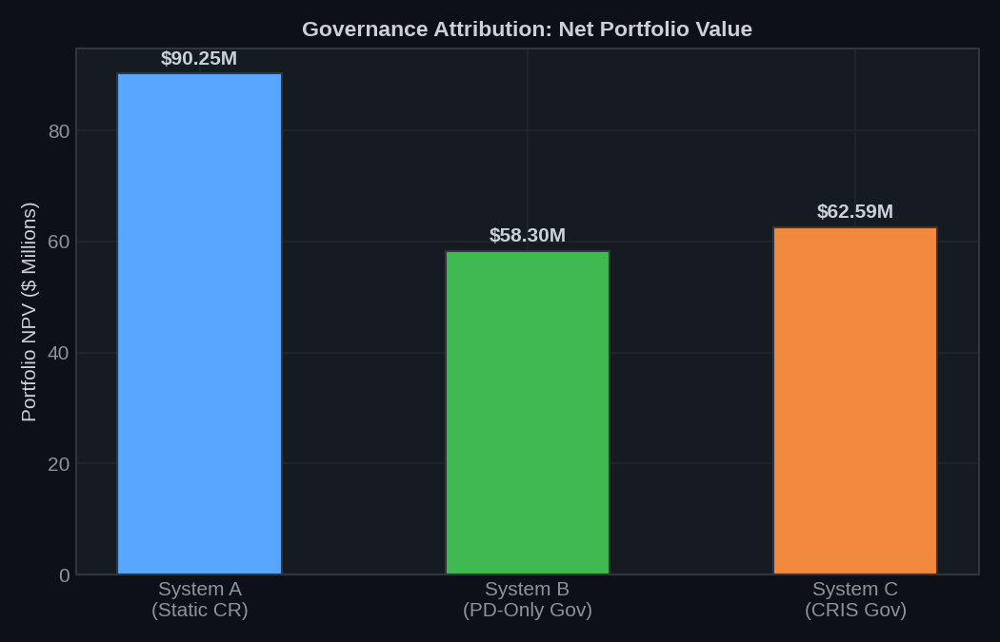
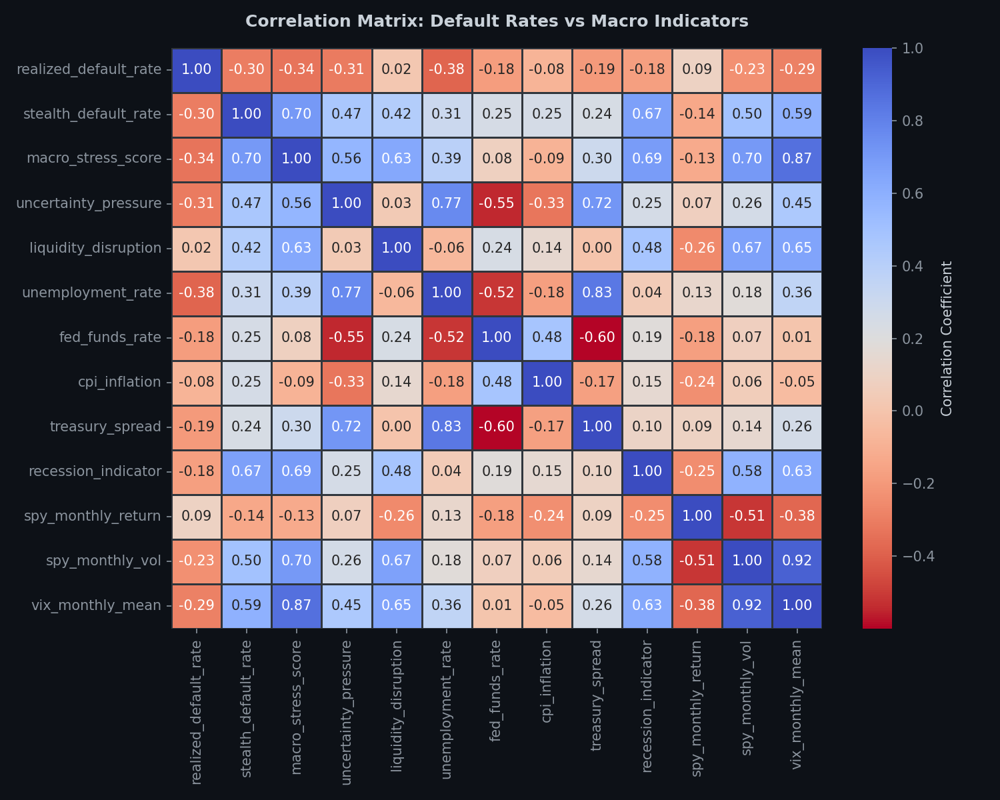
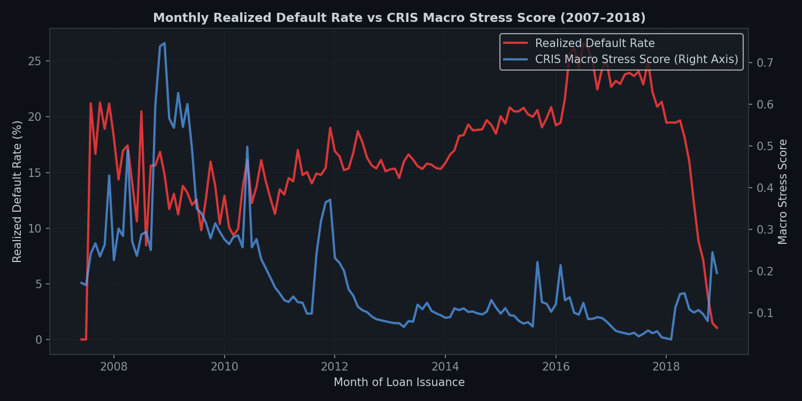
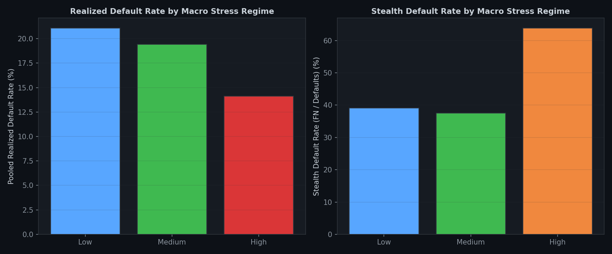
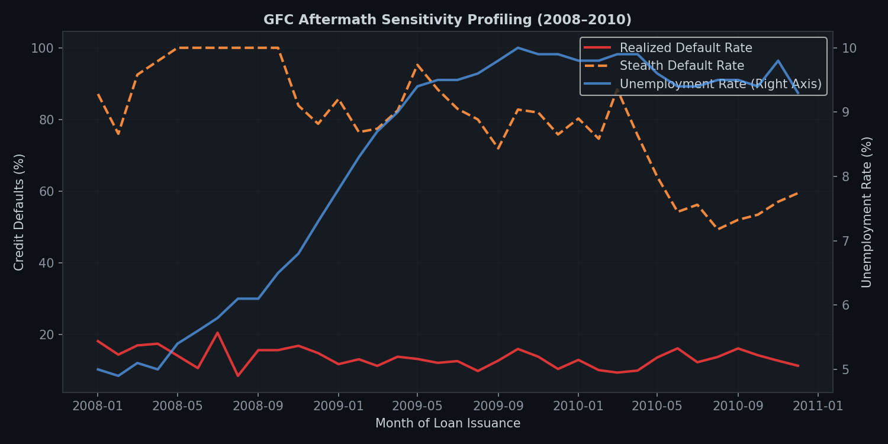
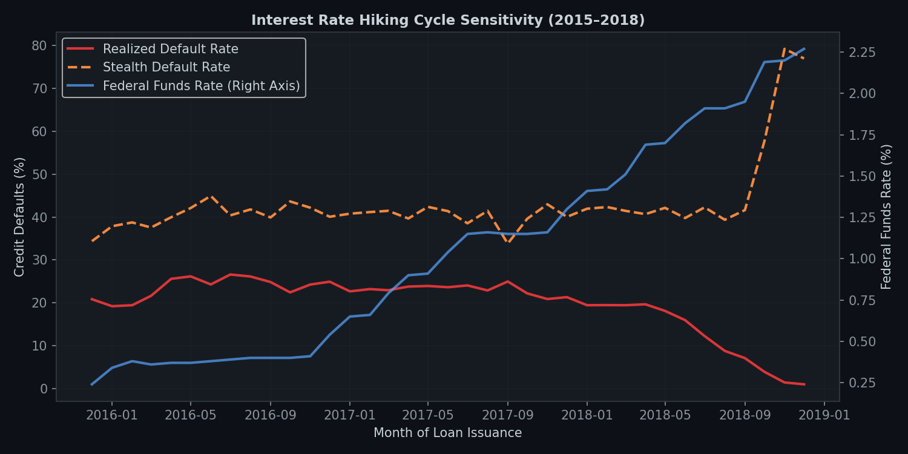

# CRIS: Cascade Risk Intelligence System
### A Quantitative Research Program on Environmental Intelligence and Consumer Credit Default Risk

[](#)
[](systems/credit_risk/README.md)
[](#)

---

## Cover Section & Hero Visual

The **Cascade Risk Intelligence System (CRIS)** was a multi-phase quantitative research program designed to evaluate whether incorporating macroeconomic and market-structure signals (environmental intelligence) improves the predictive performance of borrower-level consumer credit scoring and the efficiency of portfolio-level governance.

The program audited over **1.34 million resolved consumer loans** spanning 2007–2018 and aligned them with **18 macroeconomic and market-structure indicators** to challenge standard credit underwriting scorecards under out-of-time stress regimes.

### Research Timeline and Pipeline Development


---

## 1. Research Question

Traditional consumer credit models rely almost exclusively on static, borrower-specific credit registry data at the time of origination. However, credit portfolios are exposed to systemic, macroeconomic fluctuations that can rapidly escalate default correlation across cohorts.

The core research question investigated by CRIS was:
> **"Can environmental intelligence (macroeconomic and market structure signals) improve borrower-level credit risk prediction systems or portfolio-level governance?"**

To answer this, CRIS tested:
1. **Predictive Macro-Conditioning**: Whether injecting low-frequency macroeconomic signals directly into high-dimensional borrower profiles improves out-of-sample default classification.
2. **Macro-Governed Portfolios**: Whether conditioning portfolio allocation limits and underwriting thresholds on dynamic, monthly environmental stress indicators yields superior risk-adjusted returns compared to static, borrower-centric risk limits.

---

## 2. Research Timeline & Methodology

The CRIS research program was executed across seven distinct stages:

*   **Phase 0 & 0.5 — Ingestion & Leakage Auditing**: Built a clean, leakage-free data pipeline by removing 45 post-origination features from 1.34M resolved LendingClub loans, standardizing ingestion timestamps to prevent lookahead bias.
*   **Phase 1 & 1.5 — Champion Model Challenge & Selection**: Evaluated 5 machine learning classifiers under strict out-of-time splits (Train $\le 2015$, Test $\ge 2018$) with a 2-year temporal gap. LightGBM was selected as the champion model.
*   **Phase 2 — Borrower Profiling & Signal Decomposition**: Validated monotonic risk decile sorting (11.83x default separation) and audited the marginal predictive power of borrower-intrinsic traits.
*   **Phase 3 & 3.1 — Direct Signal Integration & Signal Reduction Studies**: Tested the predictive impact of macroeconomic signals and mapped the performance degradation curves under varying signal counts.
*   **Phase 4 — Portfolio Governance Attribution**: Conducted controlled historical simulations of System A (Unconstrained), System B (Borrower-centric limit tightening), and System C (CRIS Macro-governed overlays) under simulated economic downturns.
*   **Macro Default Analysis**: Investigated the statistical relationships between monthly macroeconomic stress and stealth defaults (defaulters classified as safe by the model).

---

## 3. Key Findings Dashboard

The following scorecard summarizes the empirical conclusions supported, unsupported, or unresolved by the CRIS validation audits:

### CRIS Evidence Scorecard


| Research Hypothesis / Claim | Status | Empirical Evidence |
| :--- | :---: | :--- |
| **Borrower-Centric Sufficiency** | **SUPPORTED** | A borrower-only LightGBM model retains **96.5%** of the full model's predictive power (**0.68240** vs. **0.70687** ROC-AUC) when all lender-pricing and grade variables are excluded. |
| **Borrower PD Limit Governance** | **SUPPORTED** | Tightening underwriting thresholds and allocation limits dynamically based on borrower-only PD distributions (System B) successfully controls portfolio loss rates under stress. |
| **Direct Macro Feature Injection** | **UNSUPPORTED** | Directly adding monthly macroeconomic features to the borrower-level model **degraded** out-of-time ROC-AUC from **0.70687** to **0.70061** ($p < 0.001$). |
| **Explanatory Macro-Conditioning** | **SUPPORTED** | Macro stress indicators are strongly positively associated with monthly aggregate stealth default rates ($r = 0.70$). Macro conditions explain the *aggregate* shift in defaults, but do not improve borrower-level ranking. |
| **Macro Predictive Gain for Stealth Defaults** | **UNSUPPORTED** | Adding macro features to a stealth default classifier failed to improve out-of-time AUC (**0.59135** borrower-only vs. **0.58883** with macro; difference is statistically insignificant, $p = 0.88$). |
| **Macro-Driven Governance Overlays** | **UNSUPPORTED** | System B (PD-Only) achieved a **higher** Return on Capital (**21.82%**) and higher NPV than System C (CRIS Macro Governance, **21.48%**), proving macro overlays compress yields unnecessarily. |
| **Long-Term Macro Lag Structures** | **UNRESOLVED** | The exact lead/lag relationship between macro shifts and default occurrence across multiple full credit cycles remains unresolved due to the 11-year dataset duration limit. |

---

## 4. Evidence Sections by Phase

### 4.1 Phase 1 & 1.5 — Champion Model Challenge
Five machine learning algorithms were evaluated on out-of-time test data (2018) to select the champion scoring engine.
*   **Results**: LightGBM outperformed XGBoost and Logistic Regression scorecards across ROC-AUC, PR-AUC, and calibration error.
*   **Predictive Performance Visual**:
    

### 4.2 Phase 2 — Borrower Profiling & Intrinsic Risk
A borrower-only audit retrained the champion classifier excluding all lender-assigned interest rates, credit grades, and loan terms to isolate intrinsic creditworthiness.
*   **Results**: The borrower-only model retained **96.5%** of the predictive power of the full model. FICO, Income, and Debt-to-Income (DTI) absorbed the signal previously encoded in interest rates.
*   **Evidence Visual**:
    

### 4.3 Phase 3 & 3.1 — Direct Signal Integration & Signal Reduction
CRIS evaluated models where macroeconomic features were directly appended to the borrower training matrix.
*   **Results**: Direct integration degraded out-of-time performance. In signal reduction trials, out-of-time ROC-AUC degraded monotonically as more macro features were introduced, proving that high-dimensional trees overfit to low-frequency monthly indicators.
*   **Signal Saturation Curve Visual**:
    

### 4.4 Phase 4 — Governance Attribution
Three portfolio management strategies were simulated under downturn regimes (85% Loss Given Default) to isolate the value of CRIS macro signals.
*   **Results**: System B (PD-only governance) achieved the highest net portfolio value and capital efficiency. System C (CRIS Macro Governance) suffered from yield compression due to excessive tightening on creditworthy borrowers.
*   **Governance Attribution Comparison Visual**:
    

---

## 5. Macro Default Analysis

To investigate whether macroeconomic conditions drive credit default leakage, we conducted a dedicated empirical research study aligning LendingClub cohorts with macroeconomic series from FRED and Yahoo Finance. 

### 5.1 Macroeconomic Correlation Heatmap
The heatmap below shows the correlation coefficients between default rates and monthly macro indicators across the 139-month history:


### 5.2 Key Macro default Findings
We address the core research questions regarding the interaction of macroeconomic factors and credit default behavior:

1.  **Are defaults correlated with macro conditions?**
    Yes. However, the correlation with the realized default rate aligned by **loan issuance month (vintage)** is *negative* (Pearson $r = -0.34$ with Macro Stress; $r = -0.38$ with Unemployment). This reveals a counter-cyclical underwriting phenomenon: during recessions, lenders tighten credit standards, resulting in higher-quality vintages that exhibit lower realized default rates.
2.  **Which macro variables show the strongest relationships?**
    The monthly **Stealth Default Rate** (the fraction of defaults that are classified as safe by the model) is *strongly positively correlated* with macroeconomic stress. The strongest associations are:
    *   **CRIS Macro Stress Score**: Pearson $r = 0.702$ ($p < 1\times 10^{-21}$)
    *   **Recession Indicator (USREC)**: Pearson $r = 0.669$ ($p < 1\times 10^{-18}$)
    *   **VIX Monthly Mean**: Pearson $r = 0.589$ ($p < 1\times 10^{-13}$)
3.  **Are macro variables explanatory but not predictive?**
    Yes. Macro variables appear to explain aggregate credit stress but did not improve borrower-level prediction under the tested architecture:
    *   **Model A (Borrower-Only)**: Out-of-time ROC-AUC = **0.59135**
    *   **Model B (Borrower + Macro)**: Out-of-time ROC-AUC = **0.58883**
    *   The predictive difference is **$-0.00252$**, which is statistically insignificant ($95\%$ bootstrap CI: $[-0.00859, 0.00181]$, $p\text{-value} = 0.88$). Monthly macro variables apply uniformly to all borrowers in a monthly cohort, providing zero cross-sectional variance to separate individual defaults.
4.  **Do macro conditions affect aggregate default rates even if they do not improve borrower-level ranking?**
    Yes. Macroeconomic stress shifts the default population. Under low-stress regimes, stealth defaults represent **$39.14\%$** of total defaults. Under high-stress regimes, they spike to **$63.81\%$** (a relative increase of $63.0\%$). Exogenous shocks push previously safe, high-FICO borrowers into default.

### 5.3 Stress Regime & Shock Sensitivity Visuals
The charts below show how credit default and stealth rates respond during macroeconomic shifts and historical shock periods (such as the GFC and Fed rate-hiking cycles):

| Default Rates vs. Macro Stress Score | Realized & Stealth Defaults by Regime |
| :---: | :---: |
|  |  |

| GFC Shock Sensitivity (2008–2010) | Interest Rate Hiking Cycle (2015–2018) |
| :---: | :---: |
|  |  |

---

## 6. Final Conclusions

The empirical findings from the CRIS research program lead to the following conclusions:

### A. Supported Conclusions
*   **Borrower-Intrinsic Sufficiency**: Underwriting models built on high-dimensional borrower characteristics (FICO, utilization, DTI, income) capture the vast majority of consumer default risk. 
*   **Counter-Cyclical Quality**: Realized credit default rates aligned by vintage are counter-cyclical because lending institutions restrict credit access and increase credit quality during economic downturns.
*   **Stealth Defaults as Exogenous Shocks**: Macroeconomic stress (such as high unemployment and high market volatility) systematically increases the proportion of defaults that are "stealth" (up to 63.81% in high-stress regimes), as exogenous shocks push creditworthy borrowers into default.

### B. Unsupported Conclusions
*   **Macro-Conditioned Underwriting**: The hypothesis that directly injecting monthly macroeconomic variables into borrower-level scoring models improves out-of-sample default classification is **unsupported**. It leads to panel-data overfitting and degrades out-of-time prediction.
*   **Macro-Driven Portfolio Limits**: The hypothesis that dynamic portfolio limits conditioned on monthly macro stress scores outperform static borrower-centric PD limits is **unsupported**. Under the simulated environment, macro-driven limits compress yields unnecessarily on safe borrowers.

### C. Open Research Questions
*   **Non-linear Macro Interactions**: Can macro signals provide value when modeled through complex, non-linear deep learning architectures or state-space models rather than tree-based classifiers?
*   **Alternative High-Frequency Signals**: Would high-frequency, localized economic indicators (e.g., zip-code level employment changes) provide the cross-sectional variance necessary to improve individual default prediction?

---

## 7. Validated Production Asset

The primary validated asset emerging from the CRIS research program is the **Credit Risk Platform**, a borrower-centric machine learning engine optimized for consumer default risk classification.

👉 **[Access the Credit Risk Platform documentation](systems/credit_risk/README.md)**

---

## 8. Repository Structure

```text
CRIS/
├── configs/                     # Global paths, seeds, and target leakage lists
├── reports/
│   ├── images/                  # Core visualizations (CAP, decile default rates)
│   │   ├── macro_default/       # Heatmaps and shock sensitivity profiling
│   │   └── stealth_analysis/    # PCA clusters and decile counts
│   └── final/                   # Audited research reports and verification ledgers
├── systems/
│   └── credit_risk/             # Validated Credit Risk Platform (features, models)
│       └── cr_analysis/         # Borrower-centric research and macro studies
├── validation/                  # Walk-forward, behavioral, and calibration tests
├── requirements.txt             # Pip package dependencies
├── environment.yml              # Conda environment configuration
└── README.md                    # Main Repository README
```

---

## 9. Reproducibility

To replicate the final validation audit and regenerate all reports and figures:

```bash
# 1. Setup Conda environment
conda env create -f environment.yml && conda activate CRIS

# 2. Ingest and engineer LendingClub data
python systems/credit_risk/features/ingestion.py
python systems/credit_risk/features/engineering.py

# 3. Train models and execute the validation audit
python systems/credit_risk/models/train.py
python systems/credit_risk/evaluation/final_governance_validation_audit.py
```

To run the independent macro default analysis:
```bash
python systems/credit_risk/cr_analysis/macro_default_analysis/macro_default_analysis.py
```

---

## 10. Archived Research Reports

Detailed technical documentation and cross-phase audits are archived in:
*   [FINAL_REPOSITORY_AUDIT.md](reports/final/FINAL_REPOSITORY_AUDIT.md) — System audit, folder checks, and reproducibility verification.
*   [RESEARCH_CONSISTENCY_AUDIT.md](reports/final/RESEARCH_CONSISTENCY_AUDIT.md) — Cross-phase consistency check and metric reconciliations.
*   [CLAIM_VALIDATION_MATRIX.md](reports/final/CLAIM_VALIDATION_MATRIX.md) — Validation checklist of all core CRIS hypotheses.
*   [FINAL_GOVERNANCE_ATTRIBUTION_REPORT.md](reports/final/FINAL_GOVERNANCE_ATTRIBUTION_REPORT.md) — Comparison of Systems A, B, and C under stress regimes.
*   [CRIS_FINAL_VERDICT_REPORT.md](reports/final/CRIS_FINAL_VERDICT_REPORT.md) — Final model risk committee verdict report.
*   [MACRO_DEFAULT_ANALYSIS_REPORT.md](systems/credit_risk/cr_analysis/macro_default_analysis/MACRO_DEFAULT_ANALYSIS_REPORT.md) — Statistical study on macro conditions and stealth default leakage.
