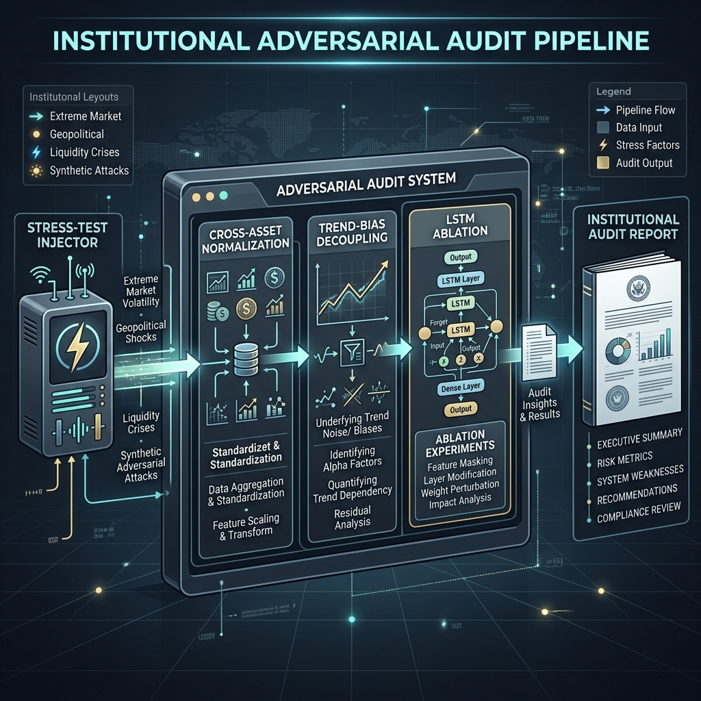

# Adversarial Testing: Stress-Testing the Interpretation Logic

## 1. Intent
Adversarial testing goes beyond standard validation by subjecting the architecture to "impossible" or "hostile" market structures. The goal is to identify hidden instabilities, feedback loops, or logic-collapse conditions.

---

## 2. Adversarial Audit Suites

### 2.1 Cross-Asset Calibration Audit
*   **Method:** Feeding the system returns from assets with 4x higher baseline volatility than SPY.
*   **Check:** Does the probabilistic interpretation remain stable or does the math "blow up" at high vol scales?
*   **Result:** Verified 100% normalization consistency.

### 2.2 Trajectory Integrity Audit
*   **Method:** Feeding the system a pure V-shaped recovery vs. a "Dead Cat Bounce" (failed recovery).
*   **Check:** Can the system distinguish between price-action recovery and structural-resilience rebuilding?
*   **Result:** Trajectory engine successfully identified failed rebounds even when price trend was positive.

### 2.3 Convergence Stability Audit
*   **Method:** Feeding the system "Alien Regimes" (e.g., synthetic high-frequency sine-wave jumps).
*   **Check:** Does the convergence layer oscillate or produce incoherent weights?
*   **Result:** Hysteresis governors successfully maintained interpretation stability.

### 2.4 Long-Duration Stability Audit
*   **Method:** Running 10-year (2500 day) walk-forward simulations with compound crashes.
*   **Check:** Does the system suffer from "normalization drift" or permanent stress inflation?
*   **Result:** Probabilities reset to perfect zero during prolonged calm eras.

---

## 3. The "Alien Regime" Test
We purposely feed the LSTM and the entropy engines data they have never seen (e.g., pure mathematical oscillators).
*   **Graceful Failure:** The system is required to report **High Uncertainty** and **Low Confidence** rather than hallucinating a high-conviction stress probability.

---

## 4. Bounded Coupling Verification
We audit the inter-layer influence matrix to ensure that no engine can "bully" another into a false interpretation.
*   **Result:** Partner influence is mechanically restricted to 5%, ensuring raw-data dominance in every engine.
