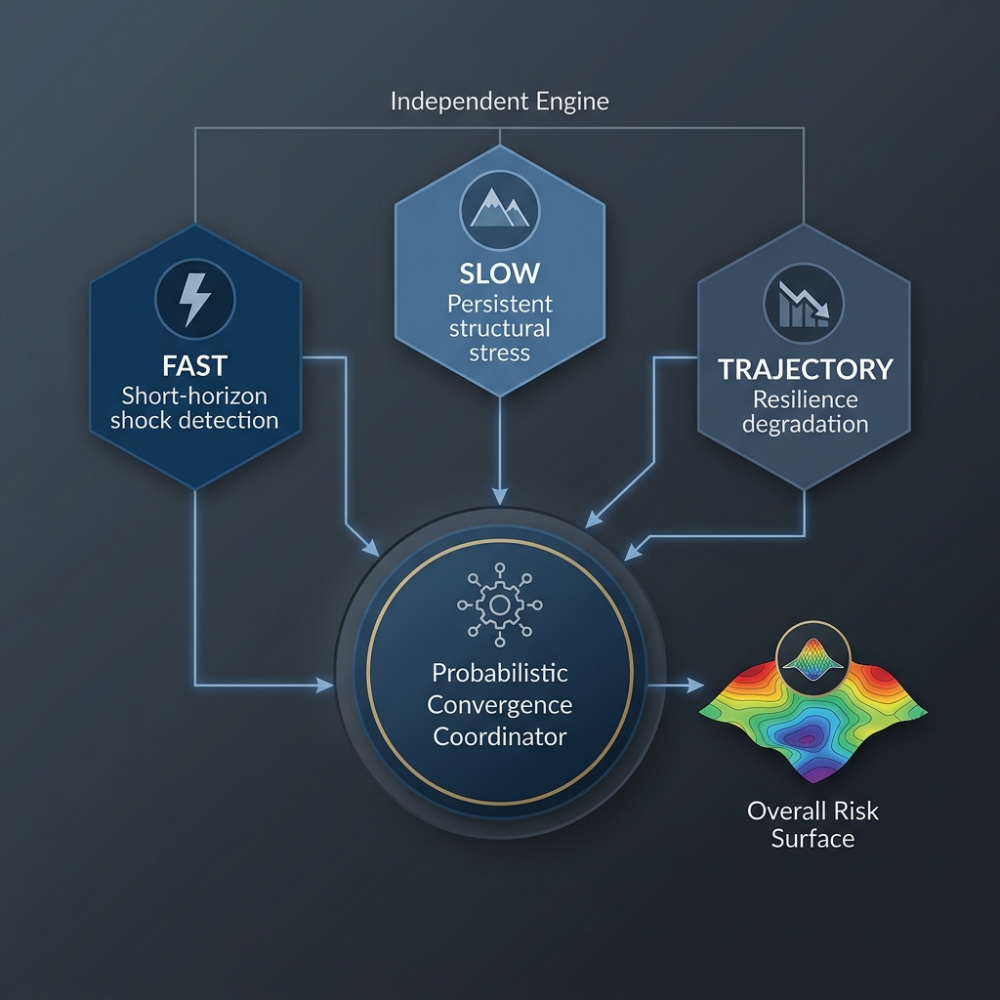
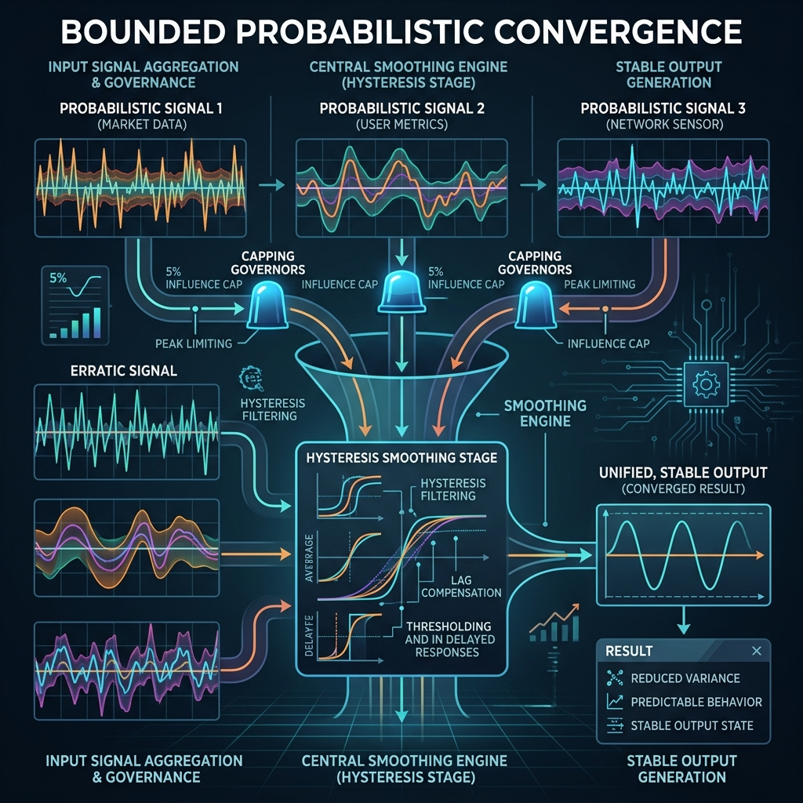

# Architecture Overview: CRIS Layer 3 Probabilistic Framework

## 1. System Intent
The CRIS Layer 3 framework is an institutional-grade market interpretation system designed to model evolving structural stress and resilience degradation. Unlike traditional categorical classifiers that output rigid, mutually exclusive labels, Layer 3 produces **Continuous Probabilistic Stress Fields**.

The system is designed to provide high-fidelity risk awareness to downstream allocators, preserving uncertainty and signal coherence during complex market transitions.

---

## 2. The Three-Field Engine Model

The architecture decouples market interpretation into three independent stress engines, each specializing in a distinct temporal horizon and structural phenomenon.

### 2.1 FAST: Short-Horizon Instability Field
*   **Focus:** Reflexive panic, liquidity disruption, and sharp jump-diffusion events.
*   **Signals:** High-frequency volatility ratios, permutation entropy (order-flow chaos proxy), and kurtosis-driven jump detection.
*   **Behavior:** Reactive and high-velocity. It is the first to escalate during acute shocks and the first to relax during stabilization.

### 2.2 SLOW: Persistent Structural Stress Field
*   **Focus:** Institutional deleveraging and structural trend-volatility persistence.
*   **Signals:** Low-frequency sample entropy, rolling volatility-of-volatility, and cross-sectional correlation clusters.
*   **Behavior:** Inertial and high-conviction. It requires sustained evidence of deterioration to escalate and provides a "stable anchor" during noisy market chop.

### 2.3 TRAJECTORY: Resilience & Degradation Engine
*   **Focus:** Long-horizon structural erosion and failed recovery dynamics.
*   **Signals:** Multi-horizon recovery half-lives, failed rebound accumulation, and bounded LSTM trajectory-similarity advisory.
*   **Behavior:** Trajectory-aware. It identifies when a market is "grinding down" structurally, even in the absence of high-velocity panic or volatility spikes.

---

## 3. Convergence & Coordination

The outputs of the three engines are integrated by the **Probabilistic Convergence Coordinator**.

*   **Decoupled Interpretation:** Each engine operates in a "vacuum" without knowledge of its partners. This prevents feedback loops and ensures raw-data dominance.
*   **Bounded Influence:** Engines are allowed to influence one another's confidence scores through a hard-capped (5%) partner-influence matrix, allowing for signal confirmation without systemic collapse.
*   **Temporal Smoothing:** Adaptive EMA governors ensure that the final "Overall Risk" probability evolves smoothly, eliminating the "flicker" and "whipsaw" common in discrete classifiers.

---

## 4. Output Contract

The framework exposes a rich, Pydantic-validated `Layer3Output` contract containing:
1.  **Field Intensities:** (Shock, Instability, Erosion, Fragility)
2.  **Meta-Dynamics:** (Stabilization Strength, Uncertainty Pressure, Signal Coherence)
3.  **Advisory State:** (NONE, FAST_SHOCK, SLOW_STRUCTURAL, TRAJECTORY_DEGRADATION, MIXED, TRANSITIONAL, UNCLEAR)

---

## 5. Mathematical Rigor
All internal computations are normalized against asset-specific historical baselines (`baseline_vol`, `baseline_entropy`). This ensures that the probabilistic interpretations are **comparable across asset classes**, era-invariant, and robust to local volatility profiles.
