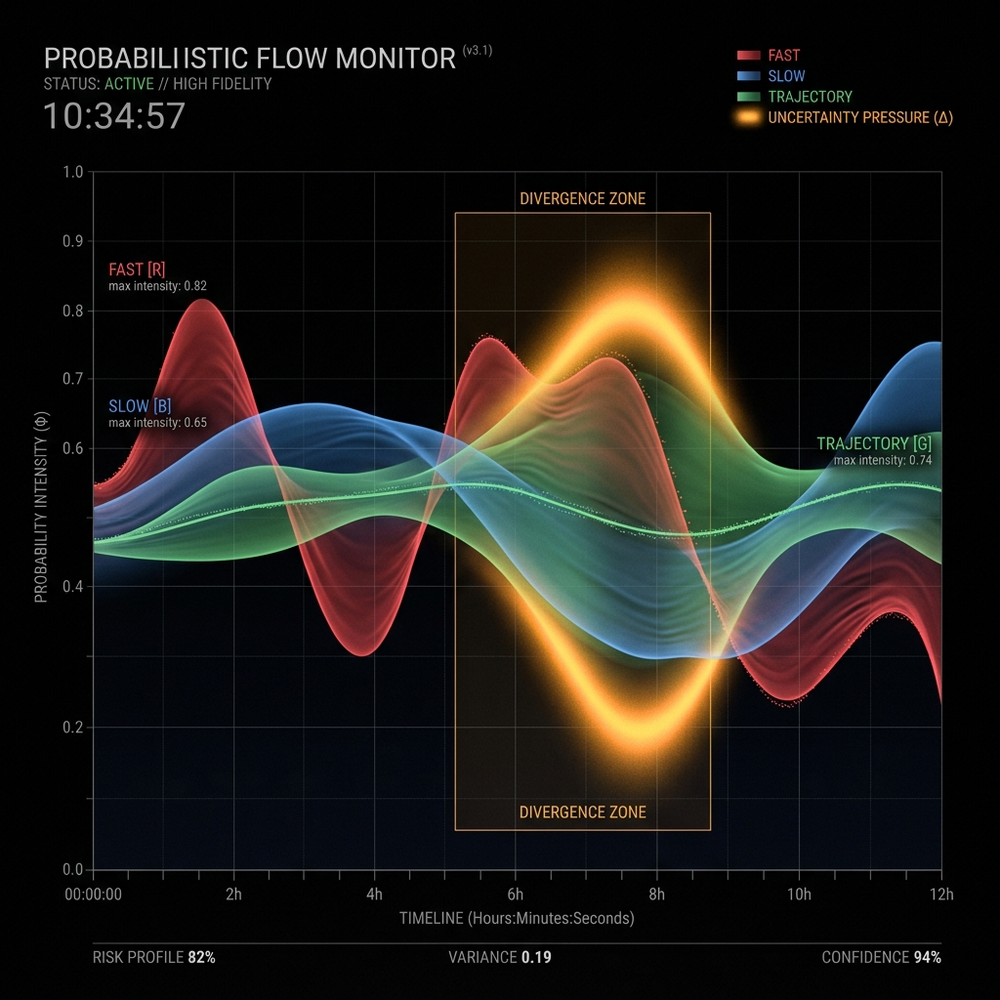

# Probabilistic Philosophy: Beyond Market Prediction

## 1. The Fallacy of Discrete States
Most financial risk systems attempt to classify the market into discrete categorical buckets (e.g., "Normal", "Crisis", "Recovery"). This approach fundamentally ignores the reality of market dynamics:
*   **Mixed States:** A market can simultaneously experience short-term reflexive panic while maintaining long-term structural resilience.
*   **State-Transition Noise:** Hard-switching between interpretations creates "flicker," causing downstream systems to oscillate and over-trade.
*   **The Prediction Trap:** Categorical labels often imply a "prediction" of what happens next, rather than a rigorous interpretation of what is currently true.

---

## 2. The Interpretation Frame
CRIS Layer 3 rejects the "Prediction Frame" in favor of the **"Interpretation Frame"**.
*   We do not ask: *"Will the market crash tomorrow?"*
*   We ask: *"What is the current intensity of structural stress and the quality of resilience trajectories?"*

By framing the problem as **probabilistic stress-field estimation**, we provide a continuous risk-surface that respects the inherent uncertainty of financial markets.

---

## 3. Preserving Uncertainty
In the CRIS framework, "Uncertainty" is not a failure of the model; it is an active signal.
*   The **Uncertainty Pressure** metric quantifies the divergence between independent stress engines. 
*   High uncertainty alerts downstream allocators that the structural signal is currently incoherent, favoring defensive neutrality over high-conviction exposure.

---

## 4. Bounded Dynamics & The "Governor"
To ensure institutional stability, the framework employs **Bounded Dynamics**.
*   **Maximum Influence Caps:** No single signal or ML model is allowed to monopolize the final probability. The LSTM advisory is hard-capped at 10%, and inter-layer influence is capped at 5%.
*   **Hysteresis & Smoothing:** Probabilities rebuild stabilization strength slower than they accumulate stress, reflecting the asymmetric psychological reality of market participants.

---

## 5. Non-Linearity vs. Robustness
While deep learning offers high predictive accuracy, its "black-box" nature is a liability in institutional risk management. CRIS Layer 3 utilizes **Bounded non-linearity**—using ML (LSTM) only as an advisory layer for trajectory-similarity, while keeping the core structural interpretation logic grounded in deterministic, interpretable entropy and volatility physics.
