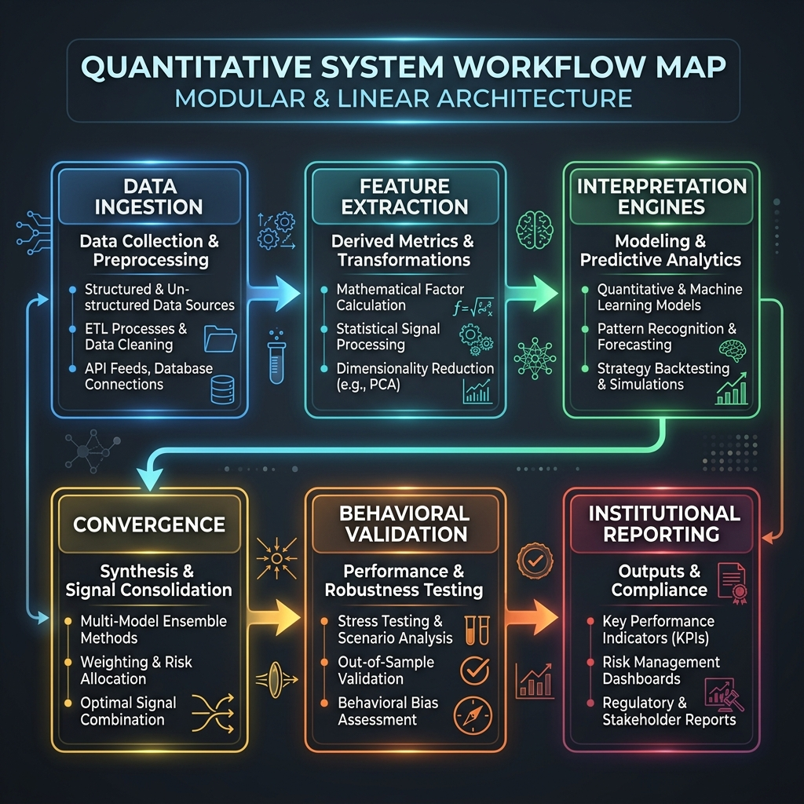
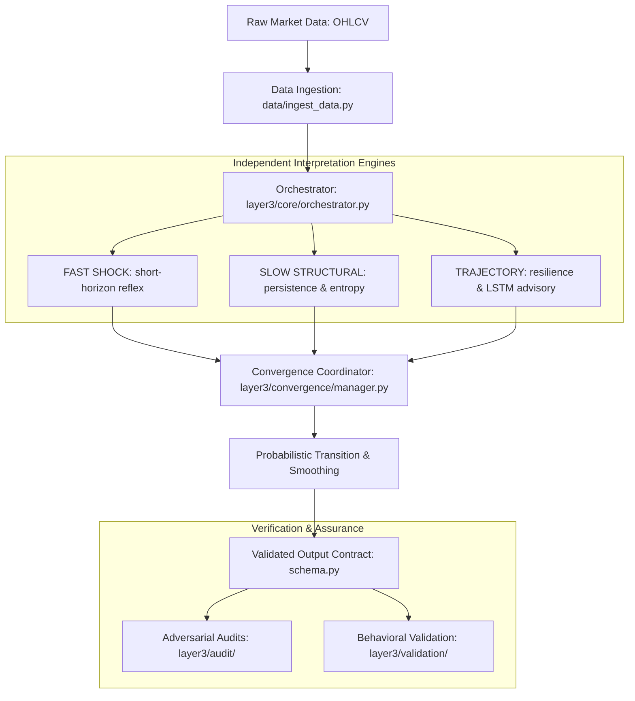

# Workflow Map: From Raw Data to Risk Interpretation

## 1. High-Level Flow
The CRIS Layer 3 pipeline follows a strictly linear, decoupled workflow designed for reproducibility and institutional traceability.

---

## 2. Execution Tracing

### 2.1 Interpretation Step
1.  **Ingestion:** `ingest_data.py` pulls and cleans historical/live CSVs into a standardized format.
2.  **Dispatch:** `orchestrator.py` initializes the `Layer3State` (persistent EMA states + LSTM models).
3.  **Engine Run:** Three sub-engines execute in parallel, mapping raw returns/prices into local risk and confidence scores.
4.  **Arbitration:** `convergence/manager.py` applies inter-layer influence and adaptive weighting.
5.  **Persistence:** `ConvergenceState` is updated to preserve temporal dynamics for the next trading day.

### 2.2 Assurance Step
1.  **Validation:** `validation/behavioral_suite.py` runs synthetic scenarios to verify the system still "heals" and "panics" as expected.
2.  **Audit:** Institutional audit scripts (e.g., `trajectory_integrity_audit.py`) falsify the interpretation logic against historical adversarial eras.

---

## 3. Operational Entry Points
*   **Production Inference:** `run_layer3(...)` inside `orchestrator.py`.
*   **Structural Training:** `train_lstm(...)` inside `orchestrator.py`.
*   **System Check:** `python layer3/validation/behavioral_suite.py`.
*   **Institutional Audit:** `python layer3/audit/institutional_audit.py`.
