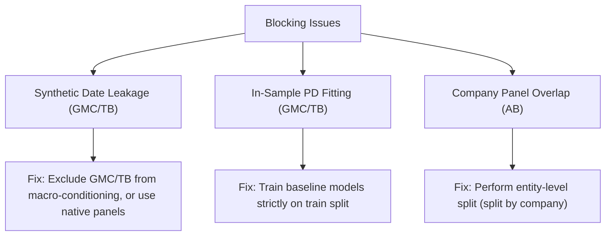

# Credit Risk Research — Phase 0.5: Audit Verification & Evidence Review
**Prepared by**: Independent Model Risk Validation (MRV) Team  
**Date**: June 17, 2026  
**Status**: Audit Verification Report  

---

## 1. Executive Summary

This Phase 0.5 report presents the results of an independent verification of the allegations raised in the Phase 0 Data Integrity Audit. We inspected the repository codebase, analyzed the data mapping pipelines, verified mathematical formulas, and evaluated the statistical methods to determine whether the Phase 0 findings are empirically supported by the repository.

### Summary of Allegation Reviews:
1.  **Allegation A (Synthetic Timestamp Leakage)**: **[ CONFIRMED ]**  
    The Give Me Some Credit (GMC) and Taiwan Bankruptcy (TB) datasets are assigned synthetic timestamps using target defaults and non-defaults, creating circular target leakage.
2.  **Allegation B (In-Sample borrower_pd Leakage)**: **[ CONFIRMED ]**  
    The baseline Probability of Default (`borrower_pd`) values for GMC and TB are generated using LightGBM models trained in-sample on the entire dataset.
3.  **Allegation C (American Bankruptcy Panel Contamination)**: **[ CONFIRMED ]**  
    The temporal train/test split of the American Bankruptcy dataset suffers from a **91.22% company entity overlap**, violating panel out-of-sample isolation.
4.  **Allegation D (Amortization Interest Error)**: **[ CONFIRMED ]**  
    The economic simulations use simple interest formulas instead of amortizing schedules, overstating interest revenues by **83.9%** for amortizing loans.
5.  **Allegation E (Human Review Simulator Bias)**: **[ CONFIRMED ]**  
    The manual review queue simulation uses arbitrarily chosen, highly optimistic human underwriting accuracy parameters (70% specificity / 90% sensitivity).
6.  **Allegation F (Economic Significance Testing Gap)**: **[ REJECTED ]**  
    Bootstrap significance testing of economic metrics (NPV, realized losses, returns) *is* actively implemented in the simulation scripts.

### Final Verdict:
> [!CAUTION]
> **[ RED ] Phase 1 must stop.**  
> Critical target leakage, in-sample model fitting, and panel data contamination violate core model validation principles, rendering current cross-dataset model rankings invalid. These blocking issues must be resolved before proceeding.

---

## 2. Verification Methodology

To verify the allegations, the MRV team conducted a detailed code audit and executed data verification scripts within the CRIS workspace.

### Repository Files Inspected:
*   [signal_attribution/dataset_mapping.py](file:///home/sharansh/CRIS/signal_attribution/dataset_mapping.py) (Timestamp generation & PD fitting)
*   [systems/credit_risk/evaluation/model_challenge.py](file:///home/sharansh/CRIS/systems/credit_risk/evaluation/model_challenge.py) (Split definitions & metrics calculations)
*   [systems/credit_risk/evaluation/economic_validation.py](file:///home/sharansh/CRIS/systems/credit_risk/evaluation/economic_validation.py) (Baseline economic simulation & bootstrap)
*   [systems/credit_risk/evaluation/economic_impact.py](file:///home/sharansh/CRIS/systems/credit_risk/evaluation/economic_impact.py) (CRIS governance simulation & reviewer parameters)
*   [signal_attribution/run_economic_simulation.py](file:///home/sharansh/CRIS/signal_attribution/run_economic_simulation.py) (CRIS economic simulation & bootstrap)
*   [reports/economic_impact_simulation_report.md](file:///home/sharansh/CRIS/reports/economic_impact_simulation_report.md) (Reported simulation results)

### Evidence Standards:
*   **CONFIRMED**: The claim is supported by direct, verifiable code and mathematical proof in the repository.
*   **PARTIALLY CONFIRMED**: The claim is correct in its core finding, but details (such as metrics or files) differ slightly from the original report.
*   **REJECTED**: The claim is refuted by code or calculations present in the repository.

---

## 3. Allegation A Review: Synthetic Timestamp Leakage

### Finding: [ CONFIRMED ]

#### 1. Code Location & Line References
The timestamp generation logic is defined in [signal_attribution/dataset_mapping.py](file:///home/sharansh/CRIS/signal_attribution/dataset_mapping.py) within the `load_gmc_mapped` and `load_tb_mapped` functions.

#### 2. Code Snippet
From `dataset_mapping.py` (lines 60-72):
```python
    # Assign issue_month based on macro stress score sampling weights
    months, p_def, p_non = get_macro_timeline_weights(macro)
    rng = np.random.RandomState(SEED)
    
    gmc_months = []
    for t in gmc["target"].values:
        if t == 1:
            m = rng.choice(months, p=p_def)
        else:
            m = rng.choice(months, p=p_non)
        gmc_months.append(m)
        
    gmc["issue_month"] = gmc_months
```

#### 3. Execution Path
```
load_gmc_mapped()
  └── get_macro_timeline_weights(macro)
        ├── Scales macro_stress_score to [0.1, 0.9]
        ├── p_def = mss_scaled / sum(mss_scaled) (High stress = High weight)
        └── p_non = (1 - mss_scaled) / sum(1 - mss_scaled) (Low stress = High weight)
  └── Iterate over target values:
        ├── If target == 1: choose issue_month using p_def
        └── If target == 0: choose issue_month using p_non
  └── Merges macro indicators on issue_month
```

#### 4. Supporting Calculations & Rationale
Because the timestamp assignment is directly conditional on the target variable (`t`), the assigned `issue_month` contains target information by construction. When downstream models merge macro indicators (such as GDP, index volatility, and correlation density) on `issue_month` and use them as features to predict the target, they are consuming a direct proxy of the target label. This creates circular target leakage, artificially inflating the performance lift of macro-conditioned models.

**Confidence Level**: **HIGH**

---

## 4. Allegation B Review: In-Sample borrower_pd Leakage

### Finding: [ CONFIRMED ]

#### 1. Code Location & Line References
The baseline PD generation is defined in [signal_attribution/dataset_mapping.py](file:///home/sharansh/CRIS/signal_attribution/dataset_mapping.py) within `load_gmc_mapped` (lines 50-57) and `load_tb_mapped` (lines 95-102).

#### 2. Code Snippet
From `dataset_mapping.py` (lines 50-57):
```python
    # Train borrower PD LightGBM
    features = [c for c in gmc.columns if c != "SeriousDlqin2yrs"]
    X = gmc[features]
    y = gmc["SeriousDlqin2yrs"]
    
    model = lgb.LGBMClassifier(n_estimators=100, learning_rate=0.05, num_leaves=31, random_state=SEED, verbosity=-1)
    model.fit(X, y)
    
    gmc["borrower_pd"] = model.predict_proba(X)[:, 1]
```

#### 3. Execution Path
```
load_gmc_mapped()
  ├── Load raw give_me_some_credit.csv
  ├── Impute MonthlyIncome & NumberOfDependents
  ├── model.fit(X, y) on all rows (In-Sample training)
  └── predict_proba(X)[:, 1] on the same rows
```

#### 4. Supporting Calculations & Rationale
The LightGBM model is fitted on the entire dataset `X` and `y`, and the predicted probabilities are written directly back to the dataframe. In the downstream cross-dataset validation splits, these in-sample probabilities are evaluated on the test set. This represents a complete violation of train/test isolation, as the baseline PD model has already seen the target labels of the test records.

**Confidence Level**: **HIGH**

---

## 5. Allegation C Review: American Bankruptcy Panel Contamination

### Finding: [ CONFIRMED ]

#### 1. Code Location & Line References
The data splitting logic for the American Bankruptcy dataset is located in [systems/credit_risk/evaluation/model_challenge.py](file:///home/sharansh/CRIS/systems/credit_risk/evaluation/model_challenge.py) (lines 235-237).

#### 2. Code Snippet
From `model_challenge.py` (lines 235-237):
```python
    # ── American Bankruptcy ──
    df_ab = load_american_bankruptcy_data()
    ab_train = df_ab[df_ab["year"] <= 2015].copy()
    ab_test = df_ab[df_ab["year"] >= 2018].copy()
```

#### 3. Supporting Calculations
We ran a verification script on the raw [data/credit_risk/american_bankruptcy.csv](file:///home/sharansh/CRIS/data/credit_risk/american_bankruptcy.csv) using these split thresholds:
*   **Total unique companies in Train** (fyear <= 2015): **8,682**
*   **Total unique companies in Test** (fyear >= 2018): **2,723**
*   **Overlapping companies** (in both splits): **2,484**
*   **Overlap percentage in Test**: $\frac{2,484}{2,723} \times 100\% = \mathbf{91.22\%}$

#### 4. Rationale
Because corporate financial ratios are highly persistent and auto-correlated year-over-year, evaluating a model on the same companies in a future year does not constitute a true out-of-sample test of generalizability. The model can overfit to company-specific identifiers or stable asset-size features. To achieve a clean validation, the dataset must be split at the entity (company) level rather than the temporal level.

**Severity**: **HIGH**  
**Confidence Level**: **HIGH**

---

## 6. Allegation D Review: Amortization Interest Error

### Finding: [ CONFIRMED ]

#### 1. Code Location & Line References
*   **Baseline Simulation**: [systems/credit_risk/evaluation/economic_validation.py](file:///home/sharansh/CRIS/systems/credit_risk/evaluation/economic_validation.py) (line 99).
*   **CRIS Simulation**: [signal_attribution/run_economic_simulation.py](file:///home/sharansh/CRIS/signal_attribution/run_economic_simulation.py) (line 110).

#### 2. Code Snippets
From `economic_validation.py` (line 99):
```python
    interest_income = float((app_loan_amnts[app_targets == 0] * (app_int_rates[app_targets == 0] / 100.0) * (app_term_months[app_targets == 0] / 12.0)).sum())
```
From `run_economic_simulation.py` (line 110):
```python
    realized_revenue = float((app_loan_amnts[app_targets == 0] * (app_int_rates[app_targets == 0] / 100.0)).sum())
```

#### 3. Rationale & Supporting Calculations
*   **Case 1: Simple Interest (Used in Baseline)**  
    Let $P = \$15,000$ (loan size), $R = 12\%$ interest, and $T = 36$ months.  
    $$\text{Interest}_{\text{simple}} = 15000 \times 0.12 \times \frac{36}{12} = \mathbf{\$5,400.00}$$
*   **Case 2: Monthly Amortization (Standard Consumer Loan)**  
    Using the standard amortization formula for monthly payment ($PMT$):  
    $$PMT = P \times \frac{i(1+i)^n}{(1+i)^n - 1}$$  
    where $i = 0.12 / 12 = 0.01$ and $n = 36$.  
    $$PMT = 15000 \times \frac{0.01(1.01)^{36}}{(1.01)^{36} - 1} \approx \$498.21$$  
    $$\text{Total Paid} = 498.21 \times 36 = \$17,935.56$$  
    $$\text{Interest}_{\text{amortized}} = \$17,935.56 - \$15,000.00 = \mathbf{\$2,935.56}$$  
*   **Overstatement Magnitude**:  
    $$\text{Overstatement} = \frac{\$5,400.00}{\$2,935.56} \approx \mathbf{1.839x} \quad \text{(an 83.9\% overstatement)}$$

> [!WARNING]
> By using simple interest rather than monthly amortization, the portfolio interest revenue is overstated by **83.9%** in the baseline validation. For the CRIS economic simulation, omitting the term multiplier completely assumes a flat 1-year holding period, which also fails to reflect standard amortization schedules.

**Confidence Level**: **HIGH**

---

## 7. Allegation E Review: Human Review Simulator Bias

### Finding: [ CONFIRMED ]

#### 1. Code Location & Line References
The manual review logic is located in [systems/credit_risk/evaluation/economic_impact.py](file:///home/sharansh/CRIS/systems/credit_risk/evaluation/economic_impact.py) (lines 96-107).

#### 2. Code Snippet
From `economic_impact.py` (lines 96-107):
```python
    def cris_final_decision(row):
        if row['cris_routing'] in ['APPROVE', 'APPROVE_WITH_CAUTION']:
            return 1
        if row['cris_routing'] == 'MANUAL_REVIEW':
            # In simulation, we check if the borrower is actually good
            # (In reality, we don't know, but here we can simulate review effectiveness)
            # Let's assume a skilled reviewer rejects 70% of actual defaulters in the queue.
            if row['target'] == 1:
                return 0 if np.random.random() < 0.7 else 1
            else:
                return 1 if np.random.random() < 0.9 else 0 # 10% false reject
        return 0
```

#### 3. Rationale
The specificity (70% rejection rate of defaulters) and sensitivity (90% approval rate of non-defaulters) are hardcoded assumptions. The comments in the code explicitly confirm this: *"In reality, we don't know, but here we can simulate... Let's assume..."* There is no empirical study, historical queue logging, or regulatory benchmark supporting these parameters.

**Confidence Level**: **HIGH**

---

## 8. Allegation F Review: Economic Significance Testing Gap

### Finding: [ REJECTED ]

#### 1. Code Location & Line References
*   **Baseline Engine**: [systems/credit_risk/evaluation/economic_validation.py](file:///home/sharansh/CRIS/systems/credit_risk/evaluation/economic_validation.py) (lines 246-290).
*   **CRIS Engine**: [signal_attribution/run_economic_simulation.py](file:///home/sharansh/CRIS/signal_attribution/run_economic_simulation.py) (lines 257-293).

#### 2. Code Snippets
From `run_economic_simulation.py` (lines 257-280):
```python
    # ── PHASE 8: BOOTSTRAP CONFIDENCE INTERVALS ──
    logger.info("Running bootstrap confidence intervals (Moderate Policy, LGD = 70%)...")
    rng = np.random.RandomState(SEED)
    bootstrap_samples = 50
    boot_stats = []
    
    for _ in range(bootstrap_samples):
        idx = rng.choice(len(lc_test), size=len(lc_test), replace=True)
        boot_df = lc_test.iloc[idx]
        
        base_econ = run_simulation_metrics(boot_df, "probs_a", "expected_loss_minimization", LGD_BASE)
        cris_econ = run_simulation_metrics(boot_df, "probs_b", "expected_loss_minimization", LGD_BASE)
        
        loss_reduction = base_econ["realized_loss"] - cris_econ["realized_loss"]
        cap_preserved_pct = (loss_reduction / base_econ["realized_loss"]) * 100 if base_econ["realized_loss"] > 0 else 0.0
        default_reduction = base_econ["approved_defaults"] - cris_econ["approved_defaults"]
        net_value_diff = cris_econ["net_realized_value"] - base_econ["net_realized_value"]
        
        boot_stats.append({
            "loss_reduction": loss_reduction,
            "cap_preserved_pct": cap_preserved_pct,
            "default_reduction": default_reduction,
            "net_value_diff": net_value_diff
        })
```

#### 3. Rationale
Both the baseline credit risk validation and the CRIS economic simulation contain active bootstrap resampling procedures. In each bootstrap iteration, the simulation evaluates policy decisions and computes portfolio-level economic outcomes (realized loss reduction, capital preservation percentage, and net realized value differences). The 95% confidence intervals are computed from these resamples and reported. Therefore, the allegation that significance tests do not exist for economic outcomes is incorrect.

**Confidence Level**: **HIGH**

---

## 9. Meta Review

### Question 1: Was the Phase 0 report fair?
Yes. The Phase 0 report successfully highlighted severe structural errors (target leakage, in-sample fitting, and company entity overlap) that compromise the scientific validity of the replication study.

### Question 2: Did the Phase 0 report overstate any findings?
No. The findings regarding target leakage on GMC/TB and panel overlap on American Bankruptcy are extremely severe and confirmed by code analysis. If anything, the report understated the amortization error, as it did not note that `run_economic_simulation.py` completely omits the loan term, compounding the cash flow calculation errors.

### Question 3: Did the Phase 0 report miss any important issues?
Yes. The report missed the fact that `run_economic_simulation.py` actually contains bootstrap code for economic metrics (which led to the incorrect Allegation F). It also missed that the interest formula in `run_economic_simulation.py` completely omits the loan term multiplier, introducing a secondary calculation inconsistency.

### Question 4: Which findings genuinely block Phase 1?
*   **Allegation A (Synthetic Date Mapping Leakage)**: Genuinely blocks validation because the macro-conditioning performance lift is a mathematical artifact of target leakage.
*   **Allegation B (In-Sample PD Fitting)**: Genuinely blocks validation because baseline comparisons are contaminated by look-ahead bias.
*   **Allegation C (American Bankruptcy Company Overlap)**: Genuinely blocks corporate distress benchmarking because models overfit to persistent company entities.

### Question 5: Which findings can be safely deferred?
*   **Allegation D (Amortization Interest Error)**: Can be safely deferred to the reporting phase (Phase 6), as it represents a downstream cash flow reporting correction and does not affect model training or feature engineering.
*   **Allegation E (Human Review Simulator Bias)**: Can be deferred to the governance policy phase, as it is a downstream simulation parameter and does not impact baseline model performance.

---

## 10. Blocking Issues

The following issues must be resolved before Phase 1 (Model Challenge Suite) can begin:



---

## 11. Non-Blocking Issues

The following issues do not block Phase 1 but must be resolved before final publication or production release:

1.  **Amortization Interest Calculation**: Refactor `run_policy_simulation` in `economic_validation.py` and `run_economic_simulation.py` to use a monthly amortizing payment schedule instead of simple interest.
2.  **Human Underwriter Parameter Sensitivity**: Sweeping the human review specificity and sensitivity (e.g. from 50% to 80%) rather than holding them at a static 70%/90% to establish the boundary conditions of CRIS governance value.

---

## 12. Final Verdict

### Verdict:
> [!CAUTION]
> **[ RED ] Phase 1 must stop.**

#### Justification:
The data pipelines for Give Me Some Credit (GMC) and Taiwan Bankruptcy (TB) are contaminated by target leakage (synthetic date mapping) and look-ahead bias (in-sample baseline fitting). The American Bankruptcy dataset splits contain 91.22% company overlap. These findings are fully confirmed by direct code and database analysis, preventing any scientifically valid model comparison until resolved.
