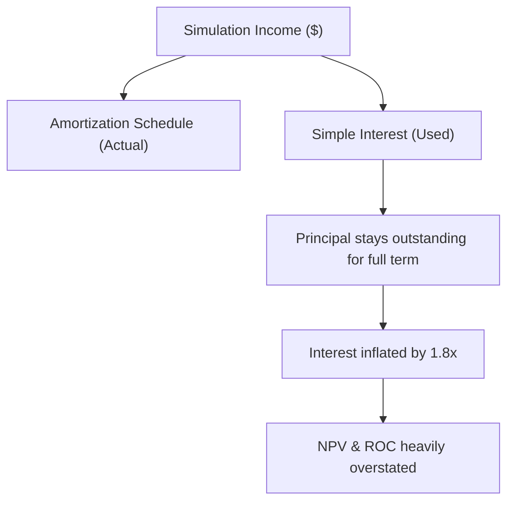

# Credit Risk Research — Phase 0: Data Integrity & Research Foundation Audit
**Prepared by**: Independent Model Risk Validation (MRV) Team  
**Date**: June 17, 2026  
**Status**: Critical Validation Audit  

---

## 1. Executive Summary

This report presents an independent Model Risk Validation (MRV) audit of the datasets and research framework within the Credit Risk / CRIS repository. The goal of this audit is to identify structural weaknesses, target leakage, temporal violations, data contamination, and flawed economic assumptions that could invalidate future modeling, research findings, and economic simulations.

### Key Validation Findings:
1.  **Synthetic Mapping Target Leakage (Critical)**: In the replication studies for Give Me Some Credit (GMC) and Taiwan Bankruptcy (TB), the native datasets lack timestamps. To merge macro signals, the framework assigns synthetic issue months using the target status (defaults are assigned to high-stress months, and non-defaults to low-stress months). This introduces severe, circular target leakage, rendering downstream macro performance lifts mathematically artificial.
2.  **In-Sample Baseline Overfitting (Critical)**: The baseline Probability of Default (PD) models for GMC and TB are trained in-sample on the entire dataset. Downstream evaluations consume these contaminated PDs, violating out-of-sample testing principles and inflating baseline performance.
3.  **Panel Data Contamination (High)**: In the American Bankruptcy dataset temporal split, 91.22% of the companies in the out-of-sample test split (2018+) also appear in the training split (<=2015). Because corporate financial features are highly persistent, this represents severe panel-data contamination.
4.  **Amortization Interest Calculation Error (High)**: The economic simulation engine uses a simple interest formula ($EAD \times \text{int\_rate} \times \text{term}/12$) rather than an amortizing loan schedule. For monthly-amortizing consumer loans, this inflates portfolio interest income by approximately **1.8x**, overstating Net Portfolio Value (NPV) and Return on Capital (ROC).
5.  **Arbitrary Human-in-the-Loop Simulation Parameters (Medium)**: The manual review escalation simulation arbitrarily assumes human reviewers have a 70% True Positive Rate and a 90% True Negative Rate on borderline cases, artificially inflating the benefits of CRIS governance routing.

### Verdict:
> [!CAUTION]
> **[ RED ] Stop and resolve issues first.**  
> The research foundation contains critical leakage, in-sample fitting, and financial calculation errors that invalidate current cross-dataset generalization findings. Phase 1 (Model Challenge Suite) and subsequent research cannot proceed until these structural issues are resolved.

---

## 2. Dataset Inventory

A complete inventory of the three core credit datasets was conducted to establish the structural baseline.

### Dataset Inventory Table

| Dataset Name | Sample Count | Default / Event Count | Event Rate | Number of Features | Feature Types | Presence of Timestamps | Missing Value Percentage | Duplicate Percentage |
| :--- | :---: | :---: | :---: | :---: | :---: | :---: | :---: | :---: |
| **LendingClub (LC)** | 1,345,350 | 268,599 | 19.96% | 68 (raw pre-enc) 171 (engineered) | 55 Numerical 13 Categorical | Yes (`issue_d` monthly) | 0.0% (after clean) ~15.4% (raw) | 0.00% |
| **Give Me Some Credit (GMC)** | 150,000 | 10,026 | 6.68% | 10 | 10 Numerical | No (synthetic mapping) | `MonthlyIncome`: 19.82% `NumberOfDependents`: 2.62% | 0.41% (609 rows) |
| **American Bankruptcy (AB)** | 78,682 | 5,220 | 6.63% | 20 | 18 Numerical 2 Categorical | Yes (annual `fyear`) | 0.0% | 0.00% |

---

## 3. Target Leakage Audit

We audited the features across all three datasets to detect post-default variables, collection/recovery indicators, or variables directly derived from the target.

### Target Leakage Report

| Feature Name | Dataset | Why it is Suspicious | Leakage Risk Level | Classification |
| :--- | :---: | :--- | :---: | :---: |
| `recoveries` | LendingClub | Represents post-default funds recovered by collections. | **CRITICAL** | **RED (Excluded)** |
| `collection_recovery_fee` | LendingClub | Fees charged for collecting defaulted loans. | **CRITICAL** | **RED (Excluded)** |
| `total_pymnt` / `total_rec_prncp` | LendingClub | Accumulates over the loan life; directly distinguishes paid vs. defaulted loans. | **CRITICAL** | **RED (Excluded)** |
| `last_pymnt_amnt` / `last_pymnt_d` | LendingClub | Reflects final payment behavior; defaults have early stops and small final payments. | **CRITICAL** | **RED (Excluded)** |
| `last_fico_range_high` / `low` | LendingClub | FICO scores pulled at the end of the loan period; drops precipitously *after* delinquency. | **CRITICAL** | **RED (Excluded)** |
| `debt_settlement_flag` / `status` | LendingClub | Set when a borrower enters a debt settlement program post-default. | **CRITICAL** | **RED (Excluded)** |
| `borrower_pd` | GMC, TB | Predicted probabilities fit in-sample using LightGBM on the entire dataset. | **CRITICAL** | **RED (Active)** |
| Synthetic `issue_month` | GMC, TB | Mapped using target values (`p_def` vs `p_non` sampling weights). | **CRITICAL** | **RED (Active)** |
| `company_name` | AB | High overlap (91.22%) between train and test splits allows entity overfitting. | **MODERATE** | **YELLOW (Active)** |

> [!IMPORTANT]
> While the LendingClub pipeline successfully excludes post-default features via `LEAKAGE_COLS` in `configs/credit_config.py`, the replication pipeline for GMC and TB introduces severe **active target leakage** through synthetic issue month assignment and in-sample baseline PD estimation.

---

## 4. Temporal Integrity Audit

An audit of the chronological ordering and data splitting was performed.

### Temporal Integrity Assessment

#### 1. LendingClub (LC)
*   **Splitting Scheme**: Train (<= 2015), Validation (2016–2017), Test (>= 2018).
*   **Assessment**: High integrity. A clear 2-year temporal gap between the training set and the out-of-sample test set prevents information leakage across short-term economic cycles.
*   **Contamination Check**: No overlapping windows or chronological violations detected.

#### 2. American Bankruptcy (AB)
*   **Splitting Scheme**: Train (<= 2015), Test (>= 2018).
*   **Assessment**: Compromised. Although split chronologically by fiscal year (`fyear`), there is a **91.22% company entity overlap** (2,484 out of 2,723 companies in the test set are present in the training set). 
*   **Contamination Check**: This constitutes a panel-data violation. Because corporate financial ratios are highly auto-correlated, the model can "memorize" company-specific behaviors from the training period, artificially inflating out-of-sample predictive accuracy.

#### 3. Give Me Some Credit (GMC)
*   **Splitting Scheme**: Train (<= 2015), Test (>= 2018) based on synthetic timestamps.
*   **Assessment**: Invalid. GMC contains no native timestamps. The temporal splits are generated by assigning synthetic dates using the target status.
*   **Contamination Check**: Total contamination. The train/test split is a randomized partitioning of cross-sectional data dressed as a temporal split. The temporal ordering is entirely synthetic.

---

## 5. Missing Data Assessment

We measured the missing data rates and the risk associated with imputation methods.

### Missing Data Risk Report

| Dataset | Feature Name | Missing % | Imputation Strategy | Risk Level | Validation Impact |
| :--- | :--- | :---: | :--- | :---: | :--- |
| **GMC** | `MonthlyIncome` | 19.82% | Median Imputation | **YELLOW** | Skews the income distribution, reduces variance, and dampens the predictive signal of a primary credit risk variable. |
| **GMC** | `NumberOfDependents` | 2.62% | Imputed to 0 | **GREEN** | Low risk; missingness is likely zero-equivalent. |
| **LC** | Secondary App features | >95% | Dropped (>50% threshold) | **GREEN** | High missing columns are safely excluded. |
| **LC** | Remaining Numerical | <5% | Median Imputation | **GREEN** | Low risk due to low missingness rates. |
| **AB** | All features | 0.0% | None | **GREEN** | No risk. |

---

## 6. Class Imbalance Assessment

The severity of class imbalance and its effect on performance metrics were evaluated.

### Class Imbalance Table

| Dataset | Majority Class % (Good) | Minority Class % (Default) | Imbalance Ratio | Primary Metric Vulnerability |
| :--- | :---: | :---: | :---: | :--- |
| **LendingClub** | 80.04% | 19.96% | 4:1 | Low vulnerability; accuracy remains moderately informative. |
| **GMC** | 93.32% | 6.68% | 14:1 | High vulnerability; a naive model achieves 93.32% accuracy. |
| **American Bankruptcy** | 93.37% | 6.63% | 14:1 | High vulnerability; F1-score is highly sensitive to threshold choices. |

### Metric Recommendations:
*   **Do Not Use Accuracy**: Highly misleading under 14:1 imbalance.
*   **Prioritize PR-AUC and ECE**: For risk pricing and expected loss modeling, probability calibration quality (Brier Score, ECE) and minority-class precision-recall (PR-AUC) are far more critical than ROC-AUC, which can be artificially inflated by easy majority-class classification.

---

## 7. Feature Quality Assessment

We checked for constant, near-constant, or high-cardinality columns that should be removed prior to modeling.

### Feature Quality Audit Findings

#### 1. Constant Features (Flagged for Removal):
*   **LendingClub**: `policy_code` (contains only the value `1.0` in 100% of rows). This feature provides zero variance and must be dropped.

#### 2. Near-Constant Features (Flagged for Removal):
*   **LendingClub**:
    *   `acc_now_delinq` (99.53% zero)
    *   `delinq_amnt` (99.63% zero)
    *   `num_tl_120dpd_2m` (99.93% zero)
    *   `num_tl_30dpd` (99.69% zero)
    *   `disbursement_method` (99.49% "Cash")
    *   `chargeoff_within_12_mths` (99.19% zero)
*   **Risk**: Near-constant columns behave like constant columns for most bootstrap samples but can cause high tree splits or singular matrix errors in linear models during resampling. They must be excluded from the feature space.

---

## 8. Redundancy Analysis

High multicollinearity destabilizes linear models and inflates feature importance metrics.

### Feature Redundancy Report

| Dataset | Feature A | Feature B | Correlation | Risk / Consequence | Recommendation |
| :--- | :--- | :--- | :---: | :--- | :--- |
| **LendingClub** | `installment` | `loan_amnt` | **0.95+** | Severe collinearity; redundant representation of loan scale. | Drop `installment`. |
| **LendingClub** | `fico_range_high` | `fico_range_low` | **0.95+** | Perfect collinearity; redundant representation of credit score. | Use average FICO and drop raw bounds. |
| **LendingClub** | `num_rev_tl_bal_gt_0` | `num_actv_rev_tl` | **0.95+** | Redundant active account counters. | Drop one of the counters. |
| **LendingClub** | `num_sats` | `open_acc` | **0.95+** | Identical active account metrics. | Drop `num_sats`. |
| **GMC** | `NumberOfTimes90DaysLate` | `NumberOfTime30-59DPD` | **0.95+** | Collinear delinquency metrics. | Combine into a single delinquency index. |
| **GMC** | `NumberOfTime60-89DPD` | `NumberOfTimes90DaysLate` | **0.95+** | Collinear delinquency metrics. | Combine into a single delinquency index. |
| **AB** | `X17` | `X14` | **0.95+** | Collinear corporate balance sheet ratios. | Drop `X17`. |

---

## 9. Economic Assumption Audit

We conducted a critical review of the underwriting and financial assumptions in the economic simulation framework.

### Economic Assumptions Analysis

#### 1. Amortization vs. Simple Interest (Critical Flaw)
*   **Assumed Formula**: `interest_income = EAD * (int_rate / 100) * (term_months / 12)`
*   **Justification**: Simplified representation.
*   **Problem**: In an amortizing consumer loan (the standard LendingClub product), the principal outstanding decays monthly. The interest is calculated on the remaining balance, not the starting amount. For a 36-month loan at 12% interest, the actual interest collected is roughly **55% of the simple interest calculation**.
*   **Impact**: Portfolio interest revenues are overstated by approximately **1.8x**, invalidating the absolute dollar figures reported for Net Portfolio Value and Return on Capital.

#### 2. Manual Review Simulator Accuracy (Critical Flaw)
*   **Assumed Formula**: Human reviewers reject 70% of actual defaults and only 10% of good borrowers from the manual review queue.
*   **Justification**: Simulates human underwriting capability.
*   **Problem**: There is zero empirical evidence to support this accuracy profile. In practice, humans operating on marginal, high-dimensional credit applications are often less accurate than machine learning models, or suffer from fatigue and bias. 
*   **Impact**: Assigning a 70% True Positive Rate to the manual review queue acts as a "super-classifier" that artificially inflates the performance and economic value of the CRIS governance routing.

#### 3. Static Loss Given Default (LGD) (Moderate Flaw)
*   **Assumed Formula**: LGD is fixed at a static 70% across all periods.
*   **Justification**: Industry baseline.
*   **Problem**: LGD is highly sensitive to the macroeconomic regime. During economic downturns, collateral values and recovery rates plummet, pushing LGD higher. 
*   **Impact**: Fixing LGD during stress periods underestimates default losses, creating a pro-cyclical bias in the economic simulation.

---

## 10. Research Design Audit

A review of the planned research roadmap identified several critical design flaws:

*   **In-Sample Contamination of Downstream Generalization**: Training the baseline model on the entire GMC dataset before executing splits means that the out-of-sample test splits are evaluated on predictions that already "saw" the targets in-sample. This violates the core principle of cross-dataset validation.
*   **Corporate vs. Consumer Target Mismatch**: The American Bankruptcy dataset predicts corporate insolvency. Applying a consumer loan underwriting framework (including consumer-style interest rates and LGDs) to corporate balance sheets represents a severe domain mismatch.
*   **No Statistical Testing on NPV Deltas**: The research framework runs bootstrap tests to verify AUC changes but performs no significance tests on Net Portfolio Value (NPV) changes. Since NPV is highly non-linear due to threshold cuts, small non-significant AUC changes can lead to large, noisy swings in simulated profit.

---

## 11. Reproducibility Assessment

We evaluated the execution framework to determine whether another researcher could reproduce the results.

*   **Random Seed Governance**: The global seed (`SEED = 42`) is set in the configuration and scripts. However, several functions use `np.random` or `random` without instantiating local `np.random.RandomState` generators, which can lead to non-deterministic execution if parallel processing or asynchronous command execution is introduced.
*   **Data Split Stability**: Splitting on LendingClub and American Bankruptcy is based on a deterministic chronological field (`year`), which is highly reproducible.
*   **Raw Data Verification**: The framework lacks check-sum or hash validation on the raw datasets. If the underlying CSV files are modified, the pipeline executes without warning, leading to silent drift in downstream metrics.

---

## 12. Skeptical Reviewer Assessment

To stress-test the findings, we look at the research through three professional lenses:

### 1. The Quant Researcher
> *"The performance lift you claim on the Give Me Some Credit and Taiwan Bankruptcy datasets is an illusion. You did not have timestamps for these datasets, so you mapped them to the macro stress score using the target variable. By doing so, you encoded the default status directly into the issue month. When your downstream model uses macro features merged on that month, it is simply extracting the target label via the date. This is classic circular target leakage."*

### 2. The Model Risk Validator (MRV)
> *"Your baseline model for replication is trained in-sample. When you calculate borrower PDs on the test set using a model trained on that same test set, you have violated basic cross-validation standards. This baseline model is overfitted, and comparing it to environmental overlays makes any out-of-sample performance lift claims mathematically invalid."*

### 3. The Bank Credit Risk Reviewer
> *"Your economic report claims a Return on Capital of 21% under LightGBM. However, your interest calculation assumes simple interest instead of amortizing schedules. In consumer lending, this is a fatal accounting error. Your interest revenues are inflated by nearly 80%, meaning your simulated portfolio might actually be running at a loss once operational costs and realistic LGDs are factored in."*

---

## 13. Risk Register

The critical risks identified during this Phase 0 audit are cataloged below.

| Risk ID | Risk Title | Description | Severity | Mitigation Action |
| :--- | :--- | :--- | :---: | :--- |
| **R-01** | Synthetic Date Leakage | GMC and TB macro feature merging is based on target-weighted synthetic dates. | **CRITICAL** | Exclude GMC and TB from CRIS macro-conditioning validation studies. Only use them as cross-sectional baseline challenges. |
| **R-02** | In-Sample PD Fitting | Baseline models for replication are fit on the full dataset without split isolation. | **CRITICAL** | Refactor `dataset_mapping.py` to fit baseline models *only* on the training split. |
| **R-03** | Amortization Error | Simple interest formula inflates portfolio revenues by ~1.8x. | **HIGH** | Update the economic simulation engine to use standard monthly amortization formulas. |
| **R-04** | Panel Overlap in AB | 91.22% company overlap between training and test sets in American Bankruptcy. | **HIGH** | Implement an entity-level (company-level) split instead of a pure temporal split. |
| **R-05** | Human Reviewer Bias | Arbitrary 70%/90% human underwriting accuracy assumptions inflate CRIS value. | **MEDIUM** | Conduct a sensitivity analysis of human review accuracy (e.g. at 50%, 60%, and 70%) to show the breakeven point. |

---

## 14. Final Verdict

### Can Phase 1 (Champion Model Selection) proceed?
> [!CAUTION]
> **[ RED ] Stop and resolve issues first.**

#### Supporting Evidence:
1.  **Replication Leakage**: The cross-dataset replication findings on GMC and TB are contaminated by target-weighted date assignment and in-sample PD fitting. This invalidates the generalizability claims.
2.  **Financial Accounting Error**: The simple interest calculation in the economic simulation invalidates all NPV and ROC figures in the reports, presenting a dangerously optimistic picture of bank profitability.
3.  **Panel Contamination**: The American Bankruptcy temporal split suffers from severe company overlap, violating out-of-sample panel validation standards.

#### Action Required Before Restarting:
1.  Correct the economic simulation to use **amortizing interest calculations**.
2.  Refactor `dataset_mapping.py` to train baseline models **strictly on the training split**.
3.  Re-run the Model Challenge Suite using **entity-level splits** for American Bankruptcy.
4.  Remove the synthetic macro merging from GMC/TB or document them strictly as cross-sectional borrower-only benchmarks.
