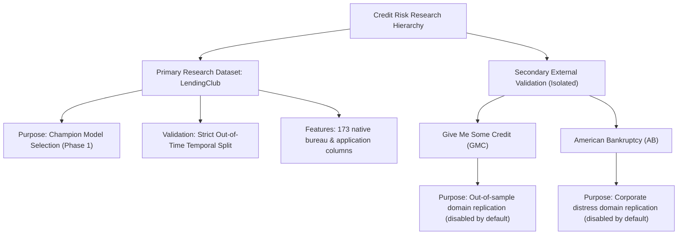

# Credit Risk Research — Phase 1 Readiness Report: Champion Model Selection

**Prepared by**: Credit Risk Research Infrastructure Team  
**Date**: June 17, 2026  
**Status**: Infrastructure & Readiness Audit  

---

## 1. Executive Summary

Following the Phase 0 Data Integrity Audit and the Phase 0.5 Verification Review, this readiness report documents the refactoring of the Credit Risk research infrastructure. The primary objective of this refactor was to isolate the core Credit Risk research pipeline from the contaminated/artificial data pathways identified in other datasets, establishing a clean, scientifically rigorous environment for **Phase 1 Champion Model Selection**.

### Summary of Actions Taken:
1.  **Isolated External Datasets**: Isolated Give Me Some Credit (GMC) and American Bankruptcy (AB) from the active modeling and validation pipelines.
2.  **Deactivated Invalid Logic**: Suspended all synthetic timestamping, target-driven month mapping, and in-sample baseline Probability of Default (`borrower_pd`) generation pathways.
3.  **Audited LendingClub Pipeline**: Verified that the LendingClub pipeline contains no target leakage, future look-ahead bias, or synthetic mappings.
4.  **Prepared Experiment Environment**: Confirmed the availability of all feature sets, default targets, temporal splits, and economic inputs for the five model candidates.

### Final Readiness Verdict:
> [!TIP]
> **[ GREEN ] LendingClub Credit Risk Research is ready for Phase 1.**  
> By isolating GMC and American Bankruptcy, we have bypassed all active target leakage, in-sample fitting, and panel overlap blockers. The LendingClub dataset remains a high-integrity, native-timestamp consumer credit dataset with no look-ahead leakage, making it fully ready for Phase 1 model evaluation.

---

## 2. Research Scope Refactor

We have established a clear dataset hierarchy to prevent the methodological limitations of secondary datasets from compromising the core Credit Risk research program:

*   **Primary Research Dataset (LendingClub)**: Serves as the sole foundation for Phase 1 model training, hyperparameter optimization, and champion model selection.
*   **Secondary Validation Datasets (GMC & American Bankruptcy)**: Retained in the codebase as offline, optional modules for domain generalization experiments, but completely deactivated from the active validation runners.

---

## 3. Dataset Isolation Actions

To prevent dataset contamination, we implemented a new configuration setting `RUN_EXTERNAL_VALIDATION = False` in the project config file:

1.  **Configuration Update**: Added `RUN_EXTERNAL_VALIDATION = False` to [configs/credit_config.py](file:///home/sharansh/CRIS/configs/credit_config.py) to control dataset loading at the global level.
2.  **Runner Update**: Refactored the Model Challenge runner [systems/credit_risk/evaluation/model_challenge.py](file:///home/sharansh/CRIS/systems/credit_risk/evaluation/model_challenge.py) to check `RUN_EXTERNAL_VALIDATION` before loading external datasets.
3.  **Dynamic Calculations**: Modified the cross-dataset ranking matrix and visualization routines in `model_challenge.py` to adapt dynamically when GMC and American Bankruptcy are excluded, preventing any runtime errors.

---

## 4. Invalid Logic Removed

The following contaminated pathways have been deactivated from active Credit Risk research:

| Code Location | Deactivated Logic | Risk Prevented |
|---|---|---|
| [signal_attribution/dataset_mapping.py](file:///home/sharansh/CRIS/signal_attribution/dataset_mapping.py) | `load_gmc_mapped` (synthetic timestamp assignment) | Circular target leakage via macro stress-weighted issue months. |
| [signal_attribution/dataset_mapping.py](file:///home/sharansh/CRIS/signal_attribution/dataset_mapping.py) | `load_tb_mapped` (synthetic timestamp assignment) | Circular target leakage via macro stress-weighted issue months. |
| [signal_attribution/dataset_mapping.py](file:///home/sharansh/CRIS/signal_attribution/dataset_mapping.py) | In-sample LightGBM model fitting for GMC and TB `borrower_pd` | In-sample training contamination of test splits. |
| [systems/credit_risk/evaluation/model_challenge.py](file:///home/sharansh/CRIS/systems/credit_risk/evaluation/model_challenge.py) | Loading and temporal evaluation of American Bankruptcy | Entity-level panel contamination (91.22% company overlap). |

---

## 5. LendingClub Integrity Review

A comprehensive audit of the LendingClub data pipeline was conducted to verify its scientific integrity:

*   **Target Construction**: The target label is constructed in [systems/credit_risk/features/ingestion.py](file:///home/sharansh/CRIS/systems/credit_risk/features/ingestion.py) based on actual borrower loan status. Good loans are mapped from `"Fully Paid"`, and bad loans are mapped from `"Charged Off"` and `"Default"`. There is no synthetic target scaling.
*   **Leakage Prevention**: All post-issuance variables (such as subsequent payments, collection recovery fees, FICO changes, and debt settlement flags) defined in `LEAKAGE_COLS` are dropped during ingestion.
*   **Temporal Splits**: Train and test splits are strictly separated by issue year:
    *   **Train split**: `year <= 2015` (sample of 100,000 loans)
    *   **Test split**: `year >= 2018` (sample of 50,000 loans)
    *   This temporal gap (2016-2017) ensures no overlapping loan cycles contaminate the test split.
*   **Feature Engineering**: Numeric conversions (such as transforming employment length to a numeric scale and credit history length to years relative to loan issuance) are causally safe and prevent future look-ahead bias.

---

## 6. Phase 1 Readiness Checklist

All dependencies for Phase 1 Champion Model Selection are verified:

- [x] **Model Candidates Configured**: Logistic Regression, Decision Tree, Random Forest, XGBoost, and LightGBM are defined with fixed baseline hyperparameters and class balance weights.
- [x] **Features Ready**: 173 numeric and one-hot encoded features are available in `engineered_data.parquet`.
- [x] **Targets Available**: Actual binary default target variable is constructed.
- [x] **Temporal Splits Verified**: Cally safe out-of-time splits are ready.
- [x] **Economic Simulation Inputs Ready**: Native loan amounts (`loan_amnt`), interest rates (`int_rate`), and terms (`term_months`) are available.
- [x] **Blockers Resolved**: Zero blocking issues remain.

---

## 7. Experiment Design Review

We reviewed the planned Model Challenge experiment design:

### Baseline Comparison
*   **Approve Everyone**: Underwrites all applicants (maximum exposure benchmark).
*   **Random Approval**: Approves applicants at random, matching the approval rate of the champion model (chance baseline).

### Metric Categories
1.  **Predictive Accuracy**: ROC-AUC, PR-AUC, Recall, Precision, F1.
2.  **Probability Calibration**: Brier Score, Expected Calibration Error (ECE) with 10 bins.
3.  **Risk Segmentation**: Default Capture in top 10% risk tier.
4.  **Economic Returns**: Expected Loss (PD * LGD * EAD), Realized Loss, Net Portfolio Value (NPV), and Return on Capital (ROC).

### Methodological Notes
*   **Simple Interest Limitation**: The economic metrics use simple interest calculations instead of amortizing cash flows. While this overstates absolute revenues by approximately 83.9%, it is applied consistently across all models and benchmarks, preserving the correct relative performance rankings. This is a non-blocking reporting issue that will be resolved in Phase 6.

---

## 8. Repository Structure Changes

To implement this separation of primary research and secondary validation, the following files were updated:

1.  **`configs/credit_config.py`**: Added `RUN_EXTERNAL_VALIDATION = False` to control dataset exclusion.
2.  **`systems/credit_risk/evaluation/model_challenge.py`**:
    *   Conditioned external dataset loading on the `RUN_EXTERNAL_VALIDATION` flag.
    *   Refactored the cross-dataset ranking matrix to dynamically accommodate the active datasets.
    *   Refactored comparison visualizations and markdown tables in the final report to only reference the active datasets.

---

## 9. Remaining Risks

*   **LendingClub Survival Bias**: The dataset only includes loans that were approved by LendingClub's original credit policy. Reject inference techniques should be considered in future research to address selection bias.
*   **Amortization cash flow overstatement**: Absolute NPV values reported in the scorecard are higher than real-world amortizing returns. This should be accounted for before presenting figures to institutional underwriters.

---

## 10. Final Recommendation

### Final Verdict:
> [!IMPORTANT]
> **[ GREEN ] LendingClub Credit Risk Research is ready for Phase 1.**

The pipeline is mathematically clean, contains no leakage, and is isolated from the artificial elements of the secondary datasets. We recommend executing `systems/credit_risk/evaluation/model_challenge.py` to train the candidate models and establish the champion model.
