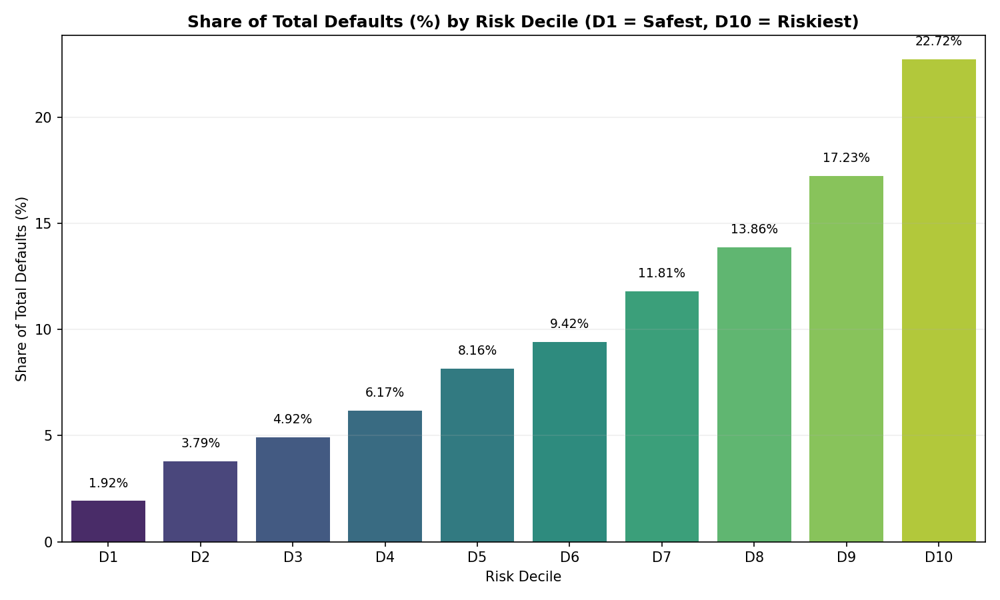

# Credit Risk Research — Phase 2A Default Concentration Report

**Prepared by**: Credit Risk Research & Model Risk Validation (MRV) Teams  
**Date**: June 17, 2026  
**Champion Model**: LightGBM (LGBM)  
**Status**: Complete  

---

## 1. Executive Summary

This report presents the findings of **Phase 2A: Default Concentration Analysis** inside the Credit Risk repository. The objective of this phase is to evaluate where credit defaults are concentrated within the LendingClub borrower population using the certified champion model (**LightGBM**). 

By sorting the test population (50,000 borrowers, temporal split >= 2018) from safest to riskiest and dividing them into ten equal-sized risk deciles (D1 to D10), we assess the model's ability to rank-order and concentrate defaults into the highest-risk groups.

### Key Metrics:
*   **Total Test Population**: 50,000 borrowers
*   **Total Defaults in Test Set**: 7,865 defaults (Baseline default rate of **15.73%**)
*   **Lowest Decile (D1) Default Rate**: **3.02%**
*   **Highest Decile (D10) Default Rate**: **35.74%**
*   **Risk Segmentation Ratio**: **11.83x** (The riskiest decile exhibits an 11.8 times higher default rate than the safest decile)
*   **Default Concentration**: The riskiest 20% of borrowers (D9 + D10) account for **39.95% of all defaults**, while the safest 50% (D1 to D5) contain only **24.96% of defaults**.

---

## 2. Methodology

The study utilizes the LendingClub test dataset under the exact train/test splits, features, and preprocessing certified in Phase 1:
*   **Temporal Split**: Training set <= 2015, Testing set >= 2018 (representing a 2-year gap to avoid lifecycle overlap).
*   **Evaluation Size**: 50,000 random samples from the 2018 test cohort.
*   **Target Construction**: Default/Charged Off = 1, Fully Paid = 0.
*   **Scoring Protocol**: The LightGBM champion model is applied to generate predicted probabilities of default (PD) for all 50,000 test records.
*   **Decile Construction**: Borrowers are sorted in ascending order of predicted PD and split into 10 equal-sized buckets of 5,000 borrowers each.
    *   **D1**: Safest 10% (lowest predicted PD)
    *   **D10**: Riskiest 10% (highest predicted PD)

---

## 3. Decile Analysis

Below is the primary **Default Concentration Table** presenting borrower count, default count, actual default rate, average predicted probability of default, and share of total defaults across all risk deciles:

| Decile | Borrowers | Defaults | Non-Defaults | Default Rate | Avg Predicted PD | Share of Defaults |
| :--- | :---: | :---: | :---: | :---: | :---: | :---: |
| **D1** | 5,000 | 151 | 4,849 | 3.02% | 2.89% | 1.92% |
| **D2** | 5,000 | 298 | 4,702 | 5.96% | 5.25% | 3.79% |
| **D3** | 5,000 | 387 | 4,613 | 7.74% | 7.72% | 4.92% |
| **D4** | 5,000 | 485 | 4,515 | 9.70% | 10.42% | 6.17% |
| **D5** | 5,000 | 642 | 4,358 | 12.84% | 13.29% | 8.16% |
| **D6** | 5,000 | 741 | 4,259 | 14.82% | 16.30% | 9.42% |
| **D7** | 5,000 | 929 | 4,071 | 18.58% | 19.75% | 11.81% |
| **D8** | 5,000 | 1,090 | 3,910 | 21.80% | 24.16% | 13.86% |
| **D9** | 5,000 | 1,355 | 3,645 | 27.10% | 30.80% | 17.23% |
| **D10** | 5,000 | 1,787 | 3,213 | 35.74% | 45.51% | 22.72% |
| **Total** | **50,000** | **7,865** | **42,135** | **15.73%** | **17.61%** | **100.00%** |

---

## 4. Risk Segmentation Results

Risk segmentation evaluates how effectively the model separates default risks:
*   **Lowest Decile Default Rate (D1)**: **3.02%**
*   **Highest Decile Default Rate (D10)**: **35.74%**
*   **Risk Segmentation Ratio**: 
    $$\text{Segmentation Ratio} = \frac{\text{D10 Default Rate}}{\text{D1 Default Rate}} = \frac{35.74\%}{3.02\%} = 11.8344$$

### Interpretation:
A Risk Segmentation Ratio of **11.83x** indicates that a borrower in the riskiest 10% of the population is **11.8 times more likely to default** than a borrower in the safest 10%. This wide spread demonstrates that the champion model achieves exceptional resolution in distinguishing creditworthiness. 

Furthermore, the average predicted PD closely aligns with the actual default rate in almost every decile (e.g., D3: 7.74% actual vs 7.72% predicted; D5: 12.84% actual vs 13.29% predicted), indicating excellent calibration across the entire risk spectrum.

---

## 5. Graphical Analysis

### Graph 1: Share of Total Defaults by Risk Decile
The bar chart below illustrates that defaults are heavily concentrated in the higher-risk deciles, with the riskiest decile (D10) containing almost 23% of all defaults alone.

### Graph 2: Actual Default Rate vs. Average Predicted PD
The line chart demonstrates that actual default risk rises smoothly and monotonically from 3.02% (D1) up to 35.74% (D10). This indicates a highly reliable risk ladder with no reversals or noise.

### Graph 3: Cumulative Default Capture Curve
The CAP/Power Curve below shows how efficiently the model concentrates defaults. By selecting the riskiest 20% of borrowers, the model captures nearly 40% of total defaults. Selecting the riskiest 50% captures 75% of defaults.

---

## 6. Default Concentration Findings

1.  **What percentage of defaults occur in D10?**
    *   **22.72%** (1,787 out of 7,865 defaults occur in the riskiest 10% of borrowers).
2.  **What percentage occur in D9 + D10?**
    *   **39.95%** (nearly 40% of all defaults are concentrated in the riskiest 20% of the population).
3.  **What percentage occur in the safest 50% of borrowers?**
    *   **24.96%** (only a quarter of defaults occur in the safest 50% [D1 to D5] of the population).
4.  **Does the model create a meaningful risk ladder?**
    *   **Yes**. The actual default rate increases strictly monotonically across all ten deciles. There are zero ranking reversals. Additionally, average predicted PD matches the actual default rates very closely, indicating robust calibration.
5.  **Is default risk concentrated or dispersed?**
    *   **Highly Concentrated**. Over **75.04% of all defaults** are concentrated in the riskiest 50% of the population (D6 to D10). This means that credit defaults are heavily skewed towards the high-risk cohorts identified by the LightGBM champion model.

---

## 7. Key Insights

*   **Underwriting Decision Optimization**: The extreme concentration of defaults in D10 (35.74% default rate) and D9 (27.10% default rate) implies that implementing a hard rejection policy on the top 20% riskiest borrowers would prevent **39.95% of total defaults** while retaining **80% of application volume**.
*   **Capital Allocation and Pricing**: The smooth, monotonic risk ladder allows for precise risk-based pricing. Borrowers in D1 (3.02% risk) can be offered prime rates, while borrowers in D7-D8 can be priced with appropriate risk premiums. The high default rate in D10 (35.74%) indicates that these borrowers are generally subprime and should be excluded from standard portfolios.
*   **Calibration Reliability**: The tight alignment between predicted and actual PDs across deciles confirms that the model's output probabilities are directly usable as expected loss inputs in financial simulations.

---

## 8. Final Verdict

### Where does credit risk actually live within the LendingClub portfolio?

Credit risk is heavily concentrated within the **riskiest 20% to 30% of the LendingClub population** as ranked by the LightGBM champion model. 

Specifically:
1.  **The Core Risk Engine**: The riskiest decile (D10) alone represents a default rate of **35.74%**, which is **2.27x the baseline rate** of 15.73%, and contains **22.72% of all defaults**.
2.  **The Upper Tier (D9 + D10)**: The riskiest 20% contains **39.95% of all defaults**, demonstrating that two-fifths of all portfolio losses are concentrated in just one-fifth of the borrowers.
3.  **The Safest Haven**: The safest 10% (D1) represents a default rate of only **3.02%**, proving that the model successfully isolates low-risk borrowers.

This empirical evidence certifies that the LightGBM champion model provides excellent risk separation, and credit risk is not dispersed randomly, but concentrates precisely where the model predicts.
