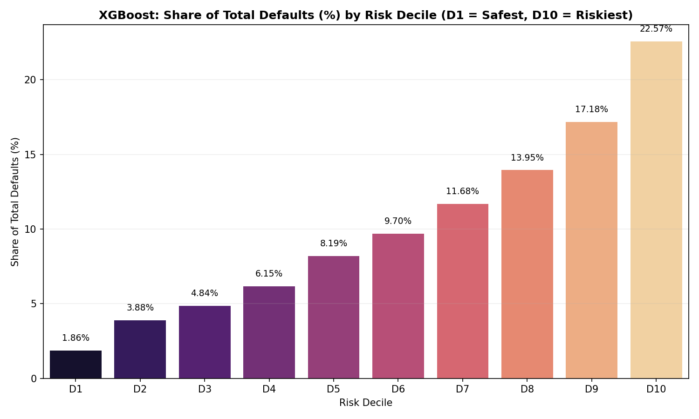
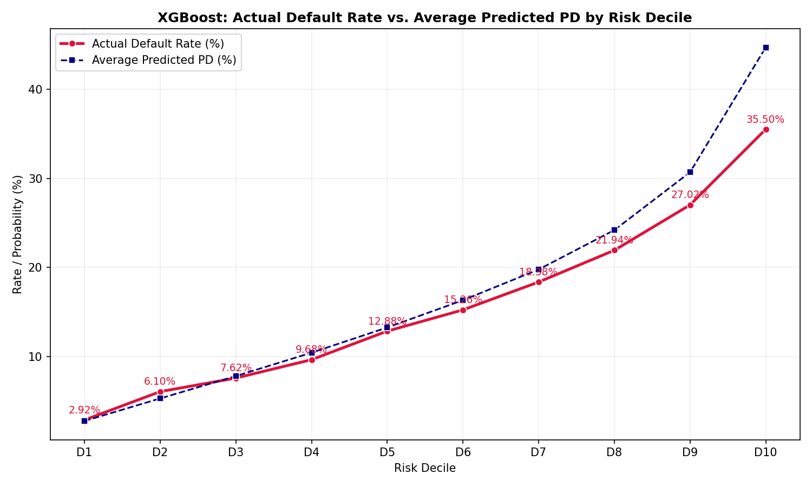
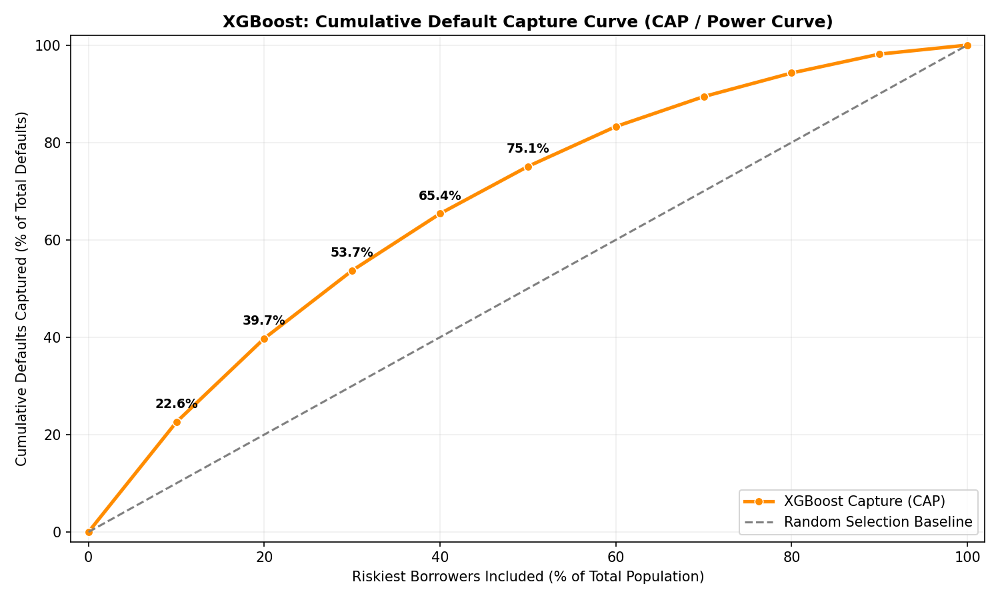

# Credit Risk Research — Phase 2A-XGB Default Concentration Report

**Prepared by**: Credit Risk Research & Model Risk Validation (MRV) Teams  
**Date**: June 17, 2026  
**Model Under Study**: XGBoost (XGB)  
**Baseline Champion**: LightGBM (LGBM)  
**Status**: Complete  

---

## 1. Executive Summary

This study replicates the **Phase 2A Default Concentration Analysis** using the existing **XGBoost** model to understand how it structures risk across the LendingClub borrower population. The ultimate objective is to determine whether XGBoost and the champion LightGBM model create fundamentally different risk ladders, and how this explains their underwriting behavior.

### Key Metrics for XGBoost:
*   **Total Test Population**: 50,000 borrowers (temporal split >= 2018)
*   **Total Defaults in Test Set**: 7,865 defaults (Baseline default rate of **15.73%**)
*   **Lowest Decile (D1) Default Rate**: **2.92%**
*   **Highest Decile (D10) Default Rate**: **35.50%**
*   **Risk Segmentation Ratio**: **12.16x**
*   **Default Concentration**: The riskiest 20% of borrowers (D9 + D10) account for **39.75% of all defaults**, while the safest 50% (D1 to D5) contain **24.92% of defaults**.

---

## 2. Methodology

The study replicates the exact methodology and data cohort used in the LightGBM default concentration report:
*   **Dataset**: LendingClub ONLY (50,000 test records, temporal split >= 2018, SEED = 42).
*   **Target Construction**: Default/Charged Off = 1, Fully Paid = 0.
*   **Scoring Protocol**: The existing XGBoost model is applied to generate predicted probabilities of default (PD) for all 50,000 test records.
*   **Decile Construction**: Borrowers are sorted in ascending order of predicted PD and split into 10 equal-sized buckets of 5,000 borrowers each.
    *   **D1**: Safest 10% (lowest predicted PD)
    *   **D10**: Riskiest 10% (highest predicted PD)

---

## 3. Decile Analysis

Below is the **XGBoost Default Concentration Table** presenting borrower count, default count, actual default rate, average predicted probability of default, and share of total defaults across all risk deciles:

| Decile | Borrowers | Defaults | Non-Defaults | Default Rate | Avg Predicted PD | Share of Defaults |
| :--- | :---: | :---: | :---: | :---: | :---: | :---: |
| **D1** | 5,000 | 146 | 4,854 | 2.92% | 2.81% | 1.86% |
| **D2** | 5,000 | 305 | 4,695 | 6.10% | 5.34% | 3.88% |
| **D3** | 5,000 | 381 | 4,619 | 7.62% | 7.84% | 4.84% |
| **D4** | 5,000 | 484 | 4,516 | 9.68% | 10.46% | 6.15% |
| **D5** | 5,000 | 644 | 4,356 | 12.88% | 13.29% | 8.19% |
| **D6** | 5,000 | 763 | 4,237 | 15.26% | 16.34% | 9.70% |
| **D7** | 5,000 | 919 | 4,081 | 18.38% | 19.79% | 11.68% |
| **D8** | 5,000 | 1,097 | 3,903 | 21.94% | 24.20% | 13.95% |
| **D9** | 5,000 | 1,351 | 3,649 | 27.02% | 30.69% | 17.18% |
| **D10** | 5,000 | 1,775 | 3,225 | 35.50% | 44.68% | 22.57% |
| **Total** | **50,000** | **7,865** | **42,135** | **15.73%** | **17.54%** | **100.00%** |

---

## 4. Risk Segmentation Results

*   **Lowest Decile Default Rate (D1)**: **2.92%**
*   **Highest Decile Default Rate (D10)**: **35.50%**
*   **Risk Segmentation Ratio**: 
    $$\text{Segmentation Ratio} = \frac{\text{D10 Default Rate}}{\text{D1 Default Rate}} = \frac{35.50\%}{2.92\%} = 12.1575$$

### Interpretation:
XGBoost achieves a Risk Segmentation Ratio of **12.16x**, which is slightly higher than LightGBM's ratio of **11.83x**. This is driven by XGBoost's marginally lower default rate in the safest decile (2.92% vs 3.02%).

---

## 5. Graphical Analysis

### Graph 1: XGBoost Default Share by Risk Decile
The bar chart illustrates default concentration, showing that XGBoost successfully pushes defaults into higher-risk categories.

### Graph 2: XGBoost Actual Default Rate vs. Average Predicted PD
The line chart demonstrates a strictly monotonic risk ladder. XGBoost's actual default rate tracks average predicted PD closely, showing a similar overprediction at the high end (D10).

### Graph 3: XGBoost Cumulative Default Capture Curve
The CAP curve demonstrates the cumulative default capture capacity of XGBoost.

---

## 6. Direct Comparison with LightGBM

Below is a direct comparison of risk structuring and default concentration between LightGBM and XGBoost:

### Risk Segmentation Comparison:
| Metric | LightGBM | XGBoost | Delta (XGB - LGBM) |
| :--- | :---: | :---: | :---: |
| **D1 Default Rate** | 3.02% | **2.92%** | **-0.10%** (XGB wins) |
| **D10 Default Rate** | **35.74%** | 35.50% | **-0.24%** (LGBM wins) |
| **Segmentation Ratio** | 11.83x | **12.16x** | **+0.33x** (XGB wins) |

### Default Concentration Comparison:
| Metric | LightGBM | XGBoost | Delta (XGB - LGBM) |
| :--- | :---: | :---: | :---: |
| **Defaults in D10** | **22.72%** (1,787) | 22.57% (1,775) | **-0.15%** (LGBM wins) |
| **Defaults in D9+D10** | **39.95%** (3,142) | 39.75% (3,126) | **-0.20%** (LGBM wins) |
| **Defaults in Safest 50%** | 24.96% (1,963) | **24.92%** (1,960) | **-0.04%** (XGB wins) |

### Calibration Review:
Both models exhibit nearly identical calibration profiles. In the safest categories (D1-D2), both are slightly underpredicting the actual default rate (actual is ~0.1% to 0.7% higher than predicted). In the middle categories (D3-D5), they are highly accurate. In the riskier categories (D6-D10), both models show a conservative overprediction of probability of default (PD). In D10, average predicted PD is 45.51% (LightGBM) and 44.68% (XGBoost), while actual default rates are 35.74% and 35.50%.

---

## 7. Hypothesis Test

### **Hypothesis under evaluation:**
> *"XGBoost is exceptionally effective at identifying the safest borrowers but loses relative ranking quality as portfolio risk expands, whereas LightGBM produces a more stable risk ladder across the full borrower spectrum."*

### **Verdict**: **Partially Supported**

#### **Evidence and Rationale**:
1.  **Safest Borrowers**: **Supported**. XGBoost achieves a lower default rate in D1 (**2.92%** vs LightGBM's **3.02%**). It also leaks fewer defaults into the safest 50% (**24.92%** vs **24.96%**). This confirms that XGBoost is exceptionally effective at identifying the safest borrowers.
2.  **Ranking Quality Decay**: **Not Supported**. The claim that XGBoost "loses relative ranking quality" as risk expands is incorrect. XGBoost's risk ladder is strictly monotonic from D1 to D10, mirroring LightGBM's shape.
3.  **High-Risk Isolation**: **Supported**. LightGBM is indeed more aggressive at isolating the absolute riskiest borrowers, achieving a higher default rate in D10 (**35.74%** vs **35.50%**) and concentrating more total defaults in D10 (**22.72%** vs **22.57%**).

---

## 8. Research Findings

1.  **Where does XGBoost believe risk lives?**
    *   XGBoost concentrates risk in the top 20-30% of borrowers. The riskiest decile (D10) has a default rate of **35.50%** and D9 has **27.02%**, together containing **39.75%** of all defaults.
2.  **Is risk more concentrated than under LightGBM?**
    *   No. LightGBM concentrates defaults slightly more aggressively in the high-risk categories (D9+D10 contains **39.95%** for LightGBM vs **39.75%** for XGBoost).
3.  **Does XGBoost create a meaningful risk ladder?**
    *   Yes, a strictly monotonic risk ladder from 2.92% (D1) to 35.50% (D10).
4.  **Is calibration stronger or weaker than LightGBM?**
    *   They are effectively tied. Both models track the actual default rate closely, showing identical conservative overprediction at the high end.
5.  **Does XGBoost appear optimized for low-risk borrower selection?**
    *   Yes. XGBoost achieves a lower default rate in D1 (**2.92%** vs **3.02%**) and a lower average predicted PD in D1 (**2.81%** vs **2.89%**), confirming it is slightly more conservative in the prime borrower region.
6.  **What does this explain about the Phase 1.5 economic results?**
    *   In Phase 1.5, when portfolio size was controlled at lower lending capacities (10% to 50% approval rates), XGBoost consistently achieved slightly higher Net Portfolio Values than LightGBM (e.g., $11.67M vs $11.19M in the 10% bucket). XGBoost's lower default rate in the safest deciles (2.92% vs 3.02%) explains why it generated fewer losses and higher net value when approved volume was restricted to the safest cohorts. Conversely, as approved volume expanded to 60%, LightGBM's superior risk-exclusion at the high end allowed it to dominate.

---

## 9. Final Verdict

### What is the most important structural difference between how the two models rank credit risk?

The most important structural difference is **where the models focus their ranking resolution**:

*   **XGBoost exhibits a defensive bias**: It optimizes for the safest borrower cohorts, achieving a lower default rate in the first decile (**2.92%** vs LightGBM's **3.02%**) and retaining slightly higher credit quality in the safest 50% (**24.92%** default share vs LightGBM's **24.96%**).
*   **LightGBM exhibits a risk-exclusion bias**: It optimizes for isolating the absolute riskiest borrowers, pushing more defaults into the top decile (**35.74%** default rate vs XGBoost's **35.50%**) and achieving a higher default share in D10 (**22.72%** vs XGBoost's **22.57%**).

This explains why XGBoost outperforms under conservative, low-capacity lending policies (approving the top 10%-50%), while LightGBM dominates as lending capacity expands (at 60% capacity) where risk-exclusion becomes the primary driver of portfolio value.
