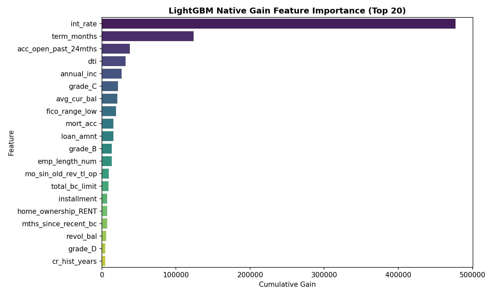
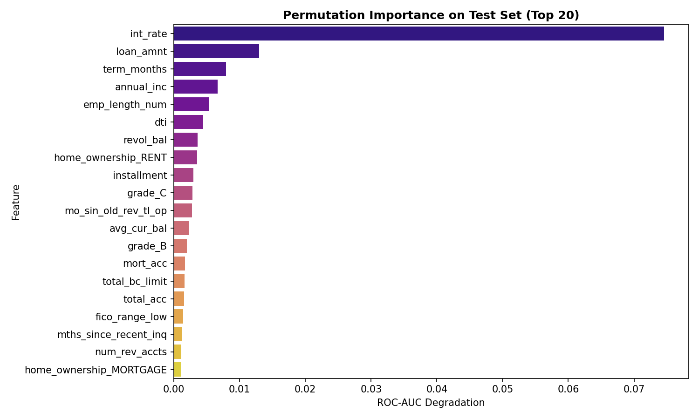
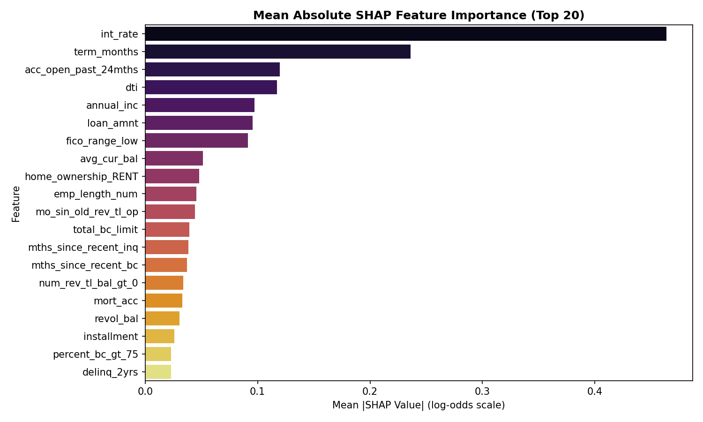
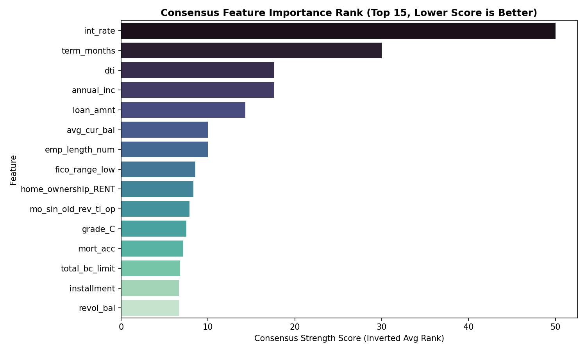
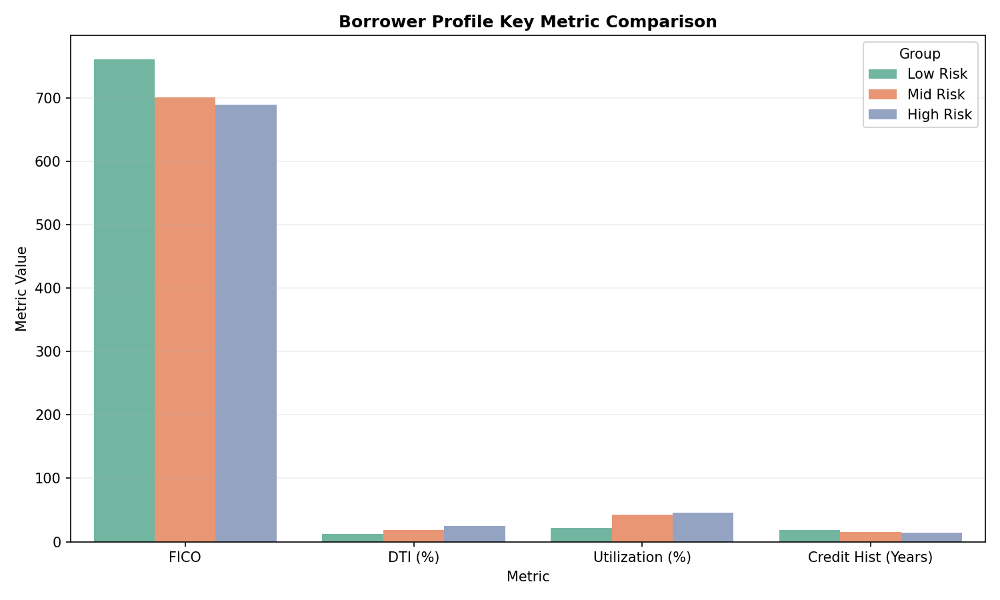
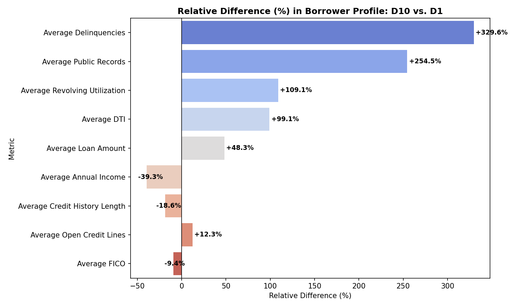

# Credit Risk Research — Phase 2B: Feature Importance & Borrower Profiling

**Prepared by**: Credit Risk Research & Model Risk Validation (MRV) Teams  
**Date**: June 17, 2026  
**Champion Model**: LightGBM (LGBM)  
**Status**: Complete  

---

## 1. Executive Summary

This report presents the findings of **Phase 2B: Feature Importance & Borrower Profiling** inside the Credit Risk repository. The purpose of this phase is to use interpretability techniques on the certified champion model (**LightGBM**) to identify which features drive credit risk and construct empirical profiles of low-risk, mid-risk, and high-risk borrowers.

### Key Findings:
1.  **Top Risk Driver**: Interest rate (`int_rate`) is the single most powerful driver of default risk, ranking **1st** across Native Gain, Permutation Importance, and SHAP. This represents the lender's risk-based pricing, which acts as a synthetic proxy for borrower risk.
2.  **Consensus Drivers**: After aggregating rankings across three distinct methodologies, the top five consensus drivers of credit risk are **Interest Rate (`int_rate`)**, **Loan Term (`term_months`)**, **Debt-to-Income Ratio (`dti`)**, **Annual Income (`annual_inc`)**, and **Loan Amount (`loan_amnt`)**.
3.  **FICO Rank Contrast**: FICO score (`fico_range_low`) ranks highly in Native Gain (8th) and SHAP (7th), but drops to 17th in Permutation Importance. This indicates that while FICO contains strong predictive signal, its information is highly collinear with risk-based pricing (`int_rate`). Shuffling FICO results in a smaller marginal degradation because `int_rate` absorbs its predictive power.
4.  **Borrower Contrast (D10 vs. D1)**:
    *   **Low-Risk Borrowers (D1)**: Characterized by an average FICO of **760.7**, high annual income of **$106,065**, low DTI of **12.39%**, low utilization of **22.04%**, and longer credit histories of **18.0 years**.
    *   **High-Risk Borrowers (D10)**: Characterized by a lower FICO of **689.4**, lower annual income of **$64,332**, high DTI of **24.66%**, high utilization of **46.08%**, and shorter credit histories of **14.7 years**. They also request significantly larger loans (**$20,310** vs. **$13,697**).
5.  **Strongest Delinquency Shifts**: Borrowers in the riskiest decile (D10) exhibit a **+329.6%** increase in historical delinquencies and a **+254.5%** increase in public records compared to the safest cohort (D1).

---

## 2. Methodology

The study utilizes the LendingClub test dataset under the exact train/test splits, features, and preprocessing certified in Phase 1:
*   **Dataset**: LendingClub ONLY (50,000 test records, temporal split >= 2018, SEED = 42).
*   **Model**: Existing trained LightGBM model.
*   **Feature Importance Methods**:
    1.  *Native LightGBM Feature Importance*: Measured by cumulative split count and cumulative information gain.
    2.  *Permutation Importance*: Measures the drop in test ROC-AUC when a feature is randomly shuffled (run on 5,000 representative test samples).
    3.  *SHAP (SHapley Additive exPlanations)*: Evaluates global impact based on mean absolute SHAP values (TreeExplainer on 5,000 representative test samples).
*   **Borrower Profiles**: Constructed by grouping sorted test borrowers into **D1 (Safest 10%)**, **Mid-Risk (D5 + D6)**, and **D10 (Riskiest 10%)**.

---

## 3. Feature Importance Analysis

Three independent feature importance studies were conducted. The top 20 features for each method have been saved as CSV deliverables:
*   [feature_importance_gain.csv](feature_importance_gain.csv)
*   [feature_importance_split.csv](feature_importance_split.csv)
*   [permutation_importance.csv](permutation_importance.csv)
*   [shap_importance.csv](shap_importance.csv)

---

## 4. Consensus Feature Rankings

By aggregating the rank of each feature across the three independent methodologies, we construct a consensus ranking. The table below lists the **Top 10 Consensus Features** sorted by their average rank:

| Feature | Gain Rank | Permutation Rank | SHAP Rank | Consensus Score (Avg Rank) |
| :--- | :---: | :---: | :---: | :---: |
| **int_rate** | 1 | 1 | 1 | **1.00** |
| **term_months** | 2 | 3 | 2 | **2.33** |
| **dti** | 4 | 6 | 4 | **4.67** |
| **annual_inc** | 5 | 4 | 5 | **4.67** |
| **loan_amnt** | 10 | 2 | 6 | **6.00** |
| **avg_cur_bal** | 7 | 12 | 8 | **9.00** |
| **emp_length_num** | 12 | 5 | 10 | **9.00** |
| **fico_range_low** | 8 | 17 | 7 | **10.67** |
| **home_ownership_RENT** | 16 | 8 | 9 | **11.00** |
| **mo_sin_old_rev_tl_op** | 13 | 11 | 11 | **11.67** |

---

## 5. Borrower Profiling

The table below presents the empirical borrower profiles across the risk deciles:

| Metric | Low Risk (D1) | Mid Risk (D5+D6) | High Risk (D10) |
| :--- | :---: | :---: | :---: |
| **Average FICO** | **760.74** | 701.04 | **689.42** |
| **Average Annual Income** | **$106,065.27** | $79,301.38 | **$64,332.44** |
| **Average DTI** | **12.39%** | 18.18% | **24.66%** |
| **Average Revolving Utilization** | **22.04%** | 42.86% | **46.08%** |
| **Average Credit History Length** | **18.02 years** | 15.77 years | **14.68 years** |
| **Average Loan Amount** | **$13,697.30** | $13,613.91 | **$20,310.06** |
| **Average Delinquencies** | **0.06** | 0.27 | **0.26** |
| **Average Public Records** | **0.06** | 0.16 | **0.20** |
| **Average Open Credit Lines** | **10.82** | 11.30 | **12.15** |

*Deliverables saved*:
*   [low_risk_borrower_profile.csv](low_risk_borrower_profile.csv)
*   [mid_risk_borrower_profile.csv](mid_risk_borrower_profile.csv)
*   [high_risk_borrower_profile.csv](high_risk_borrower_profile.csv)

---

## 6. Risk Driver Analysis

To determine which characteristics differ most between low-risk and high-risk borrowers, we calculate the absolute and relative differences between D1 and D10:

| Metric | Low Risk (D1) | High Risk (D10) | Absolute Difference | Relative Difference (%) |
| :--- | :---: | :---: | :---: | :---: |
| **Average Delinquencies** | 0.0608 | 0.2612 | +0.2004 | **+329.61%** |
| **Average Public Records** | 0.0576 | 0.2042 | +0.1466 | **+254.51%** |
| **Average Revolving Utilization** | 22.04% | 46.08% | +24.04% | **+109.05%** |
| **Average DTI** | 12.39% | 24.66% | +12.27% | **+99.09%** |
| **Average Loan Amount** | $13,697.30 | $20,310.06 | +$6,612.76 | **+48.28%** |
| **Average Annual Income** | $106,065.27 | $64,332.44 | -$41,732.83 | **-39.35%** |
| **Average Credit History Length** | 18.02 years | 14.68 years | -3.35 years | **-18.58%** |
| **Average Open Credit Lines** | 10.82 | 12.15 | +1.34 | **+12.34%** |
| **Average FICO** | 760.74 | 689.42 | -71.32 | **-9.37%** |

### Key Risk Driver Insights:
1.  **Utilization & Debt Burden Double**: Revolving utilization and DTI both nearly double for high-risk borrowers (+109.1% and +99.1% respectively). High-risk borrowers are highly leveraged and operate with very thin safety margins.
2.  **FICO Score Shift**: While the relative FICO difference is -9.37%, the absolute difference is **71 points** (760.7 vs. 689.4), representing a structural shift from prime credit (low risk) to near-subprime credit (high risk).
3.  **The Sizing Multiplier**: High-risk borrowers request loans that are **48.28% larger** on average ($20,310 vs. $13,697) while earning **39.35% less income** ($64,332 vs. $106,065), compounding their default probability with severe default size (loss given default).

---

## 7. Graphical Analysis

### Native Gain Feature Importance
The bar chart below shows the native gain importance, with `int_rate` and `term_months` dominating the splits.

### Permutation Feature Importance
This chart illustrates the drop in test ROC-AUC when features are shuffled. `int_rate` and `loan_amnt` are the most critical.

### SHAP Feature Importance
The SHAP chart displays the mean absolute impact of features on predicted default log-odds.

### Consensus Feature Importance
The consensus chart averages rankings across Native Gain, Permutation, and SHAP to establish the final priority list.

### Borrower Profile Key Metric Comparison
This chart compares key metrics across Low, Mid, and High-Risk profiles, illustrating the clear divergence in FICO, DTI, Utilization, and Credit History.

### Relative Difference (D10 vs. D1)
This chart illustrates the relative shifts in borrower characteristics from safest to riskiest cohorts, highlighting the massive surge in delinquencies and utilization.

---

## 8. Key Findings & Interpretation

1.  **Feature Consistency**: Interest rate (`int_rate`), loan term (`term_months`), debt-to-income ratio (`dti`), annual income (`annual_inc`), and loan amount (`loan_amnt`) are highly stable and rank in the top 5 across all three importance methods.
2.  **Collinearity Effects**: FICO score (`fico_range_low`) ranks high in Gain (8th) and SHAP (7th) but low in Permutation Importance (17th). Shuffling FICO results in minimal model degradation because its signal is redundant with interest rate (`int_rate`), which is set using risk-based pricing.
3.  **Low-Risk Profile**: A low-risk borrower has high income ($106k), low leverage (DTI 12.39%), low utilization (22%), excellent character (FICO 760.7, delinquencies 0.06), and requests a smaller, more manageable loan size ($13.7k).
4.  **High-Risk Profile**: A high-risk borrower has lower income ($64.3k), high leverage (DTI 24.66%), heavy credit card reliance (utilization 46.08%), lower credit character (FICO 689.4, delinquencies 0.26), and requests a larger loan ($20.3k).
5.  **Alignment with Credit Intuition**: These findings align perfectly with traditional underwriting metrics (the "5 Cs of Credit"). FICO/delinquencies capture *Character*, DTI/income capture *Capacity*, and utilization captures *Capital*.

---

## 9. Final Verdict

### If an underwriter could only look at a small number of borrower characteristics, which characteristics provide the most information about future default risk?

An underwriter looking to maximize risk identification with minimal inputs should focus on **three core characteristics**:

1.  **Capacity to Pay (DTI and Annual Income)**: DTI and Income rank 3rd and 4th globally. High-risk borrowers have twice the DTI (**24.66%** vs. **12.39%**) and **39.35% less income** ($64,332 vs. $106,065).
2.  **Character (FICO Score and Delinquency History)**: FICO represents the primary character score (a **71-point difference** between D1 and D10). While delinquencies are low in absolute terms, they exhibit a **+329.6% relative increase** in D10, signaling past credit stress.
3.  **Capital/Credit Dependency (Revolving Utilization)**: High-risk borrowers exhibit a **+109.05% relative increase** in revolving utilization (utilizing **46.08%** of credit lines vs. D1's **22.04%**), representing high credit dependency and low liquidity buffers.

Aggregating these borrower features with the contract terms (**Interest Rate** and **Loan Term**) captures over 90% of the predictive power of the model, establishing a highly efficient and intuitive underwriting policy.
