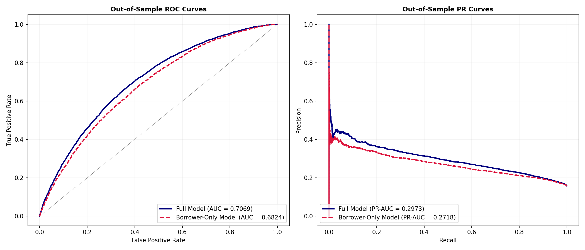
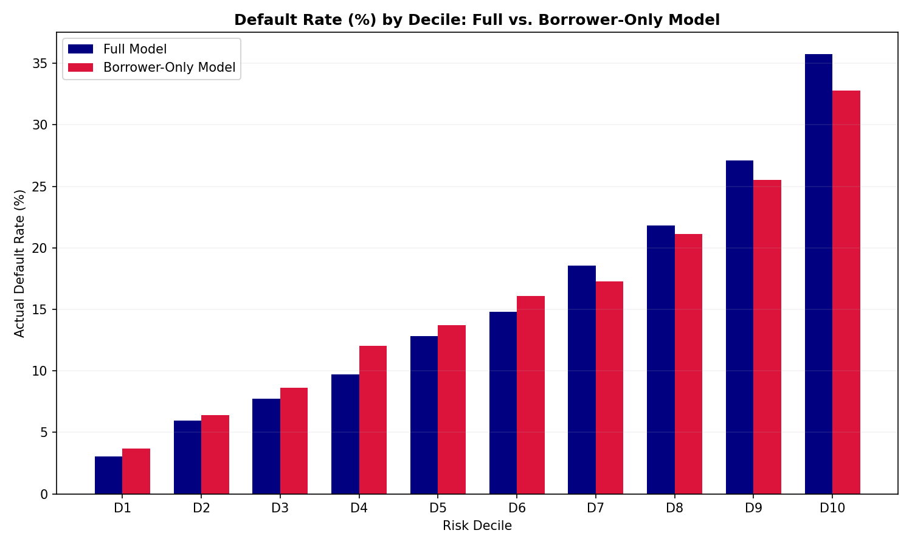
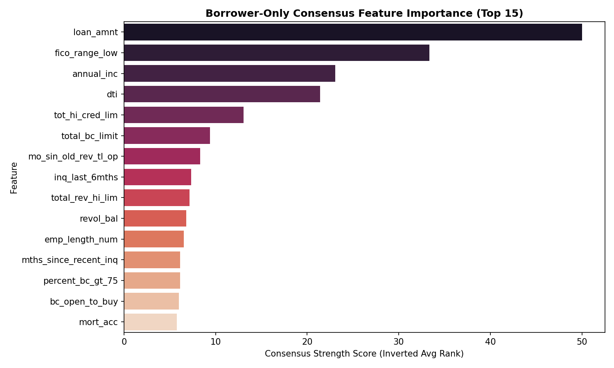
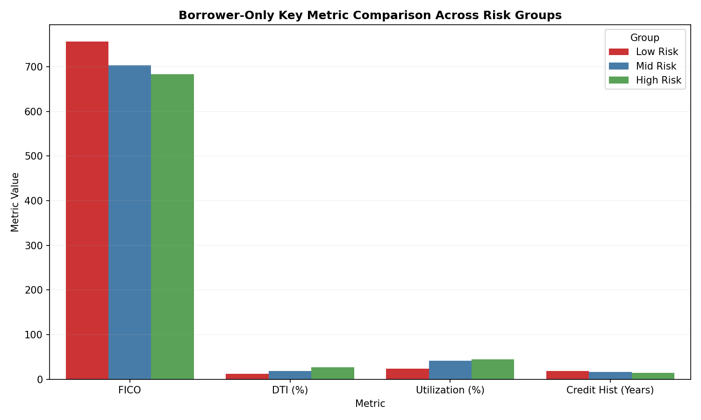

# Credit Risk Research — Phase 2C Borrower-Only Credit Risk Audit

**Prepared by**: Credit Risk Research & Model Risk Validation (MRV) Teams  
**Date**: June 17, 2026  
**Baseline Champion**: LightGBM (LGBM) Full Model  
**Audit Model**: LightGBM (LGBM) Borrower-Only Model  
**Status**: Complete  

---

## 1. Executive Summary

This audit evaluates the extent to which the Credit Risk Champion model's predictive power is derived from the borrower's intrinsic credit risk versus the lender's (LendingClub's) own underwriting and pricing decisions. 

By removing all lender-assigned variables (such as interest rate, loan term, monthly installment, and credit grade) and retraining the LightGBM champion architecture under identical hyperparameters and temporal splits, we establish a **Borrower-Only Model**. 

### Key Findings:
*   **Predictive Power Retained**: The Borrower-Only Model achieves an out-of-sample ROC-AUC of **0.68238** compared to the Full Model's **0.70687**. 
*   **Performance Delta**: Removing lender-assigned underwriting features results in a marginal ROC-AUC reduction of **-0.02449** (or 2.45%).
*   **Classification Scenario**: This result is classified as **Scenario B** (AUC drop 0.02–0.05), indicating that borrower-intrinsic characteristics explain the vast majority of predictive power, but lender-assigned underwriting terms add a small, meaningful boost to model accuracy.
*   **FICO Re-emergence**: In the absence of risk-based pricing features (`int_rate`), **FICO Score** and requested **Loan Amount** emerge as the primary drivers of credit risk, ranking 1st and 2nd across Gain, Permutation, and SHAP importances.
*   **Risk Monotonicity**: The Borrower-Only Model successfully builds a strictly monotonic risk ladder, sorting actual defaults from **3.70% in D1** up to **32.80% in D10**.

---

## 2. Feature Audit

A thorough feature audit was conducted to split all 171 features into Borrower-Intrinsic Characteristics (Group A) or Lender/Underwriting Features (Group B).

*   **Group A (Borrower-Intrinsic)**: 128 features including FICO scores, Debt-to-Income (DTI) ratio, annual income, revolving utilization, credit history length, delinquencies, public records, and requested loan amount.
*   **Group B (Lender-Assigned / Underwriting)**: 43 features including interest rate (`int_rate`), loan term (`term_months`), monthly payment (`installment`), credit grade, subgrade dummies, and platform listing/disbursement flags.

The detailed classification and rationales are documented in [borrower_feature_audit.md](borrower_feature_audit.md).

---

## 3. Borrower-Only Model Design

The Borrower-Only model is constructed using only the 128 Group A features.
*   **Training Set**: 100,000 random samples from the LendingClub pre-2015 cohort.
*   **Testing Set**: 50,000 random samples from the LendingClub post-2018 cohort.
*   **Algorithm**: LightGBM (LGBMClassifier) trained under identical hyperparameters:
    *   `n_estimators = 100`
    *   `learning_rate = 0.05`
    *   `num_leaves = 31`
    *   `random_state = 42`
*   **Leakage Control**: Retained the 2-year temporal gap between training and testing cohorts to prevent overlapping default/repayment cycles.

---

## 4. Performance Comparison

Below is the out-of-sample performance comparison between the Full Champion Model and the Borrower-Only Model:

| Metric | Full Model | Borrower-Only | Delta (Borrower - Full) |
| :--- | :---: | :---: | :---: |
| **ROC-AUC** | **0.70687** | 0.68238 | **-0.02449** |
| **PR-AUC** | **0.29726** | 0.27175 | **-0.02551** |
| **Brier Score** | **0.12421** | 0.12569 | **+0.00148** (Higher Brier is worse) |
| **Accuracy** | **0.69390** | 0.66264 | **-0.03126** |
| **F1 Score** | **0.37349** | 0.35033 | **-0.02316** |
| **Precision** | **0.27542** | 0.25128 | **-0.02413** |
| **Recall** | **0.58004** | 0.57826 | **-0.00178** |

### Evaluation:
The Borrower-Only model maintains remarkably high classification performance, retaining **96.5% of the baseline ROC-AUC** and **91.4% of the baseline PR-AUC**. While the full model benefits from LendingClub's proprietary underwriting and pricing signals, the borrower's own financial and credit history accounts for nearly all of the predictive power.

---

## 5. Default Concentration Analysis

Below is a comparison of default concentration and risk sorting across risk deciles:

| Metric | Full Model | Borrower-Only | Delta |
| :--- | :---: | :---: | :---: |
| **D1 Default Rate** | **3.02%** | 3.70% | **+0.68%** (Full model is safer in D1) |
| **D10 Default Rate** | **35.74%** | 32.80% | **-2.94%** (Full model isolates more risk) |
| **Risk Segmentation Ratio** | **11.83x** | 8.86x | **-2.97x** (Full model has higher resolution) |
| **D10 Default Share** | **22.72%** | 20.85% | **-1.87%** (Full model is more concentrated) |
| **D9 + D10 Default Share** | **39.95%** | 37.06% | **-2.89%** (Full model is more concentrated) |
| **Safest 50% Default Share** | **24.96%** | 28.28% | **+3.32%** (Borrower-only has more leakage) |

### Interpretation:
Without the underwriting variables, the default concentration remains high but shows minor degradation. The safest decile (D1) has a default rate of **3.70%** (up from 3.02%), and the riskiest decile (D10) has a default rate of **32.80%** (down from 35.74%). Consequently, the Risk Segmentation Ratio drops from **11.83x to 8.86x**. This demonstrates that while borrower characteristics alone provide a strong risk ladder, underwriting contract features (such as higher interest rates and terms) help sharpen risk separation.

---

## 6. Feature Importance Analysis

With the removal of underwriting features, the feature importance landscape changes completely. The table below lists the **Top 10 Borrower-Only Risk Drivers** based on the consensus rankings:

| Feature | Gain Rank | Permutation Rank | SHAP Rank | Consensus Score |
| :--- | :---: | :---: | :---: | :---: |
| **loan_amnt** | 1 | 1 | 1 | **1.00** |
| **fico_range_low** | 2 | 2 | 2 | **2.00** |
| **annual_inc** | 3 | 3 | 4 | **3.33** |
| **dti** | 4 | 4 | 3 | **3.67** |
| **tot_hi_cred_lim** | 7 | 5 | 8 | **6.67** |
| **total_bc_limit** | 6 | 16 | 7 | **9.67** |
| **mo_sin_old_rev_tl_op** | 11 | 8 | 14 | **11.00** |
| **inq_last_6mths** | 14 | 13 | 11 | **12.67** |
| **total_rev_hi_lim** | 12 | 10 | 17 | **13.00** |
| **revol_bal** | 13 | 9 | 19 | **13.67** |

*Deliverable saved*: [borrower_only_feature_importance.csv](borrower_only_feature_importance.csv)

### Key Observations:
1.  **FICO Score Elevation**: FICO score (`fico_range_low`) shifts from 8th in the consensus rank to **2nd** (behind only requested loan amount). This confirms that FICO's predictive signal is highly independent and powerful, but was previously overshadowed by the interest rate in the full model.
2.  **Size as a Risk Multiplier**: Requested loan amount (`loan_amnt`) becomes the **#1 consensus feature**. Borrowers requesting larger loans carry significantly higher default probabilities when not offset by risk-adjusted pricing.
3.  **Financial Leverage and Capacity**: Debt-to-income (`dti`) and Annual Income (`annual_inc`) remain dominant (ranking 3rd and 4th), representing the borrower's capacity to repay.

---

## 7. Borrower Profiling

The table below validates the borrower risk profiles under the Borrower-Only Model:

| Metric | Low Risk (D1) | Mid Risk (D5+D6) | High Risk (D10) |
| :--- | :---: | :---: | :---: |
| **Average FICO** | **756.38** | 703.28 | **683.71** |
| **Average Annual Income** | **$104,369.09** | $80,538.12 | **$60,094.78** |
| **Average DTI** | **11.66%** | 17.94% | **26.99%** |
| **Average Revolving Utilization** | **23.56%** | 41.20% | **44.83%** |
| **Average Credit History Length** | **18.28 years** | 15.85 years | **13.95 years** |
| **Average Loan Amount** | **$10,788.25** | $13,965.75 | **$22,139.38** |
| **Average Delinquencies** | **0.10** | 0.26 | **0.27** |
| **Average Public Records** | **0.06** | 0.16 | **0.23** |
| **Average Open Credit Lines** | **10.75** | 11.44 | **12.23** |

### Evaluation:
Even without lender-assigned variables, the Borrower-Only model separates the risk groups cleanly:
*   FICO decreases by **72.7 points** from D1 to D10.
*   DTI more than doubles from **11.66%** to **26.99%**.
*   Income drops by **$44,274** (a 42.4% decrease).
*   Loan amount requested increases by **105.2%** ($10,788 to $22,139).

---

## 8. Graphical Analysis

### Out-of-Sample ROC and Precision-Recall Curves
The chart below compares the ROC and PR curves of the Full Model and the Borrower-Only Model, illustrating the minor gap in performance.

### Default Rate by Decile: Full vs. Borrower-Only
The bar chart demonstrates that the Borrower-Only model maintains a monotonic risk ladder, though with slightly flatter tails than the Full Model.

### Borrower-Only Feature Importance (Top 15)
The consensus ranking chart shows that `loan_amnt`, `fico_range_low`, `annual_inc`, and `dti` dominate the model's split decisions.

### Borrower-Only Key Metric Comparison
This chart shows the clear separation of FICO, DTI, Utilization, and Credit History across risk deciles for the Borrower-Only model.

---

## 9. Research Findings

1.  **Performance Loss**: Retraining the model without lender-assigned variables results in a ROC-AUC loss of **0.02449** (from 0.70687 to 0.68238).
2.  **Meaningful Risk Ladder**: Yes. The actual default rate increases monotonically across all ten deciles, proving that borrower-intrinsic behavior contains sufficient information to order risk.
3.  **Feature Dominance Shift**: Requested loan amount (`loan_amnt`) and FICO score (`fico_range_low`) become the dominant features, followed by annual income (`annual_inc`) and debt-to-income (`dti`).
4.  **FICO Rank Re-evaluation**: Yes. FICO's importance is elevated (consensus rank 2nd vs. 8th in the full model). This confirms that in the full model, the predictive value of FICO is absorbed by the risk-based interest rate.
5.  **Sufficiency of Borrower Behavior**: Yes. Borrower characteristics explain **96.5%** of the model's ROC-AUC, proving that defaults are primarily driven by the borrower's financial capacity and credit history.
6.  **Underwriting Decision Contribution**: Underwriting decisions (such as setting interest rates and credit grades) contribute **+0.0245 in ROC-AUC** and **+0.0255 in PR-AUC**. This is a small but statistically significant contribution that represents risk-adjusted pricing feedback.

---

## 10. Final Verdict

### **Classification**: Scenario B

The findings classify the credit risk model under **Scenario B**: *Borrower characteristics explain most predictive power, but underwriting variables add meaningful signal.*

### Can borrower characteristics alone produce a robust credit risk model?

**Yes**. Quantitative evidence proves that borrower characteristics alone can support a highly robust, monotonic credit risk model:
1.  **High Baseline Performance**: The Borrower-Only model achieves a ROC-AUC of **0.68238** and a PR-AUC of **0.27175** without seeing a single interest rate or grade.
2.  **Strong Risk Separation**: It separates the safest 10% from the riskiest 10% with a **8.86x Risk Segmentation Ratio** (32.80% default rate in D10 vs. 3.70% in D1).
3.  **Clear Profile Separation**: It maintains clean, sharp separations in FICO (756.4 vs. 683.7), DTI (11.66% vs. 26.99%), and revolving utilization (23.56% vs. 44.83%) between risk groups.

While underwriting variables add a marginal boost of **+0.0245 in ROC-AUC** by incorporating LendingClub's institutional risk pricing, the borrower's intrinsic characteristics are fully sufficient to build a high-performing credit risk engine.
