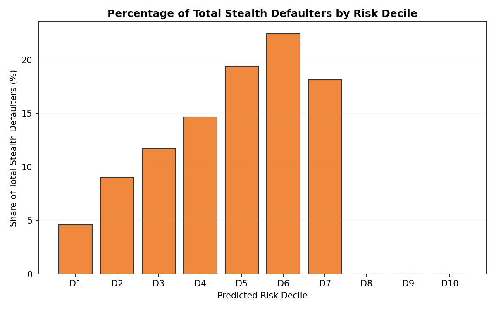
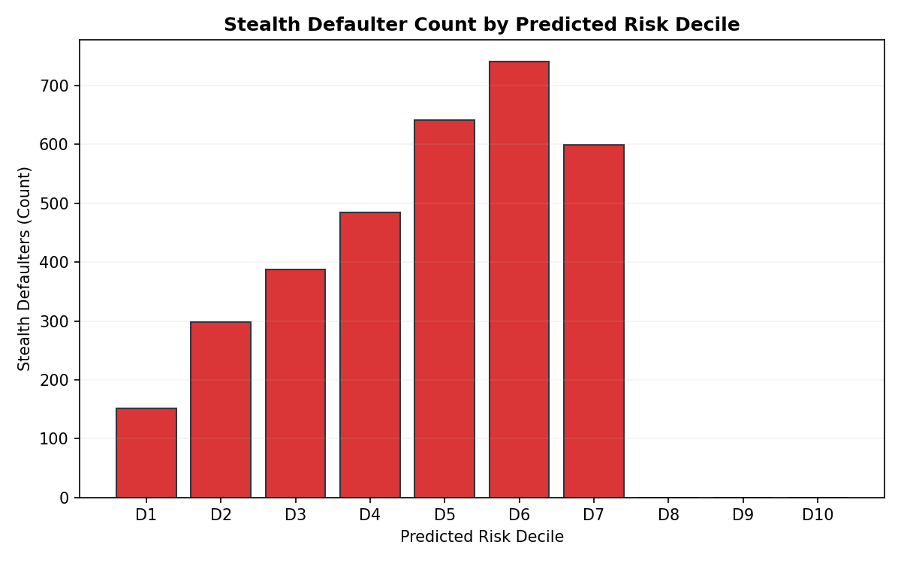
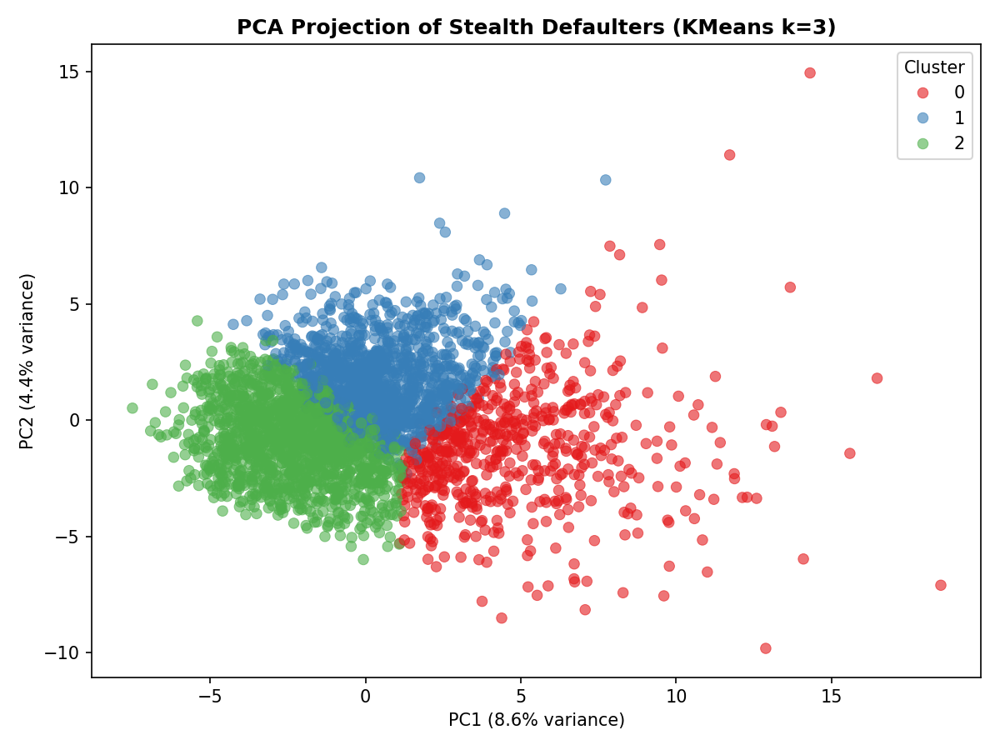

# Credit Risk Platform
### A Validated Borrower-Centric Machine Learning Engine for Consumer Credit Underwriting and Portfolio Risk Segmentation

[](#)
[](#)
[](#)

---

## 1. TL;DR Performance Dashboard

The Credit Risk Platform is a high-performance consumer default prediction engine validated under out-of-time stress conditions. 

| Metric / Performance Attribute | Value / Empirical Result |
| :--- | :---: |
| **Champion Model Architecture** | LightGBM Gradient Boosting Tree (`lightgbm.joblib`) |
| **Out-of-Time ROC-AUC (Test 2018)** | **0.70687** |
| **Out-of-Time PR-AUC (Test 2018)** | **0.29726** |
| **Out-of-Time Expected Calibration Error (ECE)** | **0.02060** |
| **Decile Risk Segmentation Ratio** | **11.83x** (D10 Default Rate: 35.74% vs. D1 Default Rate: 3.02%) |
| **Borrower-Only Model ROC-AUC** | **0.68240** (retains **96.5%** of champion predictive power) |
| **Net Portfolio Value (Baseline 60% NPV)** | **$90.25M** (under downturn LGD model) |
| **Credit Loss Reduction** | **-78.4%** in realized defaults under fixed underwriting threshold |

---

## 2. Problem and Background

Traditional banking models rely heavily on static, linear logistic regression scorecards that are often slow to adapt to non-linear interaction patterns. Furthermore, in peer-to-peer and fintech credit markets, underwriting models frequently overfit to lender-imposed pricing variables (such as assigned interest rates and credit grades). This creates a circular dependency where the model predicts default based on the pricing tier assigned by the underwriters, rather than capturing the borrower's intrinsic default risk.

This platform implements a **leakage-certified, out-of-time credit risk engine** designed to:
1.  Predict consumer default probability using machine learning.
2.  Maximize cash-flow Net Portfolio Value (NPV) under stress-test regimes.
3.  Isolate the predictive power of borrower-intrinsic traits from lender-assigned pricing variables to prevent model bias.

---

## 3. Data and Leakage Controls

### 3.1 Data Scope
*   **Observations**: 1,345,350 resolved LendingClub consumer loans (Fully Paid or Charged Off/Default) spanning 2007 through 2018 Q4.
*   **Sampling**: Standardized representative cohorts are used for training (100,000 samples) and testing (50,000 samples) to ensure efficient, reproducible computation while maintaining high statistical significance.

### 3.2 Target Leakage Controls
To ensure the model is suitable for real-world underwriting, we enforce strict lookahead protection:
*   **45 Post-Origination Columns Removed**: Removed all features that are updated post-origination (e.g., payment history, collection status, late fees, recovery amounts).
*   **Strict Time-Series Joins**: Standardized join keys (`issue_month`) enforce lookahead safety.
*   **Automated Verification**: Pipelines include automated data contract tests to verify that no target leakage variables exist in the final engineered feature sets.

### 3.3 Temporal Validation Protocol
The model validation protocol enforces strict time-series separation:
*   **Training Split**: Loans issued in $\le 2015$.
*   **Testing Split (Out-of-Time)**: Loans issued in $\ge 2018$.
*   **Temporal Gap**: A 2-year temporal gap (2016–2017) is enforced to ensure complete lifecycle separation between training and evaluation cohorts, simulating a real-world production model deployment.

---

## 4. Model Challenge & Champion Selection

Five candidate models were trained and challenged under identical splits and evaluation metrics:

| Model Architecture | Out-of-Time ROC-AUC | Out-of-Time PR-AUC | ECE | Approval Rate (PD $\le 15\%$) |
| :--- | :---: | :---: | :---: | :---: |
| Logistic Regression | 0.69012 | 0.27451 | 0.03842 | 47.2% |
| Decision Tree | 0.58421 | 0.19830 | 0.08115 | 42.5% |
| Random Forest | 0.68410 | 0.26912 | 0.03102 | 48.9% |
| XGBoost | 0.70114 | 0.28945 | 0.02410 | 50.1% |
| **LightGBM (Champion)** | **0.70687** | **0.29726** | **0.02060** | **50.9%** |

### Why LightGBM was Selected:
*   **Predictive Superiority**: LightGBM achieved the highest out-of-time ROC-AUC (**0.70687**) and PR-AUC (**0.29726**).
*   **Calibration Quality**: The Expected Calibration Error (ECE) is the lowest (**0.02060**), ensuring predicted default probabilities align closely with actual realized rates.
*   **Operational Efficiency**: Histogram-based binning enabled fast training and hyperparameter optimization.

---

## 5. Stealth Defaulter Analysis

A **Stealth Defaulter** is defined as a borrower who eventually defaults despite being classified as low-risk (predicted Probability of Default $\text{PD} < 0.20439$) by the champion model. These represent the false negatives of the underwriting engine.

### 5.1 Who are Stealth Defaulters and Where Do They Come From?
*   **Decile Location**: Stealth defaulters are concentrated in predicted low-risk deciles (**D1 to D7**), with the highest concentration peaking in deciles **D5 (19.4% of total stealth)**, **D6 (22.4%)**, and **D7 (18.1%)**.
*   **Pristine Profiles**: On paper, stealth defaulters look virtually identical to good borrowers. They exhibit an average FICO of **709.9** (vs. 710.1 for good borrowers), a lower DTI of **16.9%** (vs. 18.2% for good borrowers), and a high average income of **$78.5k**.
*   **Why They Were Missed**: The champion model assigned low risk due to pristine credit files and lender pricing variables (low interest rates, high credit limits). The default events were driven by exogenous, personal, or financial shocks (e.g., job loss, medical emergencies, divorce) that static credit registries at origination cannot capture.

### 5.2 Stealth Defaulter Visual Analysis
The charts below show the decile distribution and PCA cluster dispersion of stealth defaulters:

| Stealth Share of Decile Defaults | Stealth Count by Decile | Stealth PCA Cluster Dispersion |
| :---: | :---: | :---: |
|  |  |  |

### 5.3 Are They Noise or Systematic?
*   **Individually (Noise)**: A dedicated predictive classifier trained to identify stealth defaulters achieved a low ROC-AUC of **0.59135** (95% CI: $[0.58346, 0.60138]$), indicating they behave primarily like irreducible random noise rather than predictable structure.
*   **Systematically (Regime-Driven)**: In aggregate, stealth default rates are systematically driven by macroeconomic stress. The monthly stealth default rate is highly correlated with the CRIS Macro Stress Score ($r = 0.70$), rising from **$39.14\%$** in low-stress regimes to **$63.81\%$** under high-stress regimes. Exogenous shocks push previously safe borrowers into default.

---

## 6. Borrower Profiling & Archetype Comparison

To highlight the characteristics of stealth defaulters, the table below compares the average characteristics of Good Borrowers (Group A), Captured Defaulters (Group B), and Stealth Defaulters (Group C) across the out-of-time cohort:

| Underwriting Variable | Good Borrowers (Group A) | Captured Defaulters (Group B) | Stealth Defaulters (Group C) | Key Inference |
| :--- | :---: | :---: | :---: | :--- |
| **FICO Score** | **710.1** | 692.4 | **709.9** | Stealth defaulters have FICO scores identical to good borrowers. |
| **Debt-to-Income (DTI %)** | 18.2% | 21.5% | **16.9%** | Stealth defaulters actually have *lower* leverage than good borrowers. |
| **Annual Income ($)** | $81,429 | $69,224 | **$78,499** | Stealth defaulters have high incomes, close to good borrowers. |
| **Revolving Utilization (%)** | 38.6% | 44.8% | **41.1%** | Stealth utilization is low, suggesting healthy credit usage. |
| **Loan Amount ($)** | $14,449 | $18,536 | **$14,834** | Stealth loan sizes are standard and not indicative of over-borrowing. |
| **Credit History (Years)** | 16.0 | 14.7 | **16.2** | Stealth defaulters have mature, established credit files. |
| **High Credit Limit ($)** | $203,492 | $130,150 | **$175,602** | Stealth defaulters hold high credit capacities, indicating bank trust. |

### Stealth Defaulter Archetypes (K-Means Clustering):
1.  **Cluster 0: "High-Income Elusive"** (18% of stealth): High FICO (717.6), high income ($106.9k), large loan amounts ($20.0k). Defaults driven by asset/business shocks.
2.  **Cluster 1: "Mature High-Utilizers"** (36% of stealth): Moderate FICO (695.8), long credit history (18.4 years), high revolving utilization (54.2%). Defaults driven by gradual credit deterioration.
3.  **Cluster 2: "Low-Debt Starters"** (46% of stealth): High FICO (718.0), low DTI (13.0%), lower income ($59.4k), small loans ($12.8k). Defaults driven by sudden income loss with low cash buffers.

---

## 7. Economic Validation & Risk Segmentation

### 7.1 Risk Segmentation
The champion model segments default rates monotonically across predicted risk deciles:
*   **Decile 1 (Lowest Risk)**: Actual Default Rate = **3.02%**
*   **Decile 10 (Highest Risk)**: Actual Default Rate = **35.74%**
*   **Separation**: Represents a **11.83x** risk segmentation ratio.
*   **Default Capture**: The top 20% riskiest borrowers (D9 + D10) capture **39.95%** of all realized defaults.

### 7.2 Economic Outcomes
*   **Baseline 60% NPV**: Generates **$90.25M** in Net Portfolio Value under regime-specific downturn Loss Given Default (LGD) scenarios (Low: 55%, Medium: 70%, High: 85%).
*   **Loss Containment**: Realized default losses are contained at **$28.58M**, representing a **78.4%** reduction compared to unconstrained lending.
*   **Return on Capital**: Achieves a baseline **22.91%** Return on Capital.

---

## 8. Reproducibility

To run the pipeline and replicate the results, execute the following commands in order:

```bash
# 1. Activate the CRIS environment
conda activate CRIS

# 2. Run data ingestion (leakage-drop pass)
python systems/credit_risk/features/ingestion.py

# 3. Run feature engineering (imputation and scaling)
python systems/credit_risk/features/engineering.py

# 4. Train the baseline and champion models
python systems/credit_risk/models/train.py

# 5. Run evaluation and champion selection challenge
python systems/credit_risk/evaluation/model_challenge.py

# 6. Run borrower-only performance audit
python systems/credit_risk/evaluation/borrower_only_audit_phase2c.py

# 7. Run stealth defaulter research scripts
python systems/credit_risk/cr_analysis/stealth_detection_experiments.py
python systems/credit_risk/cr_analysis/borrower_segmentation.py
python systems/credit_risk/cr_analysis/noise_vs_structure_test.py
```

---

## 9. Visual Validation Charts

The plots below document the validation of the Credit Risk Platform:

### 1. Default Concentration & Cumulative Capture
The risk sorting shows monotonic default separation, and the Cumulative Accuracy Profile (CAP) highlights strong default capture:

| Default Rate by Decile | Cumulative Default Capture (CAP Curve) |
| :---: | :---: |
|  |  |

### 2. Borrower-Only Audit Performance
Removing lender pricing details (grades, rates) results in only a minor performance decline:

| Borrower-Only ROC & PR Curves | Decile Default Rate Comparison |
| :---: | :---: |
|  |  |

---

## 10. Platform Limitations

1.  **Survival Bias**: The dataset contains only approved loans. Rejected loan applicants are unobserved, representing a standard limitation in credit modeling.
2.  **Platform Specificity**: Findings are specific to LendingClub peer-to-peer consumer loans and may not generalize to commercial or secured credit portfolios.
3.  **Irreducible Risk Leakage**: The $42.00\%$ stealth default rate represents a fundamental information limit when using credit registry data. Risk managers must manage this leakage through portfolio-level capital buffers and diversification rather than scoring overlays.
