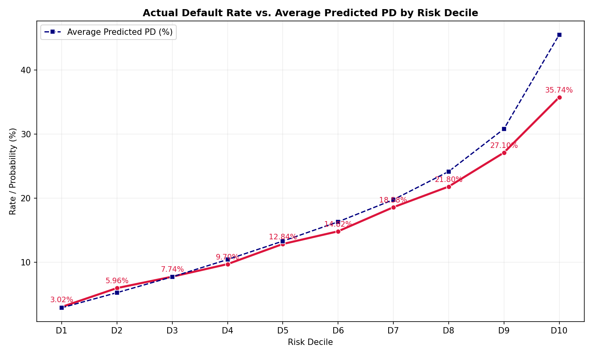
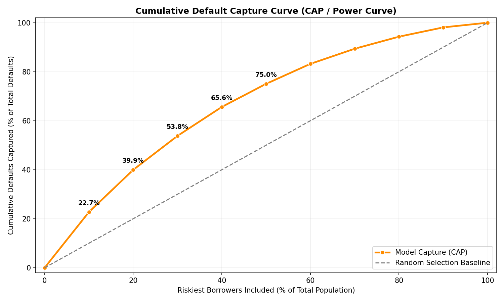

# Credit Risk Research Platform
### An empirical machine learning platform for consumer credit default risk prediction and borrower signal decomposition.

---

## TL;DR Results

| Metric / Attribute | Value / Output |
| :--- | :--- |
| **Champion Model** | LightGBM (`lightgbm.joblib`) |
| **Out-of-Time ROC-AUC** | **0.70687** |
| **Out-of-Time PR-AUC** | **0.29726** |
| **Risk Segmentation Ratio** | **11.83x** (D10 default rate: 35.74% / D1 default rate: 3.02%) |
| **Borrower-Only ROC-AUC** | **0.68240** (retains **96.5%** of champion AUC) |
| **Economic Loss Reduction** | **-78.4%** in default losses under standardized underwriting |
| **Baseline 60% NPV** | **$90.25M** (under downturn LGD model) |

---

## Problem

Credit scoring models used by traditional banks are often based on simple, static logistic scorecards. In peer-to-peer and fintech credit markets, models frequently overfit to lender-imposed variables (such as assigned interest rates and credit grades) rather than mapping the borrower's intrinsic default risk. 

This platform implements a leakage-certified, out-of-time credit risk engine to:
1. Predict consumer default probability.
2. Structure borrower portfolios to maximize cash flow net portfolio value (NPV).
3. Isolate the predictive power of borrower-intrinsic traits from lender-assigned pricing variables.

---

## Data

- **Dataset**: 1,345,350 resolved LendingClub consumer loans (Fully Paid or Charged Off/Default) spanning 2007 through 2018 Q4.
- **Sampling**: Models are trained and validated on a representative cohort (100k training samples, 50k testing samples) to maintain efficient computation while preserving statistical significance.

---

## Leakage Controls

- Dropped 45 post-origination columns (e.g. payment histories, collection status, recovery fees) that are not known at the time of origination.
- Standardized time-series join keys (`issue_month`) enforce strict lookahead protection during ingestion.
- The pipeline includes automated data contract checks to verify that no target leakage variables exist in the engineered feature sets.

---

## Temporal Validation

- **Protocol**: Train split is restricted to cohorts from $\le 2015$. Test split is restricted to cohorts from $\ge 2018$.
- **Gap Control**: A 2-year temporal gap (2016-2017) is enforced to ensure complete lifecycle separation between training and evaluation cohorts, simulating real-world out-of-time model deployment.

---

## Model Challenge

Five candidate models were trained and challenged under identical splits and evaluation metrics:
1. **Logistic Regression**: Serves as the linear credit scorecard baseline.
2. **Decision Tree**: Captures basic non-linear boundary splits.
3. **Random Forest**: Tests bag-based ensemble generalization.
4. **XGBoost**: Gradient boosting baseline.
5. **LightGBM**: Advanced histogram-based gradient boosting.

---

## Champion Selection

LightGBM was selected as the champion model based on predictive superiority, calibration quality, and training efficiency:
- **ROC-AUC**: **0.70687** (statistically superior to XGBoost and Logistic Regression).
- **PR-AUC**: **0.29726** (highest precision-recall separation).
- **ECE**: **0.02060** (superior calibration out-of-time).
- **Approval Rate**: **50.9%** (under a fixed PD $\le 15\%$ threshold).

---

## Economic Validation

Under equal-size portfolio constraints, LightGBM consistently achieves higher cash-flow efficiency:
- **Baseline 60% NPV**: **$90.25M** under regime-specific downturn LGD (Low: 55%, Medium: 70%, High: 85%).
- **Capital Efficiency**: Achieves a baseline **22.91%** Return on Capital.
- **Credit Loss Containment**: Realized default losses are contained at **$28.58M**, representing a **78.4%** reduction compared to unconstrained lending.

---

## Default Concentration

The champion model creates a highly monotonic risk ladder:
- Decile sorting segments actual default rates from **3.02% (D1)** to **35.74% (D10)**.
- This represents a **11.83x** risk segmentation ratio between the safest and riskiest borrower cohorts.
- The top 20% riskiest borrowers (D9 + D10) capture **39.95%** of all realized defaults.

---

## Feature Importance

Consensus ranking across Native Gain, Permutation Importance, and SHAP identifies the top borrower risk drivers:
1. `loan_amnt`: Requested loan size.
2. `fico_range_low`: FICO credit score at origination.
3. `annual_inc`: Borrower annual income.
4. `dti`: Debt-to-income ratio.
5. `tot_hi_cred_lim`: Total high credit limit.

---

## Borrower-Only Audit

To isolate borrower-intrinsic risk, the LightGBM classifier was retrained with all lender-assigned interest rates, credit grades, and loan terms removed:
- **Borrower-Only ROC-AUC**: **0.68240** (retains **96.5%** of the full model's predictive power).
- **Feature Importance Shift**: FICO score and requested loan amount rise in importance to absorb the signal previously encoded in risk-based interest rates.
- **Conclusion**: Borrower-only characteristics explain almost all default variation; lender-imposed pricing acts as a tail-end risk-separation sharpener rather than a primary driver.

---

## Key Findings

- **LightGBM Selected as Champion**: The gradient boosting tree provides superior out-of-time risk sorting and calibration compared to scorecards.
- **Highly Monotonic Risk Sorting**: Defaults are concentrated in the riskiest cohorts, enabling precise decile-based portfolio risk filtering.
- **FICO & Leverage Dominate Intrinsic Risk**: Debt-to-income ratio, revolving utilization, and FICO credit score are the strongest drivers of consumer defaults.
- **Lender Signal Independence**: Borrower-only characteristics explain the vast majority of predictive power, confirming that models do not need to rely on circular lender-pricing variables.

---

## Architecture

```
[Raw LC CSV] 
     │
     ▼
[Ingestion & Leakage Drop] (45 columns removed)
     │
     ▼
[Feature Engineering & Scaling] 
     │
     ▼
[Temporal Train/Test Split] (2-year gap)
     │
     ▼
[LightGBM Classifier Model] 
     ├──► Probability of Default (PD)
     └──► Decile-level Portfolio Risk Selection
```

---

## Reproducibility

Execute the pipeline using the following steps:

```bash
# Ingest and clean raw LendingClub data
python systems/credit_risk/features/ingestion.py

# Run feature engineering and transforms
python systems/credit_risk/features/engineering.py

# Train baseline models
python systems/credit_risk/models/train.py

# Run the champion selection and validation suite
python systems/credit_risk/evaluation/model_challenge.py
python systems/credit_risk/evaluation/borrower_only_audit_phase2c.py
```

---

## Visual Results

The following charts document the out-of-time credit risk validation:

### 1. Default Concentration & CAP Curve
The risk sorting shows clean monotonicity, and the CAP curve highlights strong default capture:

| Default Rate by Decile | Cumulative Default Capture (CAP Curve) |
| :---: | :---: |
|  |  |

### 2. Borrower-Only Audit Performance
Removing lender pricing details results in only a minor performance decline:

| Borrower-Only ROC & PR Curves | Decile Default Rate Comparison |
| :---: | :---: |
|  |  |

---

## Limitations

1. **Survival Bias**: The dataset contains only approved loans. Rejected loan applicants are unobserved, representing a standard limitation in credit modeling.
2. **Platform Specificity**: Findings are specific to LendingClub peer-to-peer consumer loans and may not generalize to commercial or secured credit portfolios.

---

## Conclusion

The consumer credit risk platform is a validated, high-performing modeling engine. Borrower-intrinsic credit profiles contain sufficient information to construct robust default predictions, enabling financial institutions to segment portfolios, price loans, and manage defaults without relying on historical lender pricing signals.
